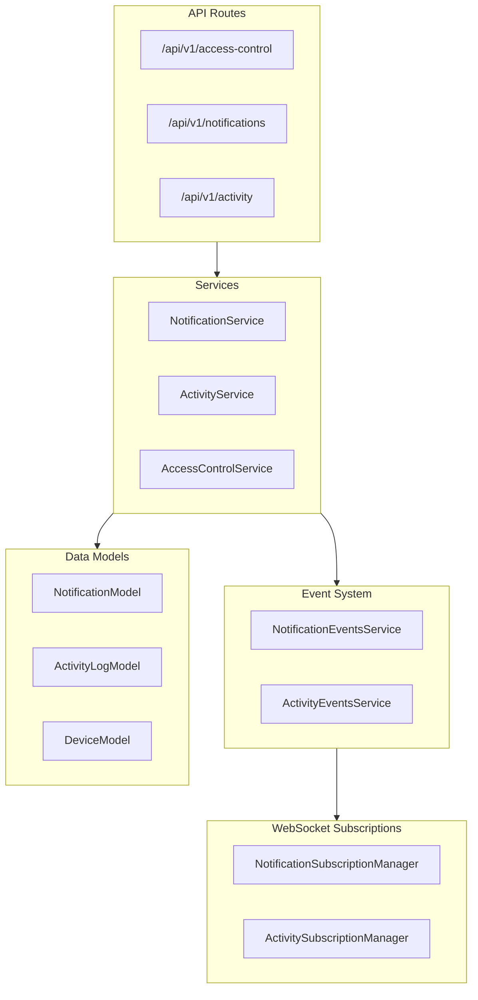

# Access Control, Notifications, and Activity Logs APIs

> **Date/time conventions:** All instants are stored in UTC and transmitted as ISO-8601 UTC strings. See [`datetime-conventions.md`](./datetime-conventions.md) for formatting, filter, and display rules.

This document describes three new API systems added to the BluLok platform: Access Control Device Querying, User Notifications, and Activity Logs.

## Architecture Overview



## 1. Access Control API

### Purpose
Query facility access control devices (doors, gates, elevators) with their current status and lock state.

### Endpoints

#### GET /api/v1/access-control/facilities/:facilityId/devices
Get all access control devices for a facility.

**Query Parameters:**
- `deviceType` (optional): Filter by type - `door`, `gate`, or `elevator`
- `status` (optional): Filter by status - `online`, `offline`, `error`, `maintenance`
- `search` (optional): Search by name or location description
- `limit` (default: 50, max: 100): Number of results
- `offset` (default: 0): Pagination offset

**Response:**
```json
{
  "success": true,
  "devices": [
    {
      "id": "uuid",
      "name": "Main Gate",
      "deviceType": "gate",
      "locationDescription": "Facility entrance",
      "status": "online",
      "isLocked": true,
      "lastActivity": "2024-01-15T10:30:00Z",
      "facilityId": "uuid",
      "gatewayId": "uuid"
    }
  ],
  "total": 15,
  "limit": 50,
  "offset": 0
}
```

#### GET /api/v1/access-control/facilities/:facilityId/summary
Get a summary of all access control devices at a facility including counts by type and status.

**Response:**
```json
{
  "success": true,
  "facilityId": "uuid",
  "facilityName": "Storage Facility A",
  "devices": [...],
  "summary": {
    "total": 10,
    "byType": { "doors": 5, "gates": 3, "elevators": 2 },
    "byStatus": { "online": 8, "offline": 1, "error": 0, "maintenance": 1 }
  }
}
```

#### GET /api/v1/access-control/devices/:deviceId
Get a single access control device by ID.

### Access Control
- All authenticated users can query devices
- Results are filtered by facility access
- Users only see devices for facilities they have access to
- Admins can see all devices

---

## 2. Notifications API

### Purpose
Flexible notification system with read receipt support for various system events.

### Notification Types
- `access_granted` - User granted access to a unit
- `access_denied` - User denied access to a unit
- `device_registered` - New device registered
- `password_reset` - Password successfully reset
- `unit_assigned` - User assigned to a unit
- `unit_unassigned` - User removed from a unit
- `system_alert` - System-wide alerts
- `maintenance_alert` - Maintenance notifications
- `security_alert` - Security-related notifications
- `general` - General notifications

### Priority Levels
- `low` - Informational
- `normal` - Default priority
- `high` - Important
- `urgent` - Requires immediate attention

### Endpoints

#### GET /api/v1/notifications
Get notifications for the current user.

**Query Parameters:**
- `type` (optional): Filter by notification type
- `priority` (optional): Filter by priority
- `isRead` (optional): Filter by read status (true/false)
- `facilityId` (optional): Filter by facility
- `limit` (default: 50, max: 100)
- `offset` (default: 0)

**Response:**
```json
{
  "success": true,
  "notifications": [
    {
      "id": "uuid",
      "type": "access_granted",
      "title": "Access Granted",
      "message": "You have been granted access to unit A-101.",
      "priority": "normal",
      "isRead": false,
      "readAt": null,
      "reference": { "type": "unit", "id": "uuid" },
      "facilityId": "uuid",
      "metadata": {},
      "createdAt": "2024-01-15T10:30:00Z"
    }
  ],
  "total": 25,
  "unreadCount": 5,
  "limit": 50,
  "offset": 0
}
```

#### GET /api/v1/notifications/unread-count
Get unread notification count for the current user.

#### GET /api/v1/notifications/:id
Get a single notification by ID.

#### POST /api/v1/notifications/:id/read
Mark a single notification as read.

#### POST /api/v1/notifications/read
Mark multiple notifications as read.

**Request Body:**
```json
{
  "notificationIds": ["uuid1", "uuid2", "uuid3"]
}
```

#### POST /api/v1/notifications/read-all
Mark all notifications as read.

**Request Body:**
```json
{
  "facilityId": "uuid" // optional - only mark for this facility
}
```

#### DELETE /api/v1/notifications/:id
Delete a notification (soft delete).

### Access Control
- Users can only access their own notifications
- Admins can view any user's notifications

### Real-time Updates
Subscribe to `notifications` via WebSocket to receive:
- `notification_created` - New notification
- `notification_read` - Notification marked as read
- `notifications_count_update` - Updated unread count
- `notifications_batch_read` - Multiple notifications marked as read

---

## 3. Activity Logs API

### Purpose
Historical record of unit and device state changes (lock/unlock, access attempts, status changes, etc.).

### Entity Types
- `unit` - Storage unit activities
- `device` - Device activities
- `facility` - Facility-wide activities
- `user` - User-related activities
- `gateway` - Gateway activities

### Activity Types
- `lock` / `unlock` / `locking` / `unlocking` - Lock state changes
- `access_attempt` - Access attempt (granted or denied)
- `status_change` - Device status change
- `error` - Error occurred
- `maintenance_start` / `maintenance_end` - Maintenance mode
- `assignment_change` - Unit assignment changes
- `configuration_change` - Configuration updates
- `connection_change` - Connection status changes
- `general` - General activities

### Actor Types
- `user` - Human user performed action
- `system` - Automated system action
- `device` - Device-initiated action
- `gateway` - Gateway-initiated action

### Result Types
- `success` - Action completed successfully
- `failure` - Action failed
- `pending` - Action in progress
- `unknown` - Result unknown

### Endpoints

#### GET /api/v1/activity
Get activity logs with filters.

**Query Parameters:**
- `entityType` (optional): Filter by entity type
- `entityId` (optional): Filter by specific entity
- `activityType` (optional): Filter by activity type
- `actorType` (optional): Filter by actor type
- `actorId` (optional): Filter by specific actor
- `result` (optional): Filter by result
- `facilityId` (optional): Filter by facility
- `unitId` (optional): Filter by unit
- `deviceId` (optional): Filter by device
- `fromDate` (optional): Start of date range (ISO 8601)
- `toDate` (optional): End of date range (ISO 8601)
- `limit` (default: 50, max: 100)
- `offset` (default: 0)

**Response:**
```json
{
  "success": true,
  "activities": [
    {
      "id": "uuid",
      "entityType": "device",
      "entityId": "uuid",
      "activityType": "lock",
      "title": "Device Locked",
      "description": "Device was locked by user",
      "actor": {
        "type": "user",
        "id": "uuid",
        "name": "John Doe"
      },
      "result": "success",
      "resultMessage": null,
      "facilityId": "uuid",
      "unitId": "uuid",
      "deviceId": "uuid",
      "metadata": {},
      "occurredAt": "2024-01-15T10:30:00Z",
      "unitNumber": "A-101",
      "deviceSerial": "SN-12345",
      "facilityName": "Storage Facility A"
    }
  ],
  "total": 100,
  "limit": 50,
  "offset": 0
}
```

#### GET /api/v1/activity/facilities/:facilityId
Get activity logs for a specific facility.

#### GET /api/v1/activity/units/:unitId
Get activity logs for a specific unit.

#### GET /api/v1/activity/devices/:deviceId
Get activity logs for a specific device.

### Access Control
- All authenticated users can query activity logs
- Results are filtered by facility access
- Tenants can only see activity for their assigned units
- Admins can see all activity

### Real-time Updates
Subscribe to `activity` via WebSocket to receive:
- `activity_update` - Initial activity data on subscription (`data.activities`, `data.count`, `data.lastUpdated`)
- `activity_new` - New activity logged; includes both `data.activity` and enriched `data.accessLog` (same shape as `GET /access-history?view=raw` rows) for live grid prepend in raw Access History / Activity Monitor
- `access_session_upsert` - Access session created/updated; `data.session` is an `AccessSessionRecord` plus `data.changed` field names — used by sessions view and Access History widget

**Regression:** `backend/npm run ws:e2e` — **Access Event Canonical Pipeline** section asserts `activity_update` snapshots, `activity_new` + `accessLog` envelopes after ingestion, role-scoped fanout, and tenant isolation.

**Subscription Parameters:**
```json
{
  "type": "subscribe",
  "subscriptionType": "activity",
  "data": {
    "facilityId": "uuid",  // optional - filter by facility
    "unitId": "uuid",      // optional - filter by unit
    "deviceId": "uuid"     // optional - filter by device
  }
}
```

---

## Database Tables

### notifications
```sql
CREATE TABLE notifications (
  id VARCHAR(36) PRIMARY KEY,
  user_id VARCHAR(36) NOT NULL,
  notification_type ENUM(...) NOT NULL,
  title VARCHAR(255) NOT NULL,
  message TEXT NOT NULL,
  priority ENUM('low', 'normal', 'high', 'urgent') DEFAULT 'normal',
  is_read BOOLEAN DEFAULT FALSE,
  read_at DATETIME,
  reference_type VARCHAR(50),
  reference_id VARCHAR(36),
  facility_id VARCHAR(36),
  metadata JSON,
  expires_at DATETIME,
  is_deleted BOOLEAN DEFAULT FALSE,
  created_at TIMESTAMP,
  updated_at TIMESTAMP,
  
  FOREIGN KEY (user_id) REFERENCES users(id) ON DELETE CASCADE,
  FOREIGN KEY (facility_id) REFERENCES facilities(id) ON DELETE SET NULL,
  
  INDEX idx_notifications_user_unread (user_id, is_read, is_deleted),
  INDEX idx_notifications_user_type (user_id, notification_type),
  INDEX idx_notifications_user_created (user_id, created_at)
);
```

### activity_logs
```sql
CREATE TABLE activity_logs (
  id VARCHAR(36) PRIMARY KEY,
  entity_type ENUM(...) NOT NULL,
  entity_id VARCHAR(36) NOT NULL,
  activity_type ENUM(...) NOT NULL,
  title VARCHAR(255) NOT NULL,
  description TEXT,
  actor_type ENUM('user', 'system', 'device', 'gateway') NOT NULL,
  actor_id VARCHAR(36),
  actor_name VARCHAR(255),
  result ENUM('success', 'failure', 'pending', 'unknown') DEFAULT 'success',
  result_message VARCHAR(500),
  facility_id VARCHAR(36),
  unit_id VARCHAR(36),
  device_id VARCHAR(36),
  metadata JSON,
  ip_address VARCHAR(45),
  occurred_at DATETIME NOT NULL,
  created_at TIMESTAMP,
  updated_at TIMESTAMP,
  
  FOREIGN KEY (facility_id) REFERENCES facilities(id) ON DELETE SET NULL,
  FOREIGN KEY (unit_id) REFERENCES units(id) ON DELETE SET NULL,
  
  INDEX idx_activity_logs_entity (entity_type, entity_id),
  INDEX idx_activity_logs_facility_time (facility_id, occurred_at),
  INDEX idx_activity_logs_unit_time (unit_id, occurred_at),
  INDEX idx_activity_logs_device_time (device_id, occurred_at)
);
```

---

## Access History Event Semantics

Access history reads from `activity_logs` and exposes a unified API at `GET /api/v1/access-history`.

### Event streams

| Stream | `activity_type` | Typical API `action` | Meaning |
|--------|-------------------|----------------------|---------|
| Gateway access attempts | `access_attempt` | `access_granted`, `remote_access_granted`, `unlock_attempt`, `lock_attempt` | Credential/policy evaluation, or cloud remote unlock authorization |
| Lock state sync | `lock`, `unlock` | `lock`, `unlock` | Physical state change reported by gateway |

In-flight transitional states (`locking`, `unlocking`) are **not** included in access history list/export queries.

### BluLok remote unlock (one session; three raw trail events)

Operator **sessions** view shows a single row with lifecycle `pending → open → closed`. The immutable raw trail (`view=raw` / `activity_logs`) still records three linked events:

| Step | When | API `action` (raw) | Method | User |
|------|------|--------------------|--------|------|
| Outbound | Cloud issues unlock JWT | `remote_access_granted` | `admin_remote` / `remote_gateway` | Initiator |
| Inbound | State sync unlock settles pending command | `unlock` | `local_device` + `metadata.correlated_remote` | Same initiator (`initiated_by`) |
| Local re-lock | Later physical lock (no remote lock product) | `lock` | `local_device` | None (`—`) |

See [`access-sessions.md`](./access-sessions.md) for correlation rules, pending TTL, and WebSocket `access_session_upsert`.

UI session labels: Waiting for unlock → Open now → Closed · duration. Expanded timeline: remote = Requested → Opened → Locked (icons); keypad/app = Unlocked → Locked (no Requested/Granted/Opened split); timeouts Requested → Timed out; pending remotes show Waiting for device to unlock. Occupied-unit override sets `tenant_unlock_override` / `occupied_unit_override` and renders with an amber row wash, Override pill, and reason subtitle (no left accent bar).

Grant-like gateway `access-events` for a device with a **pending remote unlock** attach to the session (`attempt_count`) instead of being discarded. Gateways should still prefer `devices/state` for cloud JWT unlock confirmation.

### Method taxonomy (read layer)

| Method | Meaning |
|--------|---------|
| `app`, `mobile_key`, `keypad`, `route_pass` | Preserved from gateway access-event ingestion |
| `remote_gateway` | Cloud-issued unlock authorization (any role) — UI label **Cloud** |
| `admin_remote` | Cloud-issued unlock authorization (admin/facility admin) — UI label **Cloud** |
| `local_device` | Physical state change; may still carry `initiated_by` when `correlated_remote` |

Legacy rows mapped as `automatic` are surfaced as `local_device`.

### Remote command attribution

Cloud BluLok unlock commands (`PUT /devices/blulok/:id/lock` → unlocked) **always** pass the initiating user into `LockCommandService` and write an outbound `remote_access_granted` activity immediately via `RemoteLockActivityLogger` (`backend/src/services/access/remote-lock-activity-logger.service.ts`). Shared BluLok/AC preflight guards (`rejectIfRemoteLockDisabled`, `rejectIfRecoveryBlocking`) live on `LockCommandService`. HTTP lock routes live in `devices-lock-commands.routes.ts`. Tenant override is additional metadata when a **non-occupant** unlocks an occupied unit (`tenant-unlock-override.service.ts`). Occupants and key-share recipients unlock without override.

When gateway state sync confirms unlock via a **real status transition** matching the pending command:

- `activity_type: unlock`, `method: local_device`, `correlated_remote: true`
- `actor_type: user`, initiator name/id via `initiated_by`
- Optional `tenant_unlock_override` / `occupied_unit_override` when a staff occupied-unit reason was supplied

Pending attribution is held in-process until settlement or TTL (facility hardware-ack timeout, or **60s** one-shot attribution TTL). Same-state telemetry re-reports do **not** success-consume pending attribution. Failed remote commands (gateway reject, send error, timeout, settlement mismatch, superseded by a newer command) write `access_attempt` rows with `unlock_attempt` / `lock_attempt`, `success: false`, and a human-readable `reason` (outbound grant may already exist). Settled success / mismatch / local-device rows are written by `SettledLockActivityLogger` (`backend/src/services/access/settled-lock-activity-logger.service.ts`) from `DeviceEventService` lock-status listeners.

Frontend Access History vocabulary (`ACTION_LABELS` / `METHOD_LABELS` / denial labels / filter options) lives in `frontend/src/constants/accessHistory.constants.ts` (denial labels sync-tested against backend). **Session list/detail/export** use `GET /api/v1/access-sessions` (web UI + new app clients). Legacy `GET /api/v1/access-history` defaults to **raw** event `logs[]`; transitional `view=sessions` remains. Session presentation helpers live in `frontend/src/utils/access-session-display.utils.ts`; rows/timeline in `AccessSessionRow` / `AccessSessionTimeline`. Live WS: `activity_new` prepends raw events; `access_session_upsert` upserts sessions (`useAccessHistoryLiveUpdates`). Activity Monitor and compact unit snippets request `/access-history?view=raw`. Action icons: `getAccessHistoryActionIcon` / `getAccessHistoryMethodIcon` (raw) and `getAccessSessionActionIcon` / `getAccessSessionMethodIcon` (sessions).

On-ground staff unlocks use a separate short-lived intent (`POST …/occupied-unit-override`); see [`app-occupied-unit-override.md`](./app-occupied-unit-override.md).

### Denied unlock attempts

Gateway `access_denied` events are mapped to API action `unlock_attempt` with structured `denial_reason` and `metadata.failure_summary` for UI display.

**Gateway ingestion contract:** see [`gateway-access-events.md`](./gateway-access-events.md) for the full `POST /internal/gateway/access-events` schema, examples, and when to use `devices/state` vs access-events.

---

## Data Retention & Storage Limits

### Automatic Cleanup

The existing `DataPruningService` handles automatic cleanup of notifications and activity logs to prevent unbounded database growth:

**Notifications:**
- **Expired notifications**: Deleted immediately when `expires_at` has passed
- **Soft-deleted notifications**: Permanently deleted 30 days after being marked as deleted

**Activity Logs:**
- **Old logs**: Deleted after 90 days (based on `occurred_at` timestamp)

### Cleanup Schedule

The data pruning service runs:
1. Immediately on server startup
2. Every 24 hours thereafter

### Retention Periods

| Data Type | Retention Period | Trigger |
|-----------|------------------|---------|
| Expired notifications | Immediate | `expires_at < NOW()` |
| Deleted notifications | 30 days | `is_deleted = true AND updated_at < 30 days ago` |
| Activity logs | 90 days | `occurred_at < 90 days ago` |

### Manual Cleanup

The models provide methods for manual cleanup if needed:

```typescript
// NotificationModel
await notificationModel.cleanupExpired(); // Remove expired notifications
await notificationModel.cleanupDeleted(30); // Remove soft-deleted older than N days

// ActivityLogModel
await activityLogModel.cleanupOld(90); // Remove logs older than N days
```

### Pagination Limits

API endpoints enforce pagination limits to prevent memory issues:
- Default page size: 50
- Maximum page size: 100

---

## Event-Driven Architecture

### NotificationEventsService
Emits events when notifications are created, read, or deleted. Enables:
- Real-time WebSocket updates via NotificationSubscriptionManager
- Decoupled notification handling
- Audit logging

Events:
- `notification:created`
- `notification:read`
- `notification:deleted`
- `notification:batch:read`
- `notification:changed` (catch-all)

### ActivityEventsService
Emits events when activities are logged. Enables:
- Real-time activity feeds via ActivitySubscriptionManager
- Facility/unit/device-scoped event filtering
- Dashboard updates

Events:
- `activity:logged`
- `activity:lock`
- `activity:access`
- `activity:status`
- `activity:error`
- `activity:maintenance`
- `activity:facility:{facilityId}`
- `activity:unit:{unitId}`
- `activity:device:{deviceId}`

---

## Integration Points

### Automatic Event-Driven Integrations

The following integrations are wired up automatically — no manual calls needed for these flows:

| Trigger | Service | What Happens |
|---------|---------|--------------|
| Lock/unlock via gateway state update | `DeviceEventService` → `ActivityService.logLockEvent()` | Activity log created for lock/unlock events (shown in Activity Monitor) |
| Gateway access events (BluLok + access control) | `AccessEventIngestionService` → `activity_logs` | `access_attempt` rows with `metadata.device_type` |
| Device online/offline change | `DeviceEventService` → `ActivityService.logStatusChange()` | Activity log created for status changes |
| Tenant assigned to unit | `UnitsService` → `NotificationService.notifyUnitAssigned()` | In-app notification to tenant |
| Tenant unassigned from unit | `UnitsService` → `NotificationService.notifyUnitUnassigned()` | In-app notification to tenant |
| Key shared with user | `KeySharingService` → `NotificationService.notifyAccessGranted()` | In-app notification to recipient |
| FMS sync complete/failed | `FMSService` → `InAppNotificationDispatcher` | Facility operators notified (excludes triggering user) |
| Gateway offline/online | `GatewayEventsService` → `InAppNotificationDispatcher` | Facility operators notified |
| Device low battery (≤20%) | `DeviceModel` → `InAppNotificationDispatcher` | Facility operators notified (deduped 24h) |

**Facility scoping:** REST and WebSocket notification subscriptions filter by `facilityId` (single facility) or the user's assigned `facilityIds` (all-facilities mode). Activity Monitor / access-history live feeds use terminal types (`access_attempt`, `lock`, `unlock`); the dashboard histogram aggregates `access_attempt` + `unlock` only. Facility is resolved via unit when `facility_id` is null, and global admins in all-facilities mode are not limited to JWT `facilityIds`.

**Extensibility:** Add new operational alerts in `InAppNotificationDispatcher` (`backend/src/services/notifications/in-app-notification-dispatcher.service.ts`) and register types in `IN_APP_NOTIFICATION_TYPES`.

**Inventory sync errors:** Duplicate device serials during gateway inventory sync emit `device_inventory_sync_error` (urgent) to admin, dev_admin, and facility_admin via `InventorySyncNotificationService`. Messages are human-readable and name the facility that already owns the serial, plus the assigned unit when one exists (or note when unassigned).

**Retention (per user):** Read notifications are kept 30 days; unread 90 days. Queries apply rolling windows; stale rows are purged on list fetch. Read receipts are per `user_id` — marking read affects only that user's row.

**Technical alerts:** `backend_error` notifications are created for **dev_admin only** (`notifyDevAdmins`) and are excluded from REST/WebSocket payloads for all other roles via `in-app-notification-visibility.utils.ts`.

**Important notes:**
- All side-effect calls are fire-and-forget — they never block the primary operation
- `DeviceEventService` uses dynamic `import()` to avoid circular dependency issues at startup
- Activity logging only fires for terminal lock states (`locked`/`unlocked`), not transitional states (`locking`/`unlocking`)

### Creating Notifications Manually
Use `NotificationService` convenience methods when automatic integration doesn't cover your use case:
```typescript
const service = NotificationService.getInstance();

// Access granted
await service.notifyAccessGranted(userId, unitNumber, facilityId, unitId, grantedBy);

// Access denied
await service.notifyAccessDenied(userId, unitNumber, facilityId, unitId, reason);

// Device registered
await service.notifyDeviceRegistered(userId, { name, type, id }, facilityId);

// Password reset
await service.notifyPasswordReset(userId);

// Unit assigned (auto-wired from UnitsService)
await service.notifyUnitAssigned(userId, unitNumber, facilityName, facilityId, unitId);

// Unit unassigned (auto-wired from UnitsService)
await service.notifyUnitUnassigned(userId, unitNumber, facilityName, facilityId, unitId);

// System alert
await service.notifySystemAlert(userId, title, message, priority, metadata);
```

### Logging Activity Manually
Use `ActivityService` convenience methods when automatic integration doesn't cover your use case:
```typescript
const service = ActivityService.getInstance();

// Lock/unlock event (auto-wired from DeviceEventService)
await service.logLockEvent(deviceId, unitId, facilityId, locked, actorType, actorId, actorName);

// Access attempt
await service.logAccessAttempt(deviceId, unitId, facilityId, userId, userName, granted, reason);

// Status change (auto-wired from DeviceEventService)
await service.logStatusChange(deviceId, facilityId, oldStatus, newStatus);

// Assignment change (auto-wired from UnitsService)
await service.logAssignmentChange(unitId, facilityId, userId, userName, assigned, performedBy);
```

---

## Access Control Device Management

### Creating Access Control Devices
Access control devices (doors, gates, elevators) are created via the devices API:

```
POST /api/v1/devices/access-control
```

**Request Body:**
```json
{
  "gateway_id": "uuid",
  "name": "Main Entrance Door",
  "device_type": "door",
  "location_description": "Building A - Ground Floor",
  "relay_channel": 1
}
```

Valid `device_type` values: `door`, `gate`, `elevator`

Requires Admin or Facility Admin role.

---

## Testing

### Unit Tests
- `src/__tests__/models/notification.model.test.ts`
- `src/__tests__/models/activity-log.model.test.ts`
- `src/__tests__/services/notification.service.test.ts`
- `src/__tests__/services/activity.service.test.ts`
- `src/__tests__/services/access-control.service.test.ts`
- `src/__tests__/services/subscriptions/notification-subscription-manager.test.ts`
- `src/__tests__/services/subscriptions/activity-subscription-manager.test.ts`

### E2E Tests
Access Control, Notifications, and Activity Logs APIs are tested in `backend/scripts/ws-gateway-e2e.js` under the headings:
- **"Access Control Device Setup"** — Creates door, gate, elevator devices during test setup
- **"Access Control API"** — Verifies device queries, filters, summary, single device lookup, and facility admin access
- **"Notifications API"** — Verifies real notifications (from tenant assignment + key sharing), structure validation, mark-as-read, single read, delete, type filter, and unread count
- **"Activity Logs API"** — Verifies real activity logs (from lock/unlock events + assignments), structure validation, unit/device scoped queries, type filters, date ranges, and facility admin access
