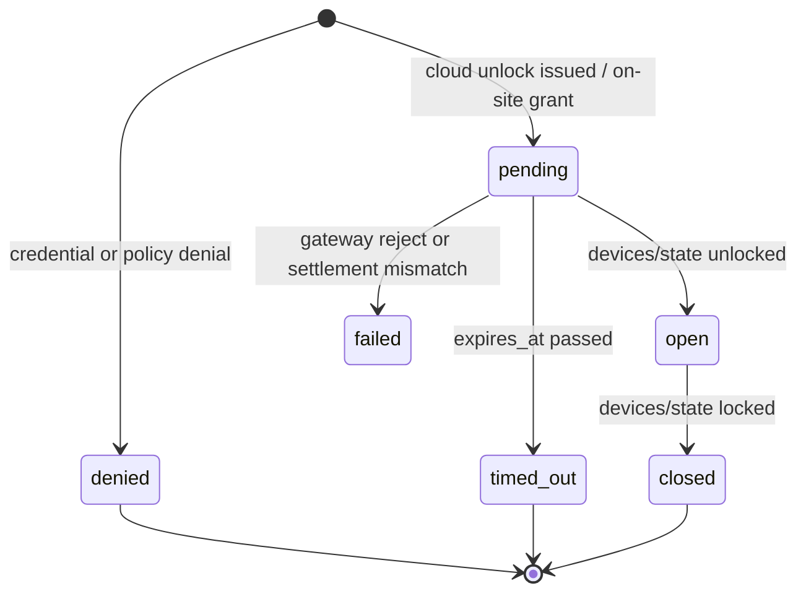

# Access Sessions

> **Date/time conventions:** All instants are stored in UTC and transmitted as ISO-8601 UTC strings. See [`datetime-conventions.md`](./datetime-conventions.md).

One logical access → one Access History row. Raw per-event evidence stays in `activity_logs`; the operator-facing aggregate is `access_sessions`.

## Why

Previously Access History listed every `activity_logs` row (`access_attempt`, `lock`, `unlock`). A single real-world access therefore appeared as 2–4 rows (remote grant + site unlock + manual re-lock; or mobile grant + unlock). Pending remote unlocks were invisible because no writer set `result: pending`, and unlock→lock could not be joined for open duration.

## Lifecycle



| State | Meaning |
|-------|---------|
| `pending` | Authorized / granted; waiting for physical open (or timeout) |
| `open` | Lock is unlocked; duration ticking |
| `closed` | Re-locked; `open_duration_sec` set when both timestamps exist |
| `denied` | Credential/policy denial (never coalesced) |
| `timed_out` | Pending past `expires_at` (sweeper or command timeout) |
| `failed` | Remote command rejected / settlement mismatch |

## Correlation rules

Owned by `AccessSessionCorrelator` (`backend/src/services/access/access-session-correlator.service.ts`):

1. **Cloud remote unlock issued** → `pending`, `origin: cloud_remote`, `remote_command_id`, `expires_at = now + facility lock_command_timeout_sec` (or 60s one-shot TTL).
2. **Cloud failure / timeout / mismatch** → same session → `failed` / `timed_out` (no second row).
3. **Gateway grant** (`app` / `mobile_key` / `keypad` / `route_pass`) → bump `attempt_count` on matching **open** session (same method + actor); else **attach** to pending `cloud_remote` (takes priority over absorb); else **coalesce** a repeat grant into an existing **on-site pending** (same method + actor; refresh `expires_at`, `metadata.coalesced_pending_grant`); else **absorb** a recent anonymous `local` / `local_device` open on the same device (unlock-before-grant race, ~60s window, plus 1s skew for MySQL `DATETIME(0)` fractional-second rounding) by upgrading method/actor/`origin: on_site`; else create `pending` `origin: on_site` (60s grant→open TTL).
4. **Gateway denial** → always a new terminal `denied` session.
5. **`devices/state` → unlocked** → open newest pending (prefer `remote_command_id`); when state reports generic `local_device`/`automatic`, keep the pending method (`admin_remote`, `mobile_key`, `app`, …); else create `origin: local` open session. If a pending grant commits between the first pending lookup and that local create, **discard the unlinked local open** and open the pending (`metadata.unlocked_after_grant_race`). Same-state unlocked re-reports that match a pending remote command still open that session (no duplicate activity row).
6. **`devices/state` → locked** → close newest open unlock session (set duration). Never create a standalone lock row — attach to the latest unlock session on the device, or synthesize a local access closed at lock time if none exists. Same-state locked re-reports still close live open/pending sessions (no synthesize, no duplicate activity row).
7. **Sweeper** (~30s) → pending past `expires_at` → `timed_out`.

`open` / `closed` are never fabricated from timeouts. Manual / local locks always appear as the **Locked** step on an unlock session timeline — never as a separate "Manually locked" history row.

Sessions are resolved **before** `activity_logs` inserts so each raw event carries `access_session_id` and is never updated for linkage.

## Storage

**Table `access_sessions`** (migration `099_create_access_sessions.ts`): identity/scope, `kind` / `origin` / `method` / `outcome` / `state`, actor fields, denial fields, lifecycle timestamps, `attempt_count`, `remote_command_id` (unique when set), `correlation_id`, `metadata`.

**`activity_logs.access_session_id`** — nullable FK-style link (no hard FK; sessions may outlive pruning windows differently).

## Attribution durability

Command **timers** and lock-status revert remain process-local in `LockCommandService`. Pending **history attribution** is persisted in `access_sessions`, so state sync on another Cloud Run instance can still open the correct session via `peekCommandAttributionDurable` / correlator device lookup.

## API

Prefer the dedicated sessions mount for web UI and new app clients. Legacy `/access-history` stays **raw event rows by default** so existing clients are not broken.

| Endpoint | Behavior |
|----------|----------|
| `GET /api/v1/access-sessions` | Session rows + `currently_open` (clean contract; no `logs` alias) |
| `GET /api/v1/access-sessions/:id` | Session detail with `events[]` timeline |
| `GET /api/v1/access-sessions/export` | CSV (state/outcome/duration columns) |
| `GET /api/v1/access-history` | **Default raw** event `logs[]`. Transitional `view=sessions` still returns sessions + `logs` alias |
| `GET /api/v1/access-history/:id` | Prefer session detail when id is a session; else raw activity row |
| `GET /api/v1/access-history/export` | CSV; pass `view=sessions` for session columns (prefer `/access-sessions/export`) |
| `GET /api/v1/gateways/:id/session-trace` | Debug snapshot: live/recent sessions, raw `activity_logs`, pending attributions (memory + durable), lock state, lookups, correlator ring. Query `user_id` / `device_id` / `unit_id`. Admin / dev_admin / facility_admin. |

Filters (both mounts): facility/unit/user/device/method/date plus `state=open|pending|…` on sessions.

### WebSocket

Subscribe `activity` as before:

- `activity_new` — raw enriched `accessLog` (Activity Monitor / raw view; matches `GET /access-history`)
- `access_session_upsert` — session row + `changed` fields for in-place pending → open → closed updates (Access History UI). Also fanned out on **`/ws/app`** as `app_event` (`event: access_session_upsert`) plus an `accessSessions` slice on `app_snapshot`.
- `access_session_trace` — correlator decisions + raw access/lock/unlock events for the Gateway **Session trace** tab (`access_session_trace_update`). Facility-scoped; optional `gateway_id` / `device_id` / `unit_id` / `user_id`. Ring is process-local (Cloud Run instance).

**Cross-instance gap:** pending is written on the instance that handled the unlock HTTP; physical unlock is applied on the instance that holds `/ws/gateway`. In-memory EventEmitter fanout does not cross instances. Dashboard Access History (page + widget) polls REST every 2s while any visible row is `pending`. App clients should do the same (see [app realtime](./app-realtime-developer-guide.md)).

**Regression:** `backend/npm run ws:e2e` asserts the full `pending → open → closed` upsert sequence twice — once on the dashboard `activity` feed (**Access History remote unlock cycle**) and once on `/ws/app` (**App Realtime**), plus the `accessSessions` slice on `app_snapshot`, tenant unit scoping of that slice, and that a reconnect snapshot already carries the settled session. Every payload is checked for `facility_name` / `unit_number` / `device_serial` so a regression to a non-enriched row fails the suite.

**Fanout read path:** both consumers (`ActivitySubscriptionManager`, `AppRealtimeHub`) need the join-enriched record, so they share `resolveSessionRecordOnce` — one `findWithContext` per event, memoised on the event object, and only after subscriber/RBAC filtering has found a recipient. When the row is gone (e.g. the unlinked-session race in `onDeviceUnlocked`) the dashboard sends `session: null`, which clients treat as "refetch"; `/ws/app` sends nothing. Never synthesise a row from the raw event — it has no facility/unit/device join context and would overwrite a good row with a blank one.

## UI

Access History page and Access History widget call **`GET /access-sessions`**:

- Status pills: Waiting for unlock (info blue) / Open now / Possibly left open · duration (open > 10m) / **Left open · duration** (open > 1h, critical: solid rose pill, row wash, badge) / Closed · duration / Denied / Timed out (amber warning) / Failed
- Table columns (sessions): **Unit / Device** (method icon + subject) · User · Method · Status · Time. Raw view keeps Action · User · Unit · Method · Status · Time.
- Expanded row (page): timeline rail centered in the same-width column as the parent method icon (`w-8` / widget `w-7`) with matching `gap-2.5`, so markers align under the row icon.
  - **Remote:** Requested → Opened → Locked (pending: Waiting for device to unlock with spinner; timeout: Requested → Timed out).
  - **Mobile key / app / route pass:** **Access granted** → Waiting for unlock | **Unlocked** → Locked | **Timed out** (grant confirmation lag is first-class).
  - **Keypad success:** near-instant **Unlocked → Locked** (or single **Denied**); keypad pending/timeout still uses Access granted → waiting / timed out.
  - Markers: open lock / closed lock / cloud (requested) / X (denied) / warning triangle (timeout, amber); spinner while waiting.
  - When no person can be attributed (e.g. keypad), User shows muted **Not identified** and unlock detail can say **via keypad**.
- Widget (medium+): compact horizontal rows — **unit · method title** left, **status pill** top-right, user · time below; click expands timeline. Small size stays a dense strip without expand.
- **Needs attention** chip → `state=open` (clears date range so all open locks appear). Auto-selected when `currently_open > 0` until the operator clears it. Rose active pill + banner make the filter obvious.
- **Raw events** toggle → `GET /access-history?view=raw` (**DEV_ADMIN only**). Everyone else stays on sessions.
- **Session trace** (Facility → Gateway → **Session trace**, `canManageGateway`): compact status strip (selected unit’s lock, or **device-lock counts** — never a gateway-level Locked/Unlocked), pending/live/history; workspace switches **Sessions** (live + historical cards), **Events** (correlator / access / lock-state cards), and **NDJSON** (pretty-printed event objects, oldest first; live events append at the end; **Autoscroll** on by default, toggle off to inspect). Filters are searchable **Unit** (`UnitFilter`) and **User** (`UserFilter`) plus a **Time** control (progressive: Anytime → After / Before / **Between two times** → date, then time). Applied values appear in `AppliedFilterBar` (dismissible chips + **Clear all**). Time filters Events and NDJSON by event instant; Sessions match if the session interval overlaps (live pending/open extend to now) and stay whole — session cards are not split even when some of their events fall outside the Events/NDJSON window. When a unit is selected, the user list is only actors who appear in events/sessions for that unit. Removing the unit chip also clears the user filter, but not the time range. **Copy dump** serializes the full snapshot plus unfiltered live events (not the client time/user view).

Activity Monitor stays on the raw operational feed (`GET /access-history?view=raw`).

## Backfill

Until backfill runs, **Access History sessions (`GET /access-sessions`) is empty/partial** even when `activity_logs` has history. Raw / Activity Monitor still show unlinked events.

Re-runnable (not part of the migration). Correlates last N days (default 90, max 365) via `metadata.remote_command_id` and a 24h unlock→lock attach window; remaining rows become single-event sessions. Already-linked `activity_logs` rows are skipped.

**Production behavior (`AccessSessionBackfillService`):**

- Single-flight via MySQL `GET_LOCK` (non-blocking) on **write** runs only; dry-run does not hold the lock.
- Cursor-batched load of unlinked activities (cap per chunk); per-session **transactions** (session write + batched activity links).
- Lock attach uses a per-device sorted index (not a full-array scan); host lookup prefers in-run sessions, then a `LIMIT 1` DB probe (cached per device).
- Unique `remote_command_id` races attach to the winner instead of failing.
- Never downgrades live **pending/open** sessions from grant-only historical rows (links only).
- Dry-run lock accounting mirrors host-attach vs synthesize (same counts as a real run within a chunk).
- FK misses null `facility_id`/`unit_id` and retry; per-item errors are skipped and counted.
- On-site grant↔unlock coalescing is **weaker** than live `AccessSessionCorrelator` (remote_command_id + time windows only).
- Historical unlock without a later lock is stored **closed** (avoids flooding Needs attention); live path keeps `open`.

**HTTP chunking (Developer Tools / admin API):**

`POST /api/v1/admin/access-sessions/backfill` runs with a ~45s wall-clock budget and a row cap. Each response includes `results.done` and optional `results.cursor`. The UI loops until `done: true`.

This avoids Cloud Run / edge killing a multi-minute write request mid-flight. Those kills return **no HTTP body and no CORS headers**, which browsers surface as a CORS / `ERR_FAILED` error even though CORS config is fine (dry-run succeeding is the tell).

**Developer Tools (preferred):** Database tab → **Backfill Access Sessions** (DEV_ADMIN). Supports days + dry-run. Auto-continues chunks and shows running totals.

**CLI** (no time budget; still resumes across the row-cap automatically):

```bash
cd backend
npx ts-node -r tsconfig-paths/register src/scripts/backfill-access-sessions.ts
npx ts-node -r tsconfig-paths/register src/scripts/backfill-access-sessions.ts --dry-run
npx ts-node -r tsconfig-paths/register src/scripts/backfill-access-sessions.ts --days=30
```

Shared implementation: `AccessSessionBackfillService` + `access-session-backfill.utils.ts`.

## Related docs

- [`access-notifications-activity-apis.md`](./access-notifications-activity-apis.md) — REST / WS surface
- [`gateway-access-events.md`](./gateway-access-events.md) — gateway ingest contract
