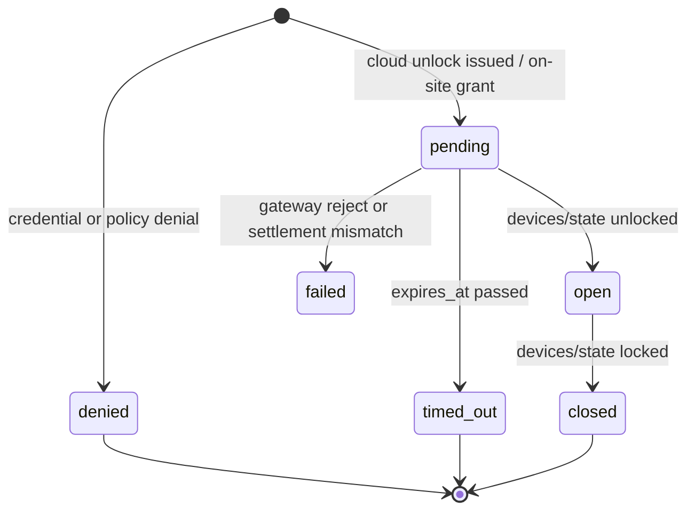

# Access Sessions

> **Date/time conventions:** All instants are stored in UTC and transmitted as ISO-8601 UTC strings. See [`datetime-conventions.md`](./datetime-conventions.md).

One logical access → one Access History row. Raw per-event evidence stays in `activity_logs`; the operator-facing aggregate is `access_sessions`.

## Why

Previously Access History listed every `activity_logs` row (`access_attempt`, `lock`, `unlock`). A single real-world access therefore appeared as 2–4 rows (remote grant + site unlock + manual re-lock; or mobile grant + unlock). Pending remote unlocks were invisible because no writer set `result: pending`, and unlock→lock could not be joined for open duration.

## Lifecycle



| State | Meaning |
|-------|---------|
| `pending` | Authorized / granted; waiting for physical open (or timeout) |
| `open` | Lock is unlocked; duration ticking |
| `closed` | Re-locked; `open_duration_sec` set when both timestamps exist |
| `denied` | Credential/policy denial (never coalesced) |
| `timed_out` | Pending past `expires_at` (sweeper or command timeout) |
| `failed` | Remote command rejected / settlement mismatch |

## Correlation rules

Owned by `AccessSessionCorrelator` (`backend/src/services/access/access-session-correlator.service.ts`):

1. **Cloud remote unlock issued** → `pending`, `origin: cloud_remote`, `remote_command_id`, `expires_at = now + facility lock_command_timeout_sec` (or 60s one-shot TTL).
2. **Cloud failure / timeout / mismatch** → same session → `failed` / `timed_out` (no second row).
3. **Gateway grant** (`app` / `mobile_key` / `keypad` / `route_pass`) → bump `attempt_count` on matching **open** session; else attach to pending cloud; else create `pending` `origin: on_site` (60s grant→open TTL).
4. **Gateway denial** → always a new terminal `denied` session.
5. **`devices/state` → unlocked** → open newest pending (prefer `remote_command_id`); else create `origin: local` open session.
6. **`devices/state` → locked** → close newest open unlock session (set duration). Never create a standalone lock row — attach to the latest unlock session on the device, or synthesize a local access closed at lock time if none exists.
7. **Sweeper** (~30s) → pending past `expires_at` → `timed_out`.

`open` / `closed` are never fabricated from timeouts. Manual / local locks always appear as the **Locked** step on an unlock session timeline — never as a separate "Manually locked" history row.

Sessions are resolved **before** `activity_logs` inserts so each raw event carries `access_session_id` and is never updated for linkage.

## Storage

**Table `access_sessions`** (migration `099_create_access_sessions.ts`): identity/scope, `kind` / `origin` / `method` / `outcome` / `state`, actor fields, denial fields, lifecycle timestamps, `attempt_count`, `remote_command_id` (unique when set), `correlation_id`, `metadata`.

**`activity_logs.access_session_id`** — nullable FK-style link (no hard FK; sessions may outlive pruning windows differently).

## Attribution durability

Command **timers** and lock-status revert remain process-local in `LockCommandService`. Pending **history attribution** is persisted in `access_sessions`, so state sync on another Cloud Run instance can still open the correct session via `peekCommandAttributionDurable` / correlator device lookup.

## API

Prefer the dedicated sessions mount for web UI and new app clients. Legacy `/access-history` stays **raw event rows by default** so existing clients are not broken.

| Endpoint | Behavior |
|----------|----------|
| `GET /api/v1/access-sessions` | Session rows + `currently_open` (clean contract; no `logs` alias) |
| `GET /api/v1/access-sessions/:id` | Session detail with `events[]` timeline |
| `GET /api/v1/access-sessions/export` | CSV (state/outcome/duration columns) |
| `GET /api/v1/access-history` | **Default raw** event `logs[]`. Transitional `view=sessions` still returns sessions + `logs` alias |
| `GET /api/v1/access-history/:id` | Prefer session detail when id is a session; else raw activity row |
| `GET /api/v1/access-history/export` | CSV; pass `view=sessions` for session columns (prefer `/access-sessions/export`) |

Filters (both mounts): facility/unit/user/device/method/date plus `state=open|pending|…` on sessions.

### WebSocket

Subscribe `activity` as before:

- `activity_new` — raw enriched `accessLog` (Activity Monitor / raw view; matches `GET /access-history`)
- `access_session_upsert` — session row + `changed` fields for in-place pending → open → closed updates (Access History UI)

## UI

Access History page and Access History widget call **`GET /access-sessions`**:

- Status pills: Waiting for unlock (info blue) / Open now / Possibly left open · duration (open > 10m) / **Left open · duration** (open > 1h, critical: solid rose pill, row wash, badge) / Closed · duration / Denied / Timed out (amber warning) / Failed
- Table columns (sessions): **Unit / Device** (method icon + subject) · User · Method · Status · Time. Raw view keeps Action · User · Unit · Method · Status · Time.
- Expanded row (page): timeline rail centered in the same-width column as the parent method icon (`w-8` / widget `w-7`) with matching `gap-2.5`, so markers align under the row icon.
  - **Remote:** Requested → Opened → Locked (pending: Waiting for device to unlock with spinner; timeout: Requested → Timed out).
  - **Keypad / app / other on-site:** near-instant **Unlocked → Locked** (or single **Denied**) — no Requested/Granted/Opened split.
  - Markers: open lock / closed lock / cloud (requested) / X (denied) / warning triangle (timeout, amber); spinner while waiting.
  - When no person can be attributed (e.g. keypad), User shows muted **Not identified** and unlock detail can say **via keypad**.
- Widget (medium+): compact horizontal rows — **unit · method title** left, **status pill** top-right, user · time below; click expands timeline. Small size stays a dense strip without expand.
- **Needs attention** chip → `state=open` (clears date range so all open locks appear). Auto-selected when `currently_open > 0` until the operator clears it. Rose active pill + banner make the filter obvious.
- **Raw events** toggle → `GET /access-history?view=raw` (**DEV_ADMIN only**). Everyone else stays on sessions.

Activity Monitor stays on the raw operational feed (`GET /access-history?view=raw`).

## Backfill

Until backfill runs, **Access History sessions (`GET /access-sessions`) is empty/partial** even when `activity_logs` has history. Raw / Activity Monitor still show unlinked events.

Re-runnable (not part of the migration). Correlates last N days (default 90, max 365) via `metadata.remote_command_id` and a 24h unlock→lock attach window; remaining rows become single-event sessions. Already-linked `activity_logs` rows are skipped.

**Production behavior (`AccessSessionBackfillService`):**

- Single-flight via MySQL `GET_LOCK` (non-blocking); concurrent runs return `skippedBusy` (HTTP **409** from admin API).
- Cursor-batched load of unlinked activities; per-session **transactions** (session write + activity links atomic).
- Unique `remote_command_id` races attach to the winner instead of failing.
- Never downgrades live **pending/open** sessions from grant-only historical rows (links only).
- Dry-run lock accounting mirrors host-attach vs synthesize (same counts as a real run).
- FK misses null `facility_id`/`unit_id` and retry; per-item errors are skipped and counted.
- On-site grant↔unlock coalescing is **weaker** than live `AccessSessionCorrelator` (remote_command_id + time windows only).
- Historical unlock without a later lock is stored **closed** (avoids flooding Needs attention); live path keeps `open`.

**Developer Tools (preferred):** Database tab → **Backfill Access Sessions** (DEV_ADMIN). Supports days + dry-run. Calls `POST /api/v1/admin/access-sessions/backfill`.

**CLI:**

```bash
cd backend
npx ts-node -r tsconfig-paths/register src/scripts/backfill-access-sessions.ts
npx ts-node -r tsconfig-paths/register src/scripts/backfill-access-sessions.ts --dry-run
npx ts-node -r tsconfig-paths/register src/scripts/backfill-access-sessions.ts --days=30
```

Shared implementation: `AccessSessionBackfillService` + `access-session-backfill.utils.ts`.

## Related docs

- [`access-notifications-activity-apis.md`](./access-notifications-activity-apis.md) — REST / WS surface
- [`gateway-access-events.md`](./gateway-access-events.md) — gateway ingest contract
