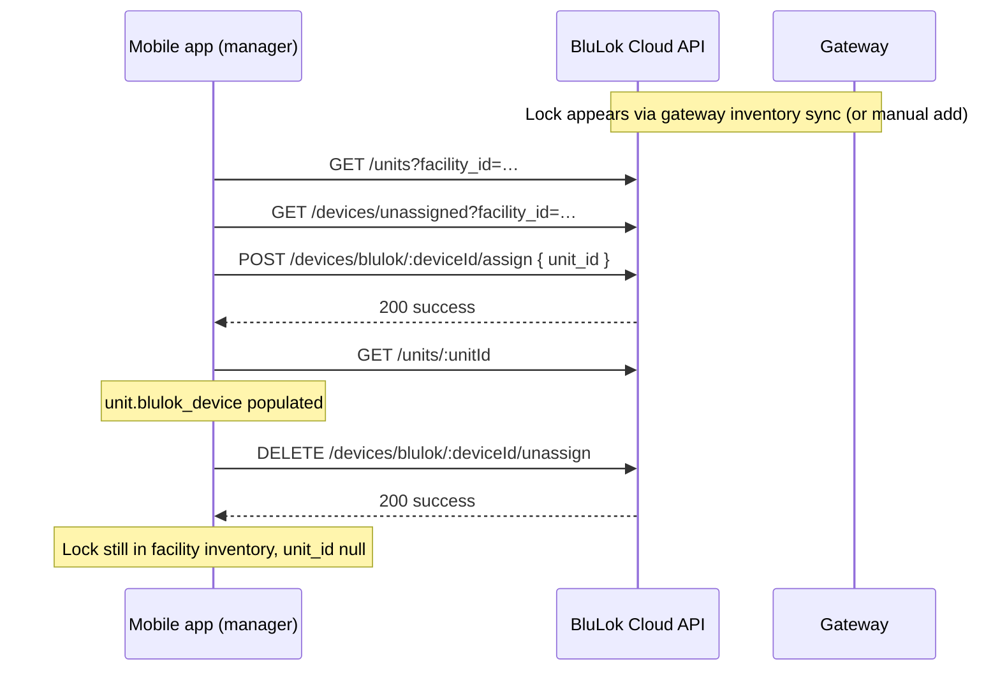
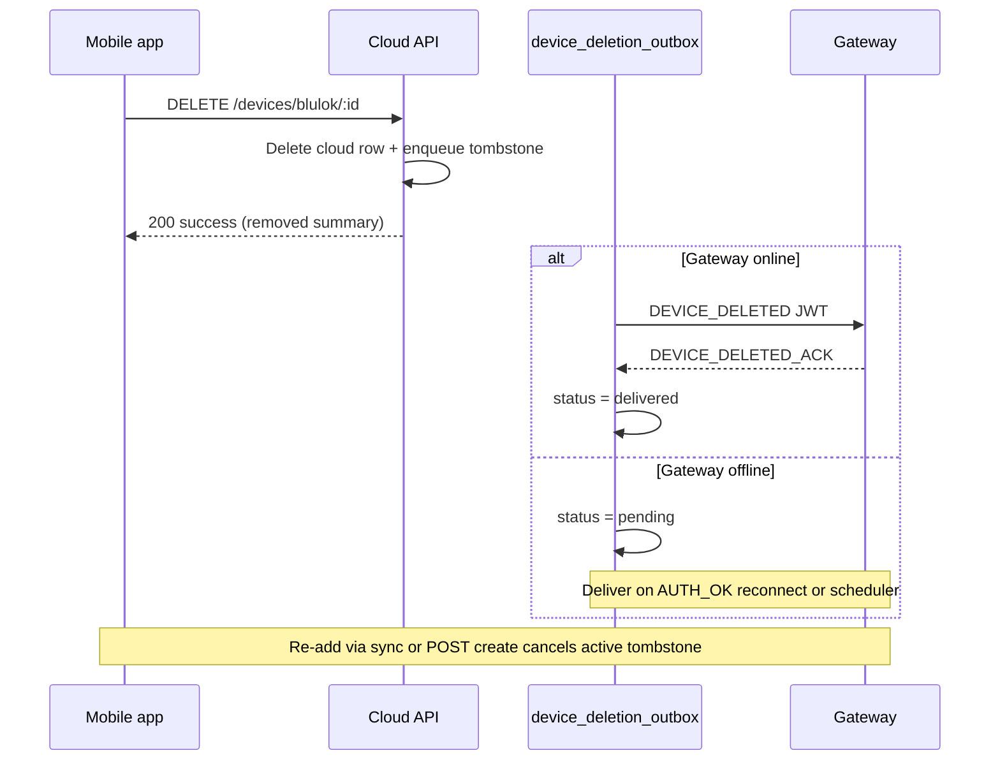

# App Guide — Assign / Unassign Locks to Units (Manager Mode)

This document is for **mobile app developers** wiring **manager mode** commissioning flows: linking an unassigned BluLok lock in cloud inventory to a storage unit, removing that link without deleting the lock from the facility, or **permanently removing a device from cloud inventory** (with a gateway tombstone).

**Summary:** The APIs **already exist**. No new backend endpoints are required for `facility_admin` (and global admin) users. Use the discovery endpoints below to resolve IDs, then call assign/unassign on the lock’s cloud UUID. For decommissioning, use the inventory **DELETE** routes in §11 (not unassign).

**Related docs:** [Facilities & devices schema](./facilities-devices-schema.md), [Auth & RBAC](./auth.md), [Device metadata / manual add](./device-metadata-editing.md), [Gateway device inventory](./gateway-device-inventory-payload.md), [Gateway integration — cloud inventory deletion](./gateway-integration.md#cloud-inventory-deletion-device_deleted), [Interactive API docs (Swagger)](./api-documentation.md).

**Live interactive docs (dev):** `{dev-backend-url}/api/docs`

---

## 1. Terminology (avoid confusion)

| Concept | What it is | API |
|--------|------------|-----|
| **Lock ↔ unit link** | Which BluLok cloud row is tied to which unit (`blulok_devices.unit_id`) | `POST …/assign`, `DELETE …/unassign` |
| **Tenant ↔ unit assignment** | Which customer has access to a unit | `POST /units/:id/assign`, `DELETE /units/:id/assign/:tenantId` |
| **Remove lock from cloud inventory** | Delete the device row entirely (manager/admin tooling); gateway tombstone | `DELETE /devices/blulok/:id`, `DELETE /devices/access-control/:id` — **not** unassign |

Manager mode commissioning is about the **lock ↔ unit link**, not tenant assignment.

---

## 2. Who can call these APIs (“manager mode”)

All assign/unassign routes use `requireAdminOrFacilityAdmin`:

| Role | Assign / unassign | List unassigned locks | Remove from cloud inventory |
|------|-------------------|------------------------|----------------------------|
| `dev_admin` | Yes (all facilities) | Yes | Yes (all facilities) |
| `admin` | Yes (all facilities) | Yes | Yes (all facilities) |
| `facility_admin` | Yes (assigned facilities only) | Yes | Yes (assigned facilities only) |
| `maintenance` | **403** | **403** | **403** |
| `blulok_technician` | **403** | **403** | **403** |
| `tenant` | **403** | **403** | **403** |

**Manager mode in the app** should authenticate as a user with role **`facility_admin`** (typical site manager) or **`admin` / `dev_admin`**. The JWT must include facility scope for facility admins (`user_facility_associations`).

If the app developer needs **`maintenance`** or **`blulok_technician`** to assign locks, that is a **product/RBAC gap** today — it would require a backend change to expand allowed roles.

---

## 3. Base URL and auth

- **Base path:** `/api/v1`
- **Auth:** `Authorization: Bearer <jwt>` from `POST /api/v1/auth/login`
- **Content-Type:** `application/json`

Example login:

```http
POST /api/v1/auth/login
Content-Type: application/json

{ "email": "manager@example.com", "password": "…" }
```

Use the returned token on every request below.

---

## 4. Recommended manager-mode flow



### Step A — Pick a facility

Facility admins only see assigned facilities. Use profile or facilities list:

```http
GET /api/v1/facilities
Authorization: Bearer …
```

### Step B — List units (see current lock, if any)

Either form works (both are mounted at `/api/v1`, same pattern as facility schedules):

```http
GET /api/v1/facilities/{facilityId}/units?limit=50&offset=0
Authorization: Bearer …
```

```http
GET /api/v1/units?facility_id={facilityId}&limit=50&offset=0
Authorization: Bearer …
```

Both accept `facility_id` or `facilityId` as a query param on `/units`. Results are always scoped to the requested facility when that filter is present.

Each unit may include `blulok_device` when a lock is linked. For a single unit:

```http
GET /api/v1/units/{unitId}
Authorization: Bearer …
```

**Response shape (excerpt):**

```json
{
  "success": true,
  "unit": {
    "id": "uuid",
    "unit_number": "A-101",
    "facility_id": "uuid",
    "blulok_device": {
      "id": "uuid",
      "device_serial": "LOCK-SERIAL-123",
      "lock_status": "locked",
      "device_status": "online"
    }
  }
}
```

If `blulok_device` is absent, the unit has no lock assigned.

### Step C — List unassigned locks in the facility

```http
GET /api/v1/devices/unassigned?facility_id={facilityId}&search={optionalSerial}&limit=50&offset=0
Authorization: Bearer …
```

**Query parameters:**

| Param | Description |
|-------|-------------|
| `facility_id` | **Recommended** — scope to one facility |
| `search` | Filter by hardware serial, facility name, or gateway name |
| `status` | Filter by `device_status` (e.g. `online`, `offline`) |
| `sortBy` / `sortOrder` | e.g. `device_serial`, `asc` |
| `limit` / `offset` | Pagination (default limit 30, max 200) |

**Response (excerpt):**

```json
{
  "success": true,
  "devices": [
    {
      "id": "cloud-uuid-use-this-for-assign",
      "device_serial": "LOCK-SERIAL-456",
      "device_status": "online",
      "lock_status": "locked",
      "battery_level": 85,
      "facility_name": "Main Storage",
      "gateway_name": "Gateway 1",
      "unit_id": null
    }
  ],
  "total": 1
}
```

**Important:** Assign/unassign use the cloud **`id`** (UUID), not `device_serial`. The serial is for display and gateway sync only.

**Alternative discovery:** `GET /api/v1/devices?device_type=blulok&facility_id={facilityId}` returns all locks; filter client-side where `unit_id` is null.

### Step D — Assign lock to unit

```http
POST /api/v1/devices/blulok/{deviceId}/assign
Authorization: Bearer …
Content-Type: application/json

{
  "unit_id": "uuid-of-target-unit"
}
```

**Success (200):**

```json
{
  "success": true,
  "message": "Device assigned to unit successfully"
}
```

**Business rules enforced by the server:**

1. Device and unit must belong to the **same facility** (via gateway).
2. **One lock per unit** — if the unit already has a different lock, the old lock is **automatically unassigned** first, then the new lock is linked.
3. If the lock is already assigned to **another** unit, the API returns **400** with a message to unassign first.
4. Assigning the same lock to the same unit again is a **no-op** (200).

### Step E — Unassign lock from unit

```http
DELETE /api/v1/devices/blulok/{deviceId}/unassign
Authorization: Bearer …
```

**Success (200):**

```json
{
  "success": true,
  "message": "Device unassigned from unit successfully"
}
```

**Behavior:**

- Clears `blulok_devices.unit_id` only — the lock **remains** in facility inventory and on the gateway.
- Unassigning a lock that is not on any unit is a **no-op** (200).
- Does **not** delete cloud inventory. For that, managers/admins use `DELETE /devices/blulok/:id` or `DELETE /devices/access-control/:id` (separate, destructive operation; gateway receives **`DEVICE_DELETED`** tombstone).

After unassign, confirm with `GET /units/:unitId` (`blulok_device` gone) or `GET /devices/unassigned` (lock reappears).

---

## 5. Optional: assign at device creation

When manually registering a lock (less common in app flows if gateway sync already created the row):

```http
POST /api/v1/devices/blulok
Authorization: Bearer …

{
  "gateway_id": "uuid",
  "device_serial": "LOCK-SERIAL-789",
  "unit_id": "optional-unit-uuid"
}
```

If `unit_id` is omitted, create then use `POST …/assign` as above. Same RBAC as assign (`facility_admin` scoped to gateway’s facility).

---

## 6. Side effects the app should expect

After assign/unassign, the backend:

1. Updates **`blulok_devices.unit_id`**
2. Syncs **unit-linked device group members** (`device_group_members` where `source_unit_id` matches)
3. Emits **device assigned / unassigned events** (activity feed, notifications pipeline)

**Downstream impact:**

- **Tenant route passes** (`lock:<device_serial>` audiences) apply only after a lock is linked to a unit the tenant can access.
- **Unit occupancy / stats** are driven by **tenant** assignments, not lock assignment — linking a lock does not mark a unit occupied.

The app does not need to call separate “sync” endpoints after assign/unassign; refresh unit/device lists locally.

---

## 7. Error handling reference

| HTTP | Typical cause | App action |
|------|---------------|------------|
| **401** | Missing/expired JWT | Re-login |
| **403** | Wrong role, or facility admin lacks facility access | Hide manager actions; show permission error |
| **400** | Missing `unit_id`, cross-facility mismatch, lock on another unit | Show server `message` |
| **404** | Invalid route or device not found (inventory DELETE only) | Refresh lists |
| **500** | Server error | Retry with backoff |

Example **400** messages from `DevicesService`:

- `unit_id is required`
- `Device not found` / `Unit not found`
- `Device and unit must belong to the same facility`
- `Device is already assigned to another unit. Unassign it first or change the assignment.`

---

## 8. Gaps and non-goals

### Already covered (no new API needed)

- Assign lock to unit
- Unassign lock from unit (keep in inventory)
- List unassigned locks per facility
- Read unit’s current lock via unit APIs
- Remove BluLok or access-control device from cloud inventory (gateway **`DEVICE_DELETED`** tombstone) — see §11

### Known gaps (only if product requires them)

| Gap | Notes |
|-----|--------|
| **`maintenance` / `blulok_technician` RBAC** | Cannot assign/unassign today; needs backend role change |
| **Unit-centric endpoint** | No `POST /units/:unitId/assign-lock`; use device-centric assign with `unit_id` body (same behavior) |
| **Assign by hardware serial only** | No `POST …/assign-by-serial`; resolve UUID via `GET /devices/unassigned?search=` first |
| **Bulk assign** | No batch endpoint; one lock at a time |

### Do not use for unassign

| Endpoint | Purpose |
|----------|---------|
| `DELETE /api/v1/devices/blulok/:id` | **Remove BluLok from cloud inventory** (`facility_admin`+ scoped) — gateway **`DEVICE_DELETED`** tombstone; offline delivery on reconnect |
| `DELETE /api/v1/devices/access-control/:id` | **Remove access control from cloud inventory** (`facility_admin`+ scoped) — same tombstone pattern |
| `DELETE /api/v1/units/:unitId/assign/:tenantId` | Remove **tenant** from unit |

---

## 9. Reference implementation

The web dashboard uses the same APIs:

- `frontend/src/services/api.service.ts` — `getUnassignedDevices`, `assignDeviceToUnit`, `unassignDeviceFromUnit`, `removeBluLokDeviceFromCloudInventory`, `removeAccessControlDeviceFromCloudInventory`
- `frontend/src/components/Devices/DeviceAssignmentModal.tsx` — unit picker UX
- `frontend/src/pages/DeviceDetailsPage.tsx` — “Remove from inventory” confirmation (BluLok + access control; hidden for tenants)
- E2E validation: `backend/scripts/ws-gateway-e2e.js` (sections “Device commissioning — HTTP unassign…” and inventory **DELETE** / **`DEVICE_DELETED`**)

Backend routes: `backend/src/routes/devices.routes.ts`  
Business logic: `backend/src/services/devices.service.ts` (`assignDeviceToUnit`, `unassignDeviceFromUnit`, `removeBluLokDeviceFromCloudInventory`, `removeAccessControlDeviceFromCloudInventory`)  
Gateway tombstone delivery: `backend/src/services/device-deletion-outbox.service.ts`

---

## 10. Quick test checklist (app developer)

### Assign / unassign

1. Log in as **facility_admin** assigned to the target facility.
2. `GET /devices/unassigned?facility_id=…` — note a lock `id`.
3. `GET /units?facility_id=…` — pick a unit without `blulok_device` (or one you intend to replace).
4. `POST /devices/blulok/{id}/assign` with `{ "unit_id": "…" }` → 200.
5. `GET /units/{unitId}` → `blulok_device.id` matches.
6. `DELETE /devices/blulok/{id}/unassign` → 200.
7. `GET /units/{unitId}` → no `blulok_device`; lock back in unassigned list.

Repeat step 4 on a unit that **already has a lock** to verify replacement (old lock becomes unassigned automatically).

### Remove from cloud inventory (optional)

8. Pick a test lock or access-control device in the facility (prefer one **not** linked to a production unit).
9. `DELETE /devices/blulok/{id}` or `DELETE /devices/access-control/{id}` → 200; note `removed` summary in the body.
10. `GET /devices/blulok/{id}` (or access-control equivalent) → **404**.
11. If the gateway is online, confirm firmware stops reporting the device on the next inventory sync (see §11).
12. Re-add the device (gateway sync or `POST /devices/blulok` / `POST /devices/access-control`) → active tombstone is **cancelled**; device row returns.

---

## 11. Remove device from cloud inventory (destructive)

Use this when a manager **decommissions** hardware from a facility — wrong device registered, spare removed from site, access-control relay retired, etc. This is **not** the same as **unassign** (§4 Step E): unassign keeps the cloud row and gateway inventory; inventory delete **removes the row** and tells the gateway to stop reporting the device.

### Unassign vs inventory delete

| Operation | Cloud row | Unit link | Gateway tombstone |
|-----------|-----------|-----------|-------------------|
| `DELETE …/unassign` | Kept | Cleared | None |
| `DELETE …/blulok/:id` or `DELETE …/access-control/:id` | **Deleted** | Cleared as part of delete (BluLok) | **`DEVICE_DELETED`** (unless delete came from gateway sync — see below) |

### Who can call

Same RBAC as assign/unassign (§2): `requireAdminOrFacilityAdmin`. Facility admins are scoped with:

- BluLok: `hasUserAccessToDevice(deviceId, userId, role)` — device’s gateway must belong to an assigned facility.
- Access control: `hasUserAccessToAccessControlDevice(…)` — same facility rule.

Cross-facility attempts return **403** `{ "success": false, "message": "Access denied to this device" }`.

### HTTP endpoints

**BluLok lock**

```http
DELETE /api/v1/devices/blulok/{deviceId}
Authorization: Bearer …
```

**Access control** (gates, doors, elevators, etc.)

```http
DELETE /api/v1/devices/access-control/{deviceId}
Authorization: Bearer …
```

Use the cloud **`id`** (UUID) from device detail or list APIs — same as assign/unassign.

**Success (200) — BluLok (excerpt):**

```json
{
  "success": true,
  "message": "Lock removed from cloud inventory. The gateway has been notified to stop reporting this device; if offline, the tombstone command will be delivered on reconnect.",
  "removed": {
    "gatewayId": "uuid",
    "facilityId": "uuid",
    "hadUnit": true,
    "unitId": "uuid-or-null",
    "deviceSerial": "LOCK-SERIAL-123"
  }
}
```

**Success (200) — access control (excerpt):**

```json
{
  "success": true,
  "message": "Access control device removed from cloud inventory. The gateway has been notified to stop reporting this device; if offline, the tombstone command will be delivered on reconnect.",
  "removed": {
    "gatewayId": "uuid",
    "facilityId": "uuid",
    "accessId": "AC-SERIAL-456",
    "relayChannel": 1
  }
}
```

The HTTP response returns **200 as soon as the cloud row is deleted** and the tombstone is enqueued. Gateway delivery may still be **pending** if the gateway is offline or recovery is blocking outbound traffic.

### What the cloud deletes

**BluLok**

1. `device_group_members` for this lock (`device_type: blulok`)
2. Unit-linked group members if the lock was assigned (`source_unit_id` = former `unit_id`)
3. The `blulok_devices` row
4. Side effects: `device_unassigned` event if it had a unit; `device_removed` event; optional **access-code push** to the gateway if removal affects access-code groups

**Access control**

1. `device_group_members` for this device (`device_type: access_control`)
2. The `access_control_devices` row
3. Side effects: `device_removed` event; optional access-code push if the device was in an access-code group

The app does **not** need a separate unassign call before inventory delete — BluLok unit linkage is cleared inside the delete transaction.

### App UX expectations

- Show a **destructive** confirmation; copy should mention gateway notification and offline reconnect delivery (match server `message`).
- After success: pop navigation or refresh lists — `GET` detail for that `id` will **404**.
- Hide the action for **tenant** (and other non-admin roles); web reference: `DeviceDetailsPage.tsx`.
- Do **not** treat inventory delete like unassign: the device will **not** appear in `GET /devices/unassigned` afterward.

### Gateway command: `DEVICE_DELETED`

After an admin/API delete (`source: admin_api`), the backend enqueues a row in **`device_deletion_outbox`** and attempts delivery. The gateway receives a **signed Ed25519 JWT** (same transport as lock commands) with payload:

| Field | BluLok | Access control |
|-------|--------|----------------|
| `cmd_type` | `"DEVICE_DELETED"` | `"DEVICE_DELETED"` |
| `facility_id` | facility UUID | facility UUID |
| `gateway_id` | gateway UUID | gateway UUID |
| `device_kind` | `"lock"` | `"access_control"` |
| `lock_id` | hardware serial (`device_serial`) | — |
| `access_id` | — | hardware serial (`device_serial`) |
| `relay_channel` | — | relay channel (default `1`) |
| `nonce` | UUID per delivery attempt | UUID per delivery attempt |

Example BluLok payload (before signing):

```json
{
  "cmd_type": "DEVICE_DELETED",
  "facility_id": "550e8400-e29b-41d4-a716-446655440011",
  "gateway_id": "…",
  "device_kind": "lock",
  "lock_id": "LOCK-SERIAL-123",
  "nonce": "…"
}
```

Example access-control payload (before signing):

```json
{
  "cmd_type": "DEVICE_DELETED",
  "facility_id": "550e8400-e29b-41d4-a716-446655440011",
  "gateway_id": "…",
  "device_kind": "access_control",
  "access_id": "AC-SERIAL-456",
  "relay_channel": 2,
  "nonce": "…"
}
```

Implementation: `DeviceDeletionOutboxService.buildDeviceDeletedJwt` in `backend/src/services/device-deletion-outbox.service.ts`.

Firmware/gateway behavior (local exclusion set, omitting tombstoned devices from inventory sync) is documented in [Gateway integration — Cloud inventory deletion](./gateway-integration.md#cloud-inventory-deletion-device_deleted).

### Gateway ACK: `DEVICE_DELETED_ACK`

The gateway replies with **`DEVICE_DELETED_ACK`**:

```json
{
  "nonce": "<same nonce as JWT>",
  "success": true
}
```

(`accepted: true` is also treated as success.) On ACK, the outbox row moves to **`delivered`**. Rejection or timeout (~12s) schedules a retry with backoff.

### Outbox delivery behavior (app-relevant summary)



| Situation | Outbox / gateway |
|-----------|------------------|
| Gateway **online** at delete | JWT sent immediately; awaits **`DEVICE_DELETED_ACK`** |
| Gateway **offline** | Row stays **`pending`**; flushed after **`AUTH_OK`** reconnect and by periodic scheduler |
| Device **re-added** before ACK | Active tombstone **cancelled** (`cancelled`) — manual `POST /devices/blulok` or `POST /devices/access-control`, or gateway inventory sync recreating the row |
| Delete initiated by **gateway sync** (device omitted from inventory) | Cloud row removed with `source: gateway_sync` — **no** tombstone enqueued (gateway already knows) |
| **Gateway recovery** blocking operational outbound | **`DEVICE_DELETED` deferred** — outbox stays deliverable; retries are **not** burned while blocked |

### Error handling (inventory delete)

| HTTP | Typical cause | App action |
|------|---------------|------------|
| **403** | Wrong role, or facility admin lacks access to device’s facility | Hide action; show permission error |
| **404** | Unknown `deviceId`, or already deleted | Refresh lists; navigate back |
| **400** | Missing `deviceId` in route | Fix client URL |
| **500** | Server error | Retry with backoff; cloud row may or may not be deleted — refresh before retry |

Inventory delete errors use the same auth re-login path as §7 (**401**).

### Cancelling a tombstone (re-commission)

If hardware is added back to the facility:

- **Gateway inventory sync** creating/updating the device row, or
- **Manual create** (`POST /api/v1/devices/blulok` / `POST /api/v1/devices/access-control`)

…calls `cancelForBlulok` / `cancelForAccessControl` on any active outbox row for that facility + serial (+ relay channel for access control). The app can treat a successful re-add as “device is live again” without calling a separate cancel API.
