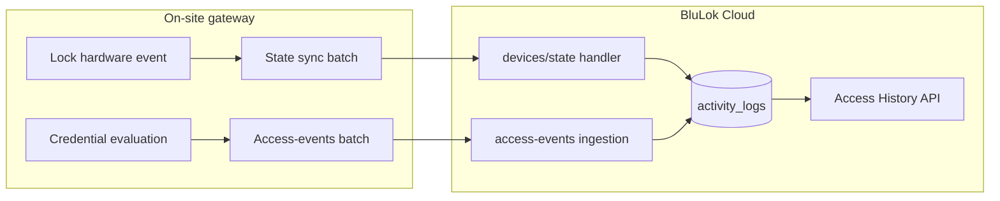

# Gateway access events — developer guide

How on-site gateways report **lock state changes** and **credential-based access** (grants, denials, keypad attempts) to BluLok Cloud so they appear in **Access History**, **Activity Monitor**, and real-time dashboard feeds.

**Source of truth (validation):** `backend/src/routes/internal-gateway.routes.ts`  
**Access-event ingestion:** `backend/src/services/access/access-event-ingestion.service.ts`  
**Type definitions:** `backend/src/services/access/access-event.types.ts`  
**Lock-state activity (BluLok):** `backend/src/services/device-event.service.ts`  
**Read-layer semantics:** `cursorDocs/access-notifications-activity-apis.md` § Access History Event Semantics

---

## Two reporting paths (do not mix them up)

BluLok Cloud uses **two separate mechanisms**. Choosing the wrong one produces missing or duplicate history rows.

| What happened | Gateway sends | Cloud `activity_type` | Access History `action` |
|---------------|---------------|----------------------|-------------------------|
| **Physical lock bolt moved** (local button, motor settled, manual turn) | `POST /devices/state` with `locked` / `state` | `lock` or `unlock` | `lock` / `unlock` |
| **Credential evaluated** (app, route pass, keypad code, policy denial) | `POST /access-events` | `access_attempt` | `access_granted`, `unlock_attempt`, etc. |
| **Cloud-initiated remote LOCK/UNLOCK** (JWT from cloud) | Confirm final state via `POST /devices/state` only | `lock` / `unlock` (attributed to initiating user) | `lock` / `unlock` with `remote_gateway` / `admin_remote` |
| **Admin remote open** (operator override at gateway) | `POST /access-events` with `admin_remote_open` | `access_attempt` | Shown as admin remote open |



### BluLok locks vs access control

| Device kind | Lock/unlock history from state sync? | Access attempts |
|-------------|--------------------------------------|-----------------|
| **BluLok** (`kind: lock`) | **Yes** — terminal `locked` / `unlocked` auto-logs | `POST /access-events` |
| **Access control** (`kind: access_control`) | **No** — state sync updates UI/telemetry only; relay open/close is **not** a separate lock row unless cloud had a pending remote command | **Required** — use `access_granted`, `access_denied`, `keypad_attempt`, `admin_remote_open` |

---

## Transport

Gateways call internal REST through the inbound WebSocket **`PROXY_REQUEST`** tunnel (same as inventory sync). See [`gateway-integration.md`](./gateway-integration.md) for `AUTH`, reconnect, and Cloud Run notes.

```json
{
  "type": "PROXY_REQUEST",
  "id": "<uuid-correlation-id>",
  "method": "POST",
  "path": "/internal/gateway/access-events",
  "headers": { "Content-Type": "application/json" },
  "body": { }
}
```

Cloud responds with `PROXY_RESPONSE` (`status`, `body`, same `id`).

| Item | Value |
|------|--------|
| REST path (proxy `path`) | `/internal/gateway/access-events` |
| Full HTTP URL (direct / tests) | `POST /api/v1/internal/gateway/access-events` |
| Auth | Facility-scoped JWT (`facility_admin`, `admin`, or `dev_admin`) |
| Facility scope | `X-Gateway-Facility-Id` header (injected by proxy) + optional `facility_id` in body |
| Lock state (separate endpoint) | `POST /internal/gateway/devices/state` — see [`gateway-device-inventory-payload.md`](./gateway-device-inventory-payload.md) |

**`facility_id` rules**

- `facility_admin`: body/query `facility_id` must match the authenticated gateway facility (cannot override `X-Gateway-Facility-Id`).
- `admin` / `dev_admin`: may specify `facility_id` in body when not using the header.
- Each event’s `facility_id` (if present) must equal the scoped facility or ingestion returns **400**.

---

## Path 1 — Lock / unlock state (`POST /devices/state`)

Use this when the **physical lock state** changes. Do **not** send `access-events` for a simple local lock or unlock on BluLok hardware.

### Request shape

```json
{
  "tid": 42,
  "facility_id": "<facility-uuid>",
  "updates": [
    {
      "kind": "lock",
      "lock_id": "ae4097b2-16b3-4b1d-b964-6021c7be6ea2",
      "state": "CLOSED",
      "locked": true,
      "online": true,
      "last_seen": "2026-06-16T23:26:00.000Z",
      "source": "GATEWAY"
    }
  ]
}
```

### Field mapping (locks)

| Gateway field | Terminal values | Cloud `lock_status` | Logged in Access History? |
|---------------|-------------------|---------------------|---------------------------|
| `state: "CLOSED"` or `locked: true` | Settled locked | `locked` | **Yes** → `lock` |
| `state: "OPENED"` or `locked: false` | Settled unlocked | `unlocked` | **Yes** → `unlock` |
| `state: "ERROR"` | Fault | `error` | No (status/telemetry only) |
| `state: "UNKNOWN"` | Unknown | `unknown` | No |

`source` (`GATEWAY`, `USER`, `CLOUD`) is accepted on the payload but is **not** used to choose access-history attribution. Attribution for remote commands is determined by whether the cloud recently issued a LOCK/UNLOCK JWT for that device.

### Transitional states

You may report in-flight states for live UI (`locking`, `unlocking` via repeated updates). **Access History list/export only includes terminal `lock` and `unlock`**, not transitional rows.

### Remote commands (cloud → gateway JWT)

When the cloud sends `LOCK` / `UNLOCK` JWTs:

1. Gateway executes on hardware.
2. Gateway reports **final** state through `devices/state`.
3. Cloud attributes the activity to the initiating user (`remote_gateway` or `admin_remote`) when the pending command matches.
4. If the final state **opposes** the requested command (e.g. unlock requested, lock observed), cloud logs an **`access_attempt` failure** (`unlock_attempt` / `lock_attempt`) — **do not** send a compensating `access-events` row for that mismatch.

### Access control state updates

```json
{
  "updates": [
    {
      "kind": "access_control",
      "access_id": "KP-7F2A-001",
      "relay_channel": 1,
      "locked": false,
      "online": true,
      "last_seen": "2026-06-16T23:26:00.000Z"
    }
  ]
}
```

This updates `is_locked` / online status and dashboard WebSocket feeds. It does **not** create Access History rows for local relay activity. Send **`access-events`** when a user/credential actually opened or was denied.

---

## Path 2 — Access events (`POST /access-events`)

Use this for **authorization outcomes**: mobile app unlock, route pass validation, keypad codes, admin override, denials.

### Top-level body

| Field | Required | Type | Notes |
|-------|----------|------|-------|
| `events` | **yes** | array | Min 1 event per request |
| `facility_id` | no | string | Defaults to scoped facility |
| `tid` | no | number \| string | Correlation only; echoed by gateway proxy patterns |

Events in one request are processed **sequentially**. There is no server-side deduplication by `event_id` today — use unique `event_id` values and avoid retries with new IDs unless you intend duplicate history rows.

### Per-event schema

| Field | Required | Type | Notes |
|-------|----------|------|-------|
| `event_id` | **yes** | string | Unique idempotency key (stored in metadata; not deduped yet) |
| `occurred_at` | **yes** | ISO-8601 UTC | When the event happened **on site**, not when the HTTP request was sent |
| `device_id` | **yes** | string | **Cloud device row UUID** — see [Device identifiers](#device-identifiers) |
| `facility_id` | no | string | Must match scoped facility |
| `unit_id` | no | string | Unit UUID when known; validated against facility |
| `gateway_id` | no | string | Cloud `gateways.id` — recommended for tracing |
| `correlation_id` | no | string | Tie to cloud command JWT / local trace |
| `action` | **yes** | enum | See [Actions](#actions) |
| `method` | **yes** | enum | See [Methods](#methods) |
| `success` | **yes** | boolean | `true` = granted / succeeded |
| `denial_reason` | **yes when `success: false`** | enum | See [Denial reasons](#denial-reasons) |
| `reason_message` | no | string | Max 500 chars; free-text detail shown in UI |
| `actor` | recommended | object | Who attempted access — see [Actor](#actor) |
| `keypad` | no | object | Keypad context — see [Keypad context](#keypad-context) |
| `route_pass` | no | object | Route pass trace fields |
| `metadata` | no | object | Opaque extension bag (merged into activity metadata) |

### Actions

| `action` | When to use | `success: true` | `success: false` |
|----------|-------------|-----------------|------------------|
| `access_granted` | App, mobile key, or route pass allowed entry | Normal grant | Rare — use denial action instead |
| `access_denied` | Policy/credential rejection (app, route pass, etc.) | N/A | **Required** + `denial_reason` |
| `keypad_attempt` | Keypad code entered on device or access controller | Code accepted | Code rejected / out of schedule |
| `admin_remote_open` | Operator forced open from gateway/UI | Open succeeded | Open failed |

**UI mapping:** `access_denied` and failed `keypad_attempt` rows are shown as **`unlock_attempt`** in Access History with structured `denial_reason`.

### Methods

| `method` | Meaning |
|----------|---------|
| `app` | BluLok mobile app |
| `mobile_key` | Mobile key / BLE credential |
| `keypad` | Physical keypad code |
| `route_pass` | Signed route-pass JWT |
| `admin_remote` | Admin/facility-admin override |
| `system` | Automated / system-initiated |
| `unknown` | Last resort |

### Denial reasons

Required when `success` is `false`.

| `denial_reason` | Typical scenario |
|-----------------|------------------|
| `out_of_schedule` | Outside allowed time window |
| `route_pass_expired` | Route pass past validity |
| `route_pass_invalid_signature` | JWT/signature verification failed |
| `route_pass_wrong_lock` | Pass not valid for this lock |
| `denylist_blocked` | User or device on denylist |
| `insufficient_permissions` | Role/key does not allow action |
| `invalid_credential` | Bad PIN, key, or app proof |
| `internal_error` | Gateway-side processing error |
| `unknown_error` | Unclassified failure |
| `other` | Generic denial |

Human-readable labels are applied in the read layer (`DENIAL_REASON_MESSAGES` in `backend/src/constants/access-history.constants.ts`).

### Actor

```json
{
  "user_id": "<cloud-users.id UUID>",
  "role": "tenant",
  "name": "Jane Tenant",
  "app_device_id": "<optional mobile device id>"
}
```

| `role` | Use when |
|--------|----------|
| `tenant` | Primary unit tenant |
| `shared_user` | Shared-key holder |
| `facility_admin` | Facility operator |
| `admin` | Platform admin |
| `dev_admin` | Dev admin |
| `maintenance` | Maintenance staff |
| `system` | No human actor |
| `gateway` | Gateway-automated (rare for access-events) |
| `unknown` | Actor not identified |

`user_id` should be the **cloud user UUID** when known so Access History can link to the user profile. Local-only actors without a cloud user may omit `user_id` but should still set `role` and `name` when possible.

### Keypad context

```json
{
  "entered_code": "1234",
  "code_id": "<optional>",
  "code_label": "Front gate daily",
  "schedule_id": "<optional>",
  "schedule_name": "Night Schedule",
  "zone_id": "<optional>",
  "zone_name": "Zone A"
}
```

**Security:** `entered_code` is **always redacted** to `***REDACTED***` before persistence. Send it if your pipeline already has it; the cloud will not store the raw digits.

### Route pass context

```json
{
  "route_pass_id": "<optional>",
  "issuance_id": "<optional>",
  "nonce": "<optional>"
}
```

Used for support/debug correlation only; not shown verbatim to tenants.

---

## Device identifiers

| API | Identifier to send | Example |
|-----|-------------------|---------|
| `devices/state` (locks) | Hardware **`lock_id`** (same as inventory `lock_id` / `device_serial`) | `ae4097b2-16b3-4b1d-b964-6021c7be6ea2` |
| `devices/state` (access) | **`access_id`** + **`relay_channel`** (default 1) | `KP-7F2A-001::2` |
| **`access-events`** | **Cloud row UUID** | `blulok_devices.id` or `access_control_devices.id` |

`access-events` joins activity rows to device names and unit links by **cloud primary key**. Sending `lock_id` instead of cloud UUID will ingest but **breaks enrichment** in Access History (missing device name, wrong joins).

### Building `lock_id` → cloud `device_id` map

Inventory sync keys devices by `lock_id` but the sync response today reports hardware identifiers in `entries[]`, not cloud UUIDs. Recommended approaches:

1. **Access control:** `GET /internal/gateway/access-codes` returns `device_id` per relay — cache that map.
2. **BluLok:** Maintain a local map as devices are commissioned. After auto-provision from inventory, resolve cloud IDs via your operator tooling or a one-time facility device export until an internal list endpoint exists.
3. Always send the **same** `device_id` you will use for unit assignment and cloud APIs.

Cross-facility `device_id` values are rejected with **400** (`device_id does not belong to scoped facility`).

---

## Response

### Success (`200`)

```json
{
  "success": true,
  "data": {
    "facility_id": "<facility-uuid>",
    "ingested": 3,
    "activity_ids": [
      "<activity_logs.id>",
      "<activity_logs.id>",
      "<activity_logs.id>"
    ]
  }
}
```

Each `activity_ids` entry is the persisted `activity_logs` row. Real-time subscribers receive `activity_new` on the **dashboard** WebSocket (`/ws`) with an enriched `accessLog` payload matching `GET /api/v1/access-history`.

### Validation errors (`400`)

| Condition | Typical message |
|-----------|-----------------|
| `success: false` without `denial_reason` | Joi custom validation error |
| Invalid `action` / `method` / `denial_reason` enum | Joi enum message |
| `facility_id` mismatch | `facility_id must match scoped facility` |
| `unit_id` not in facility | `unit_id does not belong to scoped facility` |
| `device_id` foreign facility | `device_id does not belong to scoped facility` |
| Missing `events` or empty array | Joi min length error |

### Auth errors

| HTTP | Cause |
|------|--------|
| 401 | Missing/invalid JWT |
| 403 | Wrong role or facility scope |
| 400 | Missing `facility_id` / header |

**Note:** `access-events` is **not** blocked during gateway recovery (unlike `devices/inventory` which returns **409** `recovery_in_progress`).

---

## Complete examples

### 1 — Mobile app access granted (BluLok)

```json
{
  "facility_id": "550e8400-e29b-41d4-a716-446655440011",
  "events": [
    {
      "event_id": "evt-20260616-001",
      "occurred_at": "2026-06-16T23:20:00.000Z",
      "facility_id": "550e8400-e29b-41d4-a716-446655440011",
      "unit_id": "unit-uuid",
      "device_id": "cloud-blulok-device-uuid",
      "gateway_id": "gateway-uuid",
      "action": "access_granted",
      "method": "app",
      "success": true,
      "actor": {
        "user_id": "tenant-user-uuid",
        "role": "tenant",
        "name": "Primary Tenant"
      }
    }
  ]
}
```

Then report physical unlock when the bolt moves:

```json
{
  "updates": [
    {
      "kind": "lock",
      "lock_id": "ae4097b2-16b3-4b1d-b964-6021c7be6ea2",
      "locked": false,
      "state": "OPENED"
    }
  ]
}
```

Access History shows **two rows**: grant (`access_granted` / unlock attempt success path) and **Unlock** (`local_device`) — that is expected when both credential evaluation and physical state are reported.

### 2 — Route pass denied (bad signature)

```json
{
  "events": [
    {
      "event_id": "evt-20260616-002",
      "occurred_at": "2026-06-16T23:21:00.000Z",
      "facility_id": "550e8400-e29b-41d4-a716-446655440011",
      "unit_id": "unit-uuid",
      "device_id": "cloud-blulok-device-uuid",
      "action": "access_denied",
      "method": "route_pass",
      "success": false,
      "denial_reason": "route_pass_invalid_signature",
      "actor": {
        "user_id": "shared-user-uuid",
        "role": "shared_user",
        "name": "Shared User"
      },
      "route_pass": {
        "nonce": "abc123"
      }
    }
  ]
}
```

### 3 — Keypad denied (out of schedule)

```json
{
  "events": [
    {
      "event_id": "evt-20260616-003",
      "occurred_at": "2026-06-16T23:22:00.000Z",
      "facility_id": "550e8400-e29b-41d4-a716-446655440011",
      "unit_id": "unit-uuid",
      "device_id": "cloud-blulok-device-uuid",
      "action": "keypad_attempt",
      "method": "keypad",
      "success": false,
      "denial_reason": "out_of_schedule",
      "keypad": {
        "entered_code": "1234",
        "schedule_name": "Night Schedule",
        "zone_name": "Zone A"
      }
    }
  ]
}
```

### 4 — Admin remote open (access control door)

```json
{
  "events": [
    {
      "event_id": "evt-20260616-004",
      "occurred_at": "2026-06-16T23:23:00.000Z",
      "facility_id": "550e8400-e29b-41d4-a716-446655440011",
      "device_id": "cloud-access-control-device-uuid",
      "action": "admin_remote_open",
      "method": "admin_remote",
      "success": true,
      "actor": {
        "user_id": "facility-admin-uuid",
        "role": "facility_admin",
        "name": "Facility Admin"
      }
    }
  ]
}
```

### 5 — Local lock at device (no access-event)

User turns a thumbturn / motor completes lock — **only** state sync:

```json
{
  "updates": [
    {
      "kind": "lock",
      "lock_id": "ae4097b2-16b3-4b1d-b964-6021c7be6ea2",
      "locked": true,
      "state": "CLOSED",
      "source": "USER"
    }
  ]
}
```

Access History shows **Lock** / **Local device** / **Success** with no user column.

### 6 — Batch ingest

```json
{
  "tid": 9001,
  "facility_id": "550e8400-e29b-41d4-a716-446655440011",
  "events": [
    { "...": "access_granted event" },
    { "...": "access_denied event" },
    { "...": "keypad_attempt event" }
  ]
}
```

---

## What the operator UI shows

After ingestion, `AccessHistoryReadService` maps rows for the API:

| Ingested | API `action` | API `method` | Status |
|----------|--------------|--------------|--------|
| `access_granted` + success | `access_granted` | preserved | success |
| `access_denied` | `unlock_attempt` | preserved | failed |
| `keypad_attempt` + failure | `unlock_attempt` | `keypad` | failed |
| `keypad_attempt` + success | `keypad_attempt` | `keypad` | success |
| `admin_remote_open` | `admin_remote_open` | `admin_remote` | per `success` |
| State sync `lock` | `lock` | `local_device` or remote | success |
| State sync `unlock` | `unlock` | `local_device` or remote | success |

Presentation metadata includes facility, unit, device name (from `device_settings.displayName` / lock number), initiator links, and `failure_summary` for denials.

---

## Implementation checklist

- [ ] Authenticate `/ws/gateway` with facility-scoped JWT before any PROXY calls.
- [ ] Map hardware `lock_id` → cloud `device_id` before sending `access-events`.
- [ ] Send **`devices/state`** for every terminal BluLok lock/unlock.
- [ ] Send **`access-events`** for credential evaluation (grant/deny/keypad/admin open).
- [ ] Always include `denial_reason` when `success: false`.
- [ ] Use UTC ISO-8601 for `occurred_at`.
- [ ] Use unique `event_id` per logical event; retry the same `event_id` only if you accept duplicate rows today.
- [ ] Do **not** send `access-events` for cloud-initiated LOCK/UNLOCK JWT results — state sync is enough.
- [ ] Do **not** send `access-events` for BluLok local lock/unlock — state sync is enough.
- [ ] For access control doors/gates, send **`access-events`** for user-visible access outcomes.
- [ ] Include `unit_id` when the event targets a specific storage unit.
- [ ] Include `actor` with cloud `user_id` when the mobile app or shared user is known.

---

## Testing

| Test | Location |
|------|----------|
| HTTP validation (missing `denial_reason`) | `backend/src/__tests__/routes/internal-gateway.routes.test.ts` |
| Ingestion → activity metadata | `backend/src/__tests__/services/access-history-read.service.test.ts` |
| Lock activity from state sync | `backend/src/__tests__/services/device-event.lock-activity.test.ts` |
| End-to-end PROXY + live `activity_new` | `backend/npm run ws:e2e` — **Access Event Canonical Pipeline** section |

Minimal curl-style test (facility admin token):

```bash
curl -sS -X POST "$API_BASE/api/v1/internal/gateway/access-events" \
  -H "Authorization: Bearer $FACILITY_ADMIN_JWT" \
  -H "X-Gateway-Facility-Id: $FACILITY_ID" \
  -H "Content-Type: application/json" \
  -d '{
    "facility_id": "'"$FACILITY_ID"'",
    "events": [{
      "event_id": "manual-test-1",
      "occurred_at": "2026-06-16T12:00:00.000Z",
      "facility_id": "'"$FACILITY_ID"'",
      "device_id": "'"$CLOUD_DEVICE_ID"'",
      "action": "access_granted",
      "method": "app",
      "success": true,
      "actor": { "role": "tenant", "name": "Test Tenant" }
    }]
  }'
```

---

## Related docs

- [`gateway-integration.md`](./gateway-integration.md) — WebSocket auth, PROXY tunnel, recovery, telemetry
- [`gateway-device-inventory-payload.md`](./gateway-device-inventory-payload.md) — `devices/inventory` and `devices/state` field reference
- [`access-notifications-activity-apis.md`](./access-notifications-activity-apis.md) — operator REST/WebSocket for activity & access history
- [`route-pass-jwt.md`](./route-pass-jwt.md) — route pass format validated before `route_pass_*` denial reasons
