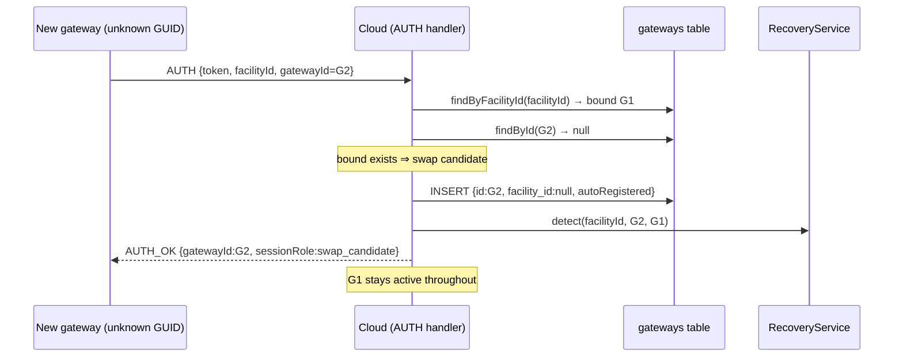

# Design — Seamless Gateway Auto-Registration over WebSocket

**Status:** Implemented  
**Related:** [Gateway Swap / Recovery — Operator & Developer Guide](./gateway-swap-recovery-operators-guide.md), [Gateway Swap / Recovery Architecture](./gateway-swap-recovery-architecture.md), [Gateway ↔ Cloud integration](./gateway-integration.md), [Gateway ZTP sticker](./gateway-ztp-sticker-design.md)

---

## 1. Goal

Let a replacement (or first) gateway **register itself by simply connecting** over the gateway WebSocket, instead of requiring a sys admin to pre-create a `gateways` row and flash the resulting GUID onto the device.

- A new gateway connects → the cloud creates its record automatically.
- The currently **live (bound) gateway session stays intact** the entire time.
- Auto-registered swap units appear directly in **Facility → Gateway → Swap / Recovery**.

Non-goal: changing the phased recovery pipeline or the “don’t trust new hardware” guarantee. Auto-registration only **creates/parks** a gateway; it never silently grants it production trust (except the explicit first-install auto-bind in §4.2).

---

## 2. Decisions (locked)

| Topic | Decision |
|-------|----------|
| **Identity** | Device sends its gateway **GUID** (`gateways.id`) in `AUTH.gatewayId` — the same GUID shown in the Swap / Recovery tab. Unknown GUID ⇒ find-or-create on that GUID. Dedup is on the **primary key**; no new MAC/serial column. |
| **Gating** | The only gate is the **existing AUTH credential**: a valid JWT that is `facility_admin` **scoped to this facility**, or `admin` / `dev_admin` (any facility). |
| **First gateway (empty facility)** | If the facility has **no bound gateway**, auto-create **and auto-bind** the connecting gateway as the `active` session (first-time install) — **unless** `GATEWAY_ZTP_REQUIRED=true` (then sticker claim is required; JWT greenfield bind is rejected). |
| **Existing bound gateway** | Auto-create an **unbound** gateway (`facility_id = null`) and park it as `swap_candidate`; the bound gateway keeps the `active` session. |
| **Coexistence with ZTP** | Lab default keeps this JWT auto-register path. Production may set `GATEWAY_ZTP_REQUIRED` so greenfield bind uses [sticker ZTP](./gateway-ztp-sticker-design.md) only. Swap/recovery is unchanged. |

---

## 3. Current behavior (what changes)

The device GUID must already exist as a row, or AUTH is rejected:

```597:609:backend\src\services\gateway\websocket-gateway.transport.ts
            const newGateway = gatewayModel ? await gatewayModel.findById(gatewayId) : null;
            if (!newGateway) {
              logger.warn(`Gateway WS AUTH failed (unknown gatewayId) gateway=${gatewayId} facility=${facilityId}`);
              safeSend(ws, { type: 'ERROR', code: 'AUTH_FAILED', message: 'Unknown gatewayId' });
              return closeAndCleanup();
            }
            if (newGateway.facility_id && newGateway.facility_id !== facilityId) {
              ...
              safeSend(ws, { type: 'ERROR', code: 'AUTH_FORBIDDEN', message: 'Gateway belongs to another facility' });
              return closeAndCleanup();
            }
            sessionRole = 'swap_candidate';
```

**Change:** “unknown GUID” stops being fatal. Instead it triggers find-or-create, with the bound/unbound branch deciding `active` vs `swap_candidate`.

Today’s manual path (`POST /api/gateways` then flash GUID) still works unchanged — auto-registration is purely additive.

---

## 4. Proposed AUTH flow

The device generates a **stable UUID once** (first boot / manufacture), persists it locally, and sends it as `AUTH.gatewayId` on every connect. `AUTH_OK` already echoes `gatewayId`, so firmware can confirm/cache it.

### 4.1 Decision tree (AUTH handler)

```
AUTH received (token, facilityId, gatewayId)
├─ token invalid                         → AUTH_FAILED (unchanged)
├─ role not facility_admin/admin/dev      → AUTH_FORBIDDEN (unchanged)
├─ facility_admin not scoped to facility  → AUTH_FORBIDDEN (unchanged)
├─ gatewayId missing/not a valid UUID     → AUTH_BAD_REQUEST (new validation)
│
├─ bound = gateways.findByFacilityId(facilityId)
│
├─ gatewayId === bound?.id                → sessionRole = active (unchanged)
│
├─ existing = gateways.findById(gatewayId)
│   ├─ exists & facility_id is another facility → AUTH_FORBIDDEN (unchanged)
│   ├─ exists & bound present                    → swap_candidate (unchanged)
│   └─ exists & no bound                         → auto-bind path (§4.2)
│
└─ NOT exists  (the new behavior)
    ├─ no bound gateway → CREATE row {id: gatewayId, facility_id: facilityId} + AUTO-BIND active (§4.2)
    └─ bound gateway    → CREATE row {id: gatewayId, facility_id: null}        + PARK swap_candidate (§4.3)
```

### 4.2 First-install auto-bind (empty facility)

- Atomic “create-and-bind if no bound gateway exists” (transaction) to avoid a race where two gateways connect at once. Loser of the race falls through to swap-candidate.
- New row: `id = gatewayId`, `facility_id = facilityId`, `status = 'online'`, `last_seen = now`, `gateway_type = 'physical'`, `key_management_version = 'v2'`, `name = <facility name>` (operator-renamable), `metadata.autoRegistered = true`.
- Set as the facility `active` session exactly like the current active path (`facilityToClient.set`).
- Emit audit/activity event `gateway_auto_registered` (bound=true).

### 4.3 Swap-candidate auto-register (bound gateway present)

- New row: `id = gatewayId`, `facility_id = null`, `status = 'online'`, `last_seen = now`, `name = "Swap candidate <short-guid>"`, `metadata.autoRegistered = true`.
- Park in `swapCandidates`, then call `GatewayRecoveryService.detect(facilityId, gatewayId, bound.id)` exactly as today.
- Bound gateway session is **untouched**.
- Emit audit/activity event `gateway_auto_registered` (bound=false).

### 4.4 Sequence (swap case)



---

## 5. Security analysis (remote locking system)

| Concern | Mitigation |
|---------|------------|
| Client supplies the primary key (GUID) | Validate **well-formed UUID v4**; reject otherwise. Accepting a PK is acceptable because the JWT is already facility-scoped and privileged. |
| Rogue valid-JWT holder spams gateway rows | (a) JWT is already scoped to the holder’s facilities. (b) Cap **unbound swap candidates per facility** (e.g. ≤ 3). (c) Per-user/facility **rate-limit** of auto-creates. (d) Audit every creation. |
| Hijacking another facility’s gateway | Unchanged guard: if GUID exists and is bound to a **different** facility → `AUTH_FORBIDDEN`. |
| Silent production takeover | Auto-register **never binds** when a bound gateway exists — only parks as candidate. Binding still requires operator-initiated recovery + `finalizeRecovery` (or explicit bypass). |
| First-install auto-bind abuse | Only fires for a facility with **zero** bound gateways; the JWT must already be scoped to that facility. Atomic create-and-bind prevents double-bind races. |
| Trust boundary expansion | None: the same JWT can already open the facility’s `active` session and issue lock commands today. Auto-registering an unbound candidate is strictly less powerful. |

**Net:** the trust gate is the JWT (as the user specified). The new code must add UUID validation, a per-facility candidate cap, rate limiting, and audit events.

---

## 6. Implementation plan (files & changes)

### Backend

1. **`backend/src/services/gateway/websocket-gateway.transport.ts`** (AUTH handler ~569–636)
   - Validate `gatewayId` is a well-formed UUID before the bound lookup.
   - Replace the unknown-GUID hard reject with the §4 decision tree.
   - Reuse existing `active` / `swap_candidate` session wiring; only the “create row” step is new.

2. **`backend/src/models/gateway.model.ts`**
   - `createWithId(id, data)` — insert honoring a supplied PK (current `create()` generates its own UUID); used for unbound swap candidates.
   - `createOrBindAsFirstGateway({ id, facilityId, name, metadata })` — transactional: insert-or-bind only if `findByFacilityId` is still null; returns `{ bound, created, gateway }`.
   - Swap-candidate **cap** is enforced in-memory in the transport via `countSwapCandidatesForFacility` (candidates are unbound rows tracked per-facility in the WS map).

3. **Audit / events**
   - Add `gateway_auto_registered` activity log (actor = gateway/JWT user, facility, gatewayId, bound flag). Reuse `ActivityService`.

4. **Rate limiting / cap**
   - In-memory per-facility throttle in the transport (consistent with existing in-memory routing) + hard cap on parked candidates per facility.

5. **`backend/src/services/gateway/message-types.ts`**
   - Update `AuthMessage.gatewayId` doc comment: “device-generated stable UUID; unknown ⇒ auto-registered”.
   - Optionally add `autoRegistered?: boolean` to `AuthOkMessage` so firmware logs first registration.

### No DB migration required
Dedup is on the existing `gateways.id` primary key. `facility_id` is already nullable. We only set `metadata.autoRegistered`.

### Frontend
- Auto-registered candidates surface via `GET /gateways/facility/:facilityId/recovery/candidates` and the **Swap / Recovery** tab.
- Optional polish: badge auto-registered candidates (“auto-registered”) in the Swap / Recovery tab; allow rename of the generated `name`.

### Docs
- **Operator guide §2**: mark “create gateway record” as **optional** — first connect auto-registers.
- **§5.1**: replace manual mint/flash steps with “flash the device’s stable GUID; it auto-registers on connect”.
- **§6.1**: AUTH section — “send your stable GUID; unknown GUID auto-registers (unbound swap candidate, or auto-bound if facility has no gateway)”.
- **§11 troubleshooting**: “unknown gatewayId” is no longer fatal; add UUID-format and candidate-cap errors.

---

## 7. Test plan

**Transport AUTH (unit):**
- Unknown GUID + bound gateway present → row created `facility_id=null`, parked `swap_candidate`, `detect()` called, bound session untouched.
- Unknown GUID + no bound gateway → row created + bound, `sessionRole=active`.
- Concurrent unknown GUIDs to empty facility → exactly one `active`, others `swap_candidate` (atomic bind).
- Malformed/non-UUID gatewayId → `AUTH_BAD_REQUEST`, no row created.
- GUID exists bound to another facility → `AUTH_FORBIDDEN` (regression).
- Candidate cap exceeded → reject with clear error, no row created.
- Known bound GUID → `active` (regression, unchanged).

**Model (unit):** `createAndBindIfNoBound` atomicity; `createWithId` honors PK; cap/count query.

**E2E (`ws-gateway-e2e.js`):** connect a brand-new GUID **without** pre-creating the row → appears in candidates API; bound gateway stays active; inventory still 409 while blocking; recovery completes and rebinds.

**Regression:** existing swap/recovery suites (`test:serial`), frontend recovery tests, full `ws:e2e`.

---

## 8. Resolved decisions (implemented)

1. **Candidate cap = 3** per facility; **rate limit = 5 auto-creates / 10 min / facility** (`MAX_SWAP_CANDIDATES_PER_FACILITY`, `AUTO_REGISTER_MAX_PER_WINDOW`, `AUTO_REGISTER_WINDOW_MS` in `websocket-gateway.transport.ts`).
2. Auto-generated names: facility name when bound (fallback `"Gateway <short-guid>"`) / `"Swap candidate <short-guid>"` while unbound. Operator-renamable (sets `displayNameSetByOperator`).
3. First-install auto-bind does **not** require a no-recovery guard (empty facility).
4. `autoRegistered` **added** to `AUTH_OK` (true only on the connect that created the record).

## 9. Implementation notes

- **No DB migration** — dedup on `gateways.id` primary key; `facility_id` already nullable; `metadata.autoRegistered` set on auto-created rows.
- UUID format is validated **only before creating** a new record, so existing known (possibly legacy non-UUID) GUIDs keep working.
- Auto-create branches reject with `AUTH_BAD_REQUEST` (bad UUID), `AUTH_FORBIDDEN` (other facility / cap), or `AUTH_RATE_LIMITED`.
- Tests: `ws-gateway.transport.autoregister.test.ts`, `gateway.model.test.ts`, `gateway-auto-register.utils.test.ts`.

## 10. Gateway display-name provenance

`gateways.name` is the canonical cloud display name. It is never supplied by WebSocket `AUTH`: firmware sends only `token`, `facilityId`, `gatewayId`, and optional `firmware_version`.

- First-install / bind defaults `gateways.name` to the **facility name** (fallback `"Gateway <short-guid>"` if the facility row has no name).
- Swap-candidate auto-registration assigns `"Swap candidate <short-guid>"` until the candidate is promoted/bound.
- Add Facility does **not** create a gateway row — operators create the facility, then point hardware at it; the gateway registers over WebSocket.
- Reconnects and `kind: "gateway"` inventory updates do not change the name.
- Authorized operators can rename the bound gateway from **Facility → Gateway → Overview**; that sets `metadata.displayNameSetByOperator=true` so later binds/promotes keep the custom name.
- **Rebind safety:** binding an unbound GUID uses the current facility name unless the operator-set flag is present. After swap/recovery, the retired gateway is unbound as `"Unbound gateway <short-guid>"` with the operator-set flag cleared.
