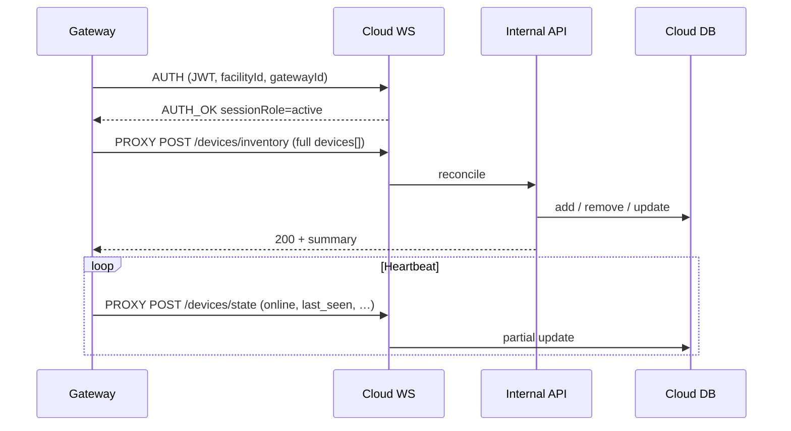

# Gateway device sync — developer guide

Comprehensive reference for **gateway firmware developers** on how BluLok Cloud learns which devices exist, keeps telemetry current, and reconciles with **admin-created (manual)** devices.

**Audience:** Java mesh-manager / gateway team implementing PROXY calls over `/ws/gateway`.

**Companion docs (field tables):** [Gateway device inventory & state payload reference](./gateway-device-inventory-payload.md)  
**Transport & auth:** [Gateway ↔ Cloud integration](./gateway-integration.md) — includes **device reachability coercion** (display-only; does not alter inventory/state sync payloads written to DB or recovery snapshots)  
**Swap / recovery (blocks inventory):** [Gateway Swap / Recovery — Operator & Developer Guide](./gateway-swap-recovery-operators-guide.md)

---

## 1. Mental model

BluLok separates **membership** from **telemetry**:

| Concern | Gateway API | Cloud behavior |
|---------|-------------|----------------|
| **What devices exist on this gateway?** | `POST …/devices/inventory` | Full **reconcile**: add missing sync-managed rows, remove omitted sync-managed rows, refresh identity/metadata fields |
| **What changed since last heartbeat?** | `POST …/devices/state` | **Non-destructive partial update** — only fields you send are written; omitted fields are left unchanged |
| **Who deleted a device?** | Cloud → gateway `DEVICE_DELETED` | Gateway records a **tombstone** and omits that device from future inventory uploads |

The gateway never calls these HTTP routes directly. It sends **`PROXY_REQUEST`** frames on the authenticated WebSocket; the cloud executes the internal route with the caller’s JWT and facility scope.

```json
{
  "type": "PROXY_REQUEST",
  "id": "<uuid>",
  "method": "POST",
  "path": "/internal/gateway/devices/inventory",
  "headers": { "Content-Type": "application/json" },
  "body": { "devices": [ … ] }
}
```

Response: `PROXY_RESPONSE` with HTTP `status` and JSON `body` (same `id`).

**Internal paths (via PROXY):**

| Purpose | Path |
|---------|------|
| Inventory reconcile | `/internal/gateway/devices/inventory` |
| Partial state / telemetry | `/internal/gateway/devices/state` |

**Auth:** Facility-scoped JWT in WebSocket `AUTH` (`facility_admin`, `admin`, or `dev_admin`). Cloud resolves the **`gateways`** row from `gateways.facility_id` — the facility must have a bound gateway before sync succeeds.

Optional envelope fields on both bodies:

| Field | Type | Notes |
|-------|------|-------|
| `tid` | number \| string | Correlation id from gateway proxy; ignored by sync logic |
| `facility_id` | UUID | Required when JWT is not already facility-scoped |

---

## 2. Device kinds and identity keys

Every item in `devices[]` or `updates[]` **must** include explicit `"kind"`. Unknown kinds → **400**.

| `kind` | Category | Identity | Cloud table / row |
|--------|----------|----------|-------------------|
| `lock` | operational | `lock_id` | `blulok_devices.device_serial` |
| `access_control` | operational | `access_id` + `relay_channel` (default **1**) | `access_control_devices` composite key `{access_id}::{relay}` |
| `bridge` | network infra | `serial` | `gateway_inventory_devices` |
| `friend_node` | network infra | `serial` | `gateway_inventory_devices` |
| `gateway` | self-update | — | Updates bound `gateways` row only (never duplicated) |

**Bridge / friend_node:** Inventory-only sync — required fields, reconcile rules, and examples in **§3.6**.

**Access control composite key:** `{access_id}::{relay_channel}`. Two keypads on one gateway both using relay 1 are still distinct because `access_id` differs.

**Admin REST vs gateway names:** Cloud admin APIs use `device_serial`; gateway PROXY uses `lock_id`, `access_id`, and `serial` (infra).

---

## 3. Inventory sync (`POST …/devices/inventory`)

### 3.1 What “full reconcile” means

Each inventory POST is treated as **the complete set** of sync-managed devices the gateway currently knows about **for that category**:

1. **Partition** `devices[]` into locks, access control, network infra (`bridge`/`friend_node`), and optional `gateway` self-updates.
2. **Locks** — compare incoming `lock_id` set to existing BluLok rows on this gateway.
3. **Access control** — compare incoming `{access_id}::{relay}` set to existing access rows on this gateway.
4. **Network infra** — compare incoming `{kind}:{serial}` to `gateway_inventory_devices` on this gateway.
5. Run lock, access, and infra reconciles **in parallel**.

For each category, per device:

| Situation | Sync-managed device | Manual / admin device |
|-----------|---------------------|------------------------|
| In payload, not in cloud | **Add** (auto-provision) | N/A (admin creates via UI) |
| In payload, in cloud | **Update** properties + apply any state fields on the item | Same property refresh; never removed by omission |
| Not in payload, in cloud | **Remove** (delete row) | **Preserved** — counted as `skipped_manual` |

**Sync-managed** means `metadata.createdFromGatewaySync === true`, `metadata.manuallyAdded !== true`, and **not** `metadata.adminIdentityOverride === true`.

**Manual** means admin UI / REST created the row (`metadata.manuallyAdded === true`). After the gateway reports that serial in inventory, cloud also sets `createdFromGatewaySync: true` for app visibility, but the row stays non-deletable by sync.

| Cloud field | Value on gateway inventory create |
|-------------|-----------------------------------|
| `metadata.createdFromGatewaySync` | `true` |
| `metadata.manuallyAdded` | `false` |

### 3.2 Auto-provision defaults (new lock)

When `lock_id` appears in inventory but not in DB:

| Cloud field | Default |
|-------------|---------|
| `supports_remote_lock` | `true` |
| `metadata.createdFromGatewaySync` | `true` |
| `metadata.manuallyAdded` | `false` |
| `lock_status` | From `state` / `locked` if sent; else `unknown` |
| `device_status` | From `online` if sent; else `offline` |

State/telemetry fields on the **same inventory item** are applied immediately after create (battery, `online`, `state`, `last_seen`, etc.).

### 3.3 Auto-provision defaults (new access control)

| Cloud field | Default |
|-------------|---------|
| `device_type` | `"door"` if omitted |
| `relay_channel` | **1** if omitted |
| `name` | `"{access_id} relay {n}"` if omitted |
| `location_description` | `"Gateway relay {n}"` if omitted |
| `access_methods` | `["keypad"]` if omitted; otherwise use inventory list (`app` / `keypad` / `fob`) |
| `metadata.createdFromGatewaySync` | `true` |
| `metadata.manuallyAdded` | `false` |

After access inventory changes, the cloud **pushes access codes** to the gateway for affected devices.

### 3.4 Property refresh (existing devices)

Identity fields are never changed by inventory sync except the **admin identity override** path (below).

**Locks** — when still in inventory, optional fields refresh `device_settings`:

- `name` → `displayName`
- `lock_number` → `lockNumber`
- `location_description` → `locationDescription`

**Access control** — `name`, `location_description`, `device_type` update when provided.

### 3.5 State fields on inventory items

Inventory items **may include telemetry** (`online`, `state`, `locked`, `battery_level`, `last_seen`, …). Those fields are mapped and applied via the same mappers as `/devices/state` after add/update.

Use inventory for **boot / reconnect / periodic full snapshot**. Use `/devices/state` for **high-frequency heartbeats** so you do not re-run reconcile logic constantly.

**Important:** Omitting a field on an inventory item does **not** clear an existing DB value for telemetry — only provided fields are written. (Same partial-update rule as state API.)

### 3.6 Bridge and friend node (network infra)

**Bridge** and **friend_node** are mesh infrastructure devices (range extenders / BLE relays). The cloud stores them for **inventory, status display, and firmware OTA targeting** — not for lock/unlock, access codes, or unit assignment.

They appear in the admin UI under **Network Infra** (`device_scope: network_infra`), separate from operational locks and access control.

#### 3.6.1 Which API to use

| API | Bridge / friend_node support |
|-----|------------------------------|
| `POST …/devices/inventory` | **Yes** — add, remove, and refresh infra rows (membership reconcile) |
| `POST …/devices/state` | **Yes** — partial telemetry only (`state`, `firmware_version`, `info`, `last_seen`, extra metadata). **Does not** add or remove rows |

Use **inventory** when mesh topology changes (new bridge, removed friend node). Use **state** for high-frequency health heartbeats (`state`, `last_seen`, firmware bumps) without re-running reconcile — same pattern as locks and access control (§4).

#### 3.6.2 Required fields (per item)

| Field | Required | Type | Notes |
|-------|----------|------|-------|
| `kind` | **yes** | string | `"bridge"` or `"friend_node"` |
| `serial` | **yes** | string | Non-empty; unique per `(gateway_id, kind)` |

Everything else is optional. Unknown extra fields are accepted and merged into row `metadata`.

#### 3.6.3 Optional fields

| Field | Type | Cloud behavior |
|-------|------|----------------|
| `state` | string | Stored on row; mapped for UI status (see §3.6.5) |
| `firmware_version` | string | Stored on row |
| `info` | object | Stored in `info` JSON column |
| `last_seen` | ISO-8601 / Date | Stored when provided; **omission does not clear** an existing timestamp |

#### 3.6.4 Reconcile semantics

Same **full reconcile** rules as locks (§3.1), with these infra-specific details:

- **Identity key:** `{kind}:{serial}` (e.g. `bridge:BR-001-A1B2`).
- **Storage:** `gateway_inventory_devices` table, scoped to this gateway.
- **Add:** Serial in payload, not in cloud → new row (`network_infra.added`).
- **Update:** Serial in payload and cloud → refresh `state`, `firmware_version`, `info`, `metadata`, `last_seen` when provided (`network_infra.updated` or `unchanged`).
- **Remove:** Row in cloud, **omitted** from payload → **hard-deleted** (`network_infra.removed`). No `DEVICE_DELETED` tombstone is sent to the gateway (you already dropped it locally).
- **Always runs:** Reconcile executes on **every** inventory POST, even when `devices[]` contains **zero** bridge/friend_node items. An inventory upload with only locks/access will **delete all** existing sync-managed infra for that gateway.
- **All infra from gateway is sync-managed:** There is no `skipped_manual` path for bridge/friend_node (unlike admin-pre-provisioned locks). Rows only exist because the gateway reported them.

Include the **complete** set of bridges and friend nodes on every full inventory snapshot (§6.1 applies here too).

#### 3.6.5 `state` → dashboard status

The gateway sends a free-form `state` string; the cloud maps common values for the admin UI:

| Gateway `state` (case-insensitive) | UI `status` |
|-----------------------------------|-------------|
| `healthy`, `ok`, `online` | `online` |
| `error`, `fault` | `error` |
| *(other non-empty values)* | stored and shown as normalized lowercase |
| *(omitted)* | `unknown` |

Use `state: "error"` (or `"fault"`) when a node is present but unhealthy — not inventory omission (omission means **removed from mesh**).

#### 3.6.6 Minimal examples

**Bridge — identity only:**

```json
{ "kind": "bridge", "serial": "BR-001-A1B2" }
```

**Friend node — with health and firmware:**

```json
{
  "kind": "friend_node",
  "serial": "FN-0042-XYZ",
  "state": "healthy",
  "firmware_version": "2.1.0",
  "info": { "role": "mesh-relay", "hop_count": 2 },
  "last_seen": "2026-06-18T13:07:27.927104Z"
}
```

**Mixed inventory** (same `devices[]` as locks and access control):

```json
{
  "devices": [
    { "kind": "lock", "lock_id": "3969d612-abcd-4ef0-b123-456789abcdef", "online": true },
    { "kind": "access_control", "access_id": "KP-7F2A-001", "relay_channel": 1, "online": true },
    { "kind": "bridge", "serial": "BR-001-A1B2", "state": "healthy", "firmware_version": "1.0.0" },
    { "kind": "friend_node", "serial": "FN-0042-XYZ", "state": "healthy", "firmware_version": "2.1.0" }
  ]
}
```

Inspect the `network_infra` block in the inventory response:

```json
"network_infra": {
  "added": 2,
  "removed": 0,
  "unchanged": 0,
  "updated": 0,
  "errors": [],
  "entries": [
    { "action": "added", "device_kind": "bridge", "identifier": "bridge:BR-001-A1B2" },
    { "action": "added", "device_kind": "friend_node", "identifier": "friend_node:FN-0042-XYZ" }
  ]
}
```

#### 3.6.7 Cloud-initiated removal and tombstones

When an operator deletes a bridge or friend node in the admin UI, the cloud sends **`DEVICE_DELETED`** over the gateway WebSocket:

```json
{
  "cmd_type": "DEVICE_DELETED",
  "device_kind": "friend_node",
  "serial": "FN-0042-XYZ"
}
```

**Gateway must:** ACK with `DEVICE_DELETED_ACK`, tombstone locally by `{kind}:{serial}`, and **omit** that device from all future inventory uploads until re-commissioned via the cloud UI.

If the device **reappears in inventory** before the tombstone is delivered, the cloud cancels the pending deletion outbox row (same pattern as locks and access control).

**Gateway-initiated removal** (omission from inventory) deletes the cloud row **without** sending `DEVICE_DELETED`.

#### 3.6.8 Facility gateway firmware (WS AUTH)

The gateway **does not** appear as a device in inventory. Its running firmware is reported on **WebSocket AUTH** as optional `firmware_version`. When present, the cloud always overwrites `gateways.firmware_version` for the connecting gateway row. OTA success may update that column between reconnects; the next AUTH seed wins.

Legacy inventory item `kind: "gateway"` (optional self-update on inventory POST) remains supported for backward compatibility but is **not** the canonical path for production gateways.

#### 3.6.9 Gateway swap / recovery

Bridge and friend_node rows are included in the recovery inventory snapshot (schema v2). During **`recovery_in_progress`**, defer inventory POSTs (§3.8) — do not treat a partial upload as authoritative for infra removal.

See also: [Firmware OTA architecture](./firmware-ota-architecture.md) — `friend_node` and `bridge` are firmware OTA target types.

### 3.7 Success response

```json
{
  "success": true,
  "message": "Inventory sync completed",
  "data": {
    "gateway_id": "<uuid>",
    "added": 1,
    "removed": 0,
    "unchanged": 2,
    "skipped_manual": 0,
    "updated": 0,
    "errors": [],
    "access_control": { "added": 0, "removed": 0, "unchanged": 1, "errors": [] },
    "network_infra": { "added": 0, "removed": 0, "unchanged": 0, "updated": 0, "errors": [] }
  }
}
```

Inspect `errors[]` and per-category summaries. Non-empty `errors` does not always mean HTTP failure — partial success is possible.

### 3.8 When inventory is blocked

| HTTP | Code | Cause |
|------|------|-------|
| **409** | `recovery_in_progress` | Gateway swap/recovery active — **do not** treat omission as authoritative until recovery completes or is bypassed |
| **404** | — | No `gateways` row for facility |
| **403** | — | JWT facility scope mismatch |
| **400** | — | Validation (missing `kind`, `lock_id`, `access_id`, invalid enum) |

During recovery, continue buffering local device knowledge but **defer** inventory POST until cloud unblocks.

---

## 4. Non-destructive state API (`POST …/devices/state`)

### 4.1 Purpose

Apply **partial telemetry** without changing device membership:

- Lock/unlock position, online/offline, battery, signal, temperature, firmware, errors, `last_seen`
- Access control `online`, `locked`, `last_seen` (stored as `last_activity`)

**Does not:** add devices, remove devices, or change `lock_id` / `access_id` identity (except lock `serial` column when explicitly sent).

**Does not support:** `gateway` kind in `updates[]` (use inventory `kind: "gateway"` for bound gateway self-updates — §3.6.8).

**Network infra (`bridge`, `friend_node`):** partial state updates are supported. Unknown serials return `not_found[]` (HTTP **200**); new infra devices must appear in **inventory** first (§3.6).

### 4.2 Partial update semantics

For each element in `updates[]`:

1. Map **only provided** fields to DB columns.
2. Skip the row if the mapped object is empty (no-op).
3. Look up device by `lock_id` or `{access_id}::{relay_channel}` on **this gateway**.
4. If not found → append to `not_found[]` (HTTP still **200**).

**Locks — `online`:**

```json
{ "kind": "lock", "lock_id": "abc-123", "online": false }
```

Maps to `device_status: "offline"`. Omitting `online` in a later update leaves `device_status` unchanged.

**Locks — lock position:**

| Gateway `state` | DB `lock_status` |
|-----------------|------------------|
| `CLOSED` | `locked` |
| `OPENED` | `unlocked` |
| `ERROR` | `error` |
| `UNKNOWN` | `unknown` |

If `state` is absent, `locked: true/false` maps to `locked` / `unlocked`.

**Access control:**

| Gateway field | DB column |
|---------------|-----------|
| `online` | `status` (`online` / `offline`) |
| `locked` | `is_locked` |
| `last_seen` | `last_activity` |

Invalid ISO timestamps for `last_seen` are **silently skipped** (no error, no write).

**Network infra (`bridge`, `friend_node`):**

| Gateway field | DB column |
|---------------|-----------|
| `state` | row `state` → UI `status` (§3.6.5) |
| `firmware_version` | `firmware_version` (`null` is ignored — omit the field instead) |
| `info` | `info` JSON |
| `last_seen` | `metadata.last_seen` |
| other keys | merged into `metadata` |

Lookup key: `{kind}:{serial}` on **this gateway**. Missing rows → `network_infra.not_found[]`.

### 4.3 Success response

```json
{
  "success": true,
  "message": "State updates applied",
  "data": {
    "gateway_id": "<uuid>",
    "updated": 2,
    "not_found": ["unknown-lock-id"],
    "errors": [],
    "access_control": {
      "updated": 1,
      "not_found": [],
      "errors": []
    },
    "network_infra": {
      "updated": 1,
      "not_found": ["bridge:unknown-serial"],
      "errors": []
    }
  }
}
```

### 4.4 Recommended usage pattern

| Event | API |
|-------|-----|
| Gateway boot, mesh topology change, device commissioned/decommissioned locally | **Inventory** (full `devices[]` — locks, access, **bridge**, **friend_node**) |
| Bridge/friend_node health, firmware, or `last_seen` heartbeat | **State** (`state`, `firmware_version`, `last_seen`, optional `info`) |
| Periodic connectivity heartbeat (every 30–120s) | **State** (`online` + `last_seen` — locks, access control, and infra) |
| Lock state change after motor event | **State** (`state` or `locked`, optional `last_seen`) |
| Access relay actuation | **State** (`locked`, `online`) |
| Battery / signal sample | **State** (telemetry fields only) |

Sending full inventory on every heartbeat is wasteful and increases risk during partial connectivity (see §6).

### 4.5 Dashboard side effects

After state persists, the cloud emits dashboard WebSocket **`device_status_update`** (and **`units_update`** when unit summaries change). The gateway WebSocket is **not** used for operator UI refresh.

---

## 5. Manual devices and how they interact with sync

### 5.1 Admin creates a device in the cloud UI

When an operator adds a BluLok lock or access device via admin REST/UI:

- Row is created with `metadata.manuallyAdded: true` and `metadata.createdFromGatewaySync: false`
- Row is **not** sync-managed (omission from inventory never deletes it)

**If the gateway later includes this device in inventory:**

- Cloud sets `metadata.createdFromGatewaySync: true` while **keeping** `metadata.manuallyAdded: true`
- App can detect “pre-provisioned and now seen by gateway” via both flags
- Row remains **not** sync-managed — still preserved if omitted later

**If the gateway omits this device from inventory:**

- Cloud **does not delete** it
- Inventory result includes `skipped_manual` + log entry: *"Manually added — preserved when omitted from gateway inventory"*

**Gateway implication:** You may see cloud devices that are not on your mesh yet (pre-provisioned). Include them in inventory once they exist locally, or ignore them — cloud will not remove them.

### 5.2 Gateway auto-provisions a device

When inventory **adds** a device:

- `metadata.createdFromGatewaySync: true`
- `metadata.manuallyAdded: false`
- Device is **sync-managed**

**If the gateway later omits it from inventory:**

- Cloud **deletes** the row (`source: gateway_sync`)
- No `DEVICE_DELETED` tombstone is sent to gateway (you already removed it locally)

**Sync-managed** means `createdFromGatewaySync === true` **and** `manuallyAdded !== true` **and** not `adminIdentityOverride`.

### 5.3 Admin deletes a device in the cloud UI

Cloud deletes the DB row and enqueues **`DEVICE_DELETED`** to the gateway (signed JWT over WebSocket).

**Gateway must:**

1. Handle `DEVICE_DELETED` (see §5.5)
2. Record a **local tombstone** keyed by:
   - Lock: `lock_id`
   - Access: `{access_id}::{relay_channel}`
   - Infra: `{kind}:{serial}`
3. **Omit** tombstoned devices from all future **`devices/inventory`** payloads

If the device reappears in inventory **before** tombstone delivery, cloud cancels the pending outbox row when it sees the device again in inventory.

### 5.4 Admin identity override (access control only)

Scenario: Admin created a placeholder access device on relay 2; gateway later reports the real keypad serial on that relay.

When **exactly one** access row on that relay has `metadata.adminIdentityOverride: true`, and the gateway inventory payload contains **exactly one** `access_control` item on that relay, that item **updates the override row in place** (serial reconciled) instead of creating a duplicate.

If the gateway reports **multiple** access devices on the same relay (e.g. two keypads both defaulting to relay 1), override reconciliation is **not** applied — each distinct `access_id` is auto-provisioned or matched to its existing row. This prevents a single admin placeholder (e.g. "Main Gate") from thrashing between serials when two hardware devices share a relay default.

Gateway should send the real `access_id` as soon as the hardware identity is known.

### 5.5 `DEVICE_DELETED` protocol (cloud → gateway)

Signed command JWT payload (simplified):

```json
{
  "cmd_type": "DEVICE_DELETED",
  "facility_id": "<uuid>",
  "gateway_id": "<uuid>",
  "nonce": "<uuid>",
  "device_kind": "lock",
  "lock_id": "<serial>"
}
```

Access control adds `access_id` and `relay_channel`. Infra uses `device_kind: "bridge"|"friend_node"` and `serial`.

**Gateway responds:** `DEVICE_DELETED_ACK` with the same `nonce`, `success: true` (or error details).

Delivery is retried until ACK or timeout. Blocked during gateway recovery (same as inventory).

**Sync-driven cloud delete** (gateway omitted a sync-managed device) does **not** send `DEVICE_DELETED`.

---

## 6. Pitfalls and design rules

### 6.1 Never send partial inventory during uncertainty

Inventory omission **deletes sync-managed cloud rows**. If your upload is truncated (bug, crash mid-serialize, stale cache), cloud may delete devices still on site.

Rules:

- Build the full `devices[]` in memory, then POST once.
- After reconnect, send a **complete** inventory before relying on cloud state.
- During **recovery_in_progress**, do not POST inventory at all.

### 6.2 Do not use state API to add devices

Unknown `lock_id`, access composite keys, or `{kind}:{serial}` for bridge/friend_node land in `not_found[]`. New hardware must appear in **inventory** first (or be admin-created manual rows for locks/access).

### 6.3 Tombstones vs local removal

| Action | Cloud row | `DEVICE_DELETED` to gateway |
|--------|-----------|------------------------------|
| Gateway omits sync-managed device | Deleted | No |
| Admin deletes device | Deleted | Yes |
| Gateway omits manual device | Preserved | No |

### 6.4 `online: false` is not deletion

Use **`online: false`** in state (or inventory) for connectivity loss. Use **inventory omission** only when the device is truly gone from gateway management scope (and sync-managed).

### 6.5 Access codes after inventory

Expect cloud-initiated access-code pushes on active-gateway `AUTH_OK` and after every access inventory sync (including unchanged reconnect payloads). Expect a **`DENYLIST_SYNC`** replace snapshot on the same `AUTH_OK` path (inventory `operational_devices` remains a second reconcile channel). Your gateway should accept code and denylist delivery independently of inventory timing.

---

## 7. End-to-end workflows

### 7.1 Cold start (normal operations)



### 7.2 Operator pre-provisions lock in cloud, then installs hardware

1. Admin creates lock in UI → manual row (`manuallyAdded`).
2. Gateway inventory omitting that lock → cloud **preserves** row (`skipped_manual`).
3. Gateway discovers lock, adds to local mesh, includes in next inventory → cloud matches by `lock_id` if serial matches admin entry, or creates separate row if serial differs (operator may need to reconcile in UI).

### 7.3 Operator removes device from cloud

1. Admin deletes device → cloud sends `DEVICE_DELETED`.
2. Gateway ACKs, tombstones locally.
3. Gateway omits device from inventory permanently until operator re-commissions via cloud UI.

### 7.4 Device falls off mesh (sync-managed)

1. Gateway stops reporting lock in inventory.
2. Cloud deletes sync-managed row.
3. No tombstone — gateway already treats device as gone.

### 7.5 Friend node decommissioned locally

1. Gateway removes friend node from local mesh table.
2. Next full inventory omits `{ "kind": "friend_node", "serial": "…" }`.
3. Cloud hard-deletes the infra row (`network_infra.removed`).
4. No tombstone — gateway already treats the node as gone.

### 7.6 Operator deletes bridge in cloud UI

1. Admin deletes network infra device → cloud sends `DEVICE_DELETED` with `device_kind` and `serial`.
2. Gateway ACKs, tombstones `{kind}:{serial}` locally.
3. Gateway omits device from inventory until operator re-commissions via cloud UI.

---

## 8. Field reference (summary)

Full column-level tables: **[gateway-device-inventory-payload.md](./gateway-device-inventory-payload.md)**

### Lock — inventory + state (common telemetry)

| Gateway field | Lock inventory | Lock state | DB |
|---------------|----------------|------------|-----|
| `lock_id` | required | required | lookup key |
| `state` | optional | optional | `lock_status` |
| `locked` | optional | optional | `lock_status` |
| `online` | optional | optional | `device_status` |
| `battery_level` | optional | optional | `battery_level` (mV) |
| `last_seen` | optional | optional | `last_seen` |
| `name`, `lock_number`, `location_description` | optional | — | `device_settings` |

### Access control — inventory + state

| Gateway field | Inventory | State | DB |
|---------------|-----------|-------|-----|
| `access_id` | required | required | `device_serial` |
| `relay_channel` | optional (default 1) | optional (default 1) | `relay_channel` |
| `online` | optional | optional | `status` |
| `locked` | optional | optional | `is_locked` |
| `last_seen` | optional | optional | `last_activity` |
| `device_type`, `name`, `location_description` | optional | — | columns / metadata |

### Bridge / friend node — inventory only

| Gateway field | Inventory | State API | DB / UI |
|---------------|-----------|-----------|---------|
| `kind` | required | — | `"bridge"` \| `"friend_node"` |
| `serial` | required | — | lookup key `{kind}:{serial}` |
| `state` | optional | — | row `state` → UI status (§3.6.5) |
| `firmware_version` | optional | — | `firmware_version` |
| `info` | optional | — | `info` JSON |
| `last_seen` | optional | — | `last_seen` (omit = leave unchanged) |

---

## 9. Validation errors (quick reference)

| HTTP | Typical cause |
|------|----------------|
| 400 | Missing `kind`, blank `lock_id` / `access_id` / `serial`, invalid enum, unknown `kind` |
| 403 | Facility scope |
| 404 | No gateway for facility |
| 409 | `recovery_in_progress` |

---

## 10. Source code map (for cloud engineers)

| Area | Path |
|------|------|
| Route validation & handlers | `backend/src/routes/internal-gateway.routes.ts` |
| Lock/access reconcile | `backend/src/services/device-sync.service.ts` |
| Network infra reconcile | `backend/src/services/gateway-inventory-device-sync.service.ts` |
| Sync-managed detection | `backend/src/utils/gateway-sync.utils.ts` (`isGatewaySyncManaged`) |
| Lock state mapping | `backend/src/utils/gateway-lock-state-map.utils.ts` |
| Access state mapping | `backend/src/utils/gateway-access-state-map.utils.ts` |
| Manual provision metadata | `backend/src/utils/device-provision.utils.ts` |
| Deletion tombstones | `backend/src/services/device-deletion-outbox.service.ts` |
| Recovery gating | `backend/src/services/gateway/gateway-recovery.service.ts` |
| E2E script | `backend/scripts/ws-gateway-e2e.js` (`npm run ws:e2e`) |

---

## 11. Related documentation

- [Gateway device inventory & state payload reference](./gateway-device-inventory-payload.md) — exhaustive field tables & JSON examples
- [Gateway ↔ Cloud integration](./gateway-integration.md) — WebSocket auth, PROXY, telemetry broadcast
- [Gateway access events](./gateway-access-events.md) — grants/denials vs lock state
- [Facilities & devices schema](./facilities-devices-schema.md) — admin REST APIs & DB model
- [Device metadata editing](./device-metadata-editing.md) — admin UI field mapping
- [Gateway swap / recovery](./gateway-swap-recovery-operators-guide.md) — when inventory is blocked
- [Firmware OTA architecture](./firmware-ota-architecture.md) — OTA targeting for `friend_node` and other device types
