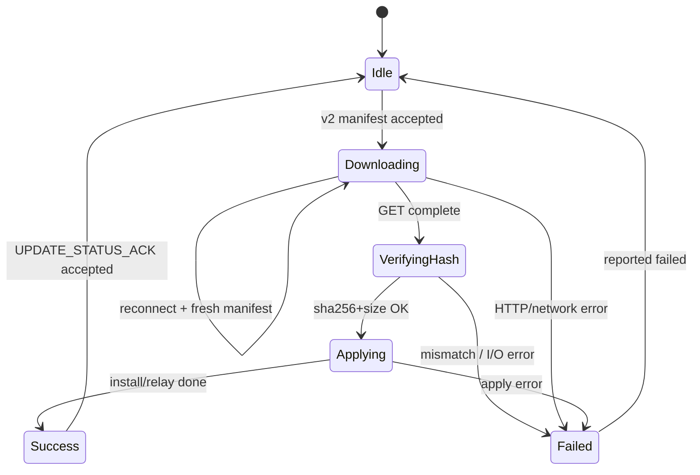

# Gateway Firmware OTA v2 — firmware developer guide

**Audience:** Mesh-manager / gateway firmware engineers implementing **delivery mode v2** (HTTPS download of a cloud-signed package URL) against BluLok Cloud.

**Status:** Cloud side is implemented. This document is the **device contract** — implement these behaviors and message formats exactly.

**Companions:**

| Doc | Role |
|-----|------|
| [Firmware OTA Architecture](./firmware-ota-architecture.md) | Full cloud + protocol reference (v1 and v2) |
| [Gateway ↔ Cloud integration](./gateway-integration.md) | `/ws/gateway` AUTH, PROXY, Cloud Run notes |
| [Gateway ZTP firmware guide](./gateway-ztp-firmware-developer-guide.md) | ECDSA AUTH / ops key material |
| [Gateway swap / recovery](./gateway-swap-recovery-architecture.md) | Swap may initiate gateway OTA with `firmwareDeliveryMode: v2` |

**Reference implementations (lab):**

- Cloud push engine: `backend/src/services/firmware/firmware.service.ts` (`executePushV2`)
- Wire types: `backend/src/services/gateway/message-types.ts`
- Simulator: `gateway-simulator/src/main/firmware/FirmwareReceiver.ts`
- Simulator tests: `gateway-simulator/__tests__/firmware-receiver.test.ts`

---

## 1. What v2 is (and is not)

| | **v1** (legacy chunked) | **v2** (this guide) |
|--|-------------------------|---------------------|
| Binary path | Cloud → gateway as `FIRMWARE_CHUNK` JWTs over `/ws/gateway` | Gateway **HTTPS GETs** a short-lived GCS signed URL from the manifest |
| Progress source | Cloud derives % from chunk ACKs | Gateway **must** send `FIRMWARE_PROGRESS` with `progress_percent` |
| Chunk ACKs | Required (`FIRMWARE_CHUNK_ACK`) | **Not used** — ignore / never expect chunks |
| Completion | Still `FIRMWARE_UPDATE_STATUS` + `push_id` | Same |
| Cloud storage | Any provider | **GCS only** (cloud refuses v2 otherwise) |

v2 exists so large packages do not saturate the gateway WebSocket or Cloud Run request size limits. The control plane (manifest, status, progress) still rides `/ws/gateway`. The data plane is plain HTTPS GET.

```text
Portal / API: initiate push (delivery_mode=v2)
       ↓
Cloud: sign FIRMWARE_MANIFEST JWT (download_url + sha256 + size + push_id)
       ↓  unicast over /ws/gateway
Gateway: verify JWT → HTTPS GET download_url → verify sha256/size
       → FIRMWARE_PROGRESS (download %)
       → apply / relay as for your target_type
       → FIRMWARE_UPDATE_STATUS (verifying → applying → success | failed)
```

**Do not** wait for `FIRMWARE_CHUNK` when `delivery_mode` is `v2` or `download_url` is present.

---

## 2. Prerequisites on the wire

1. Gateway is authenticated on **`/ws/gateway`** (`AUTH_OK` received — JWT or ZTP ECDSA).
2. Gateway holds the cloud **ops Ed25519 public key** from `AUTH_OK` / login and can verify command JWTs.
3. Device has outbound HTTPS (TLS 1.2+) to Google Cloud Storage signed URLs (typically `storage.googleapis.com` or a GCS JSON API host). No BluLok API auth header is required on the GET — the query string is the credential.
4. Enough free flash / RAM staging space for `size` bytes (manifest field).

---

## 3. Detecting v2

On every inbound envelope:

```json
{ "type": "FIRMWARE_MANIFEST", "jwt": "<Ed25519 JWT>" }
```

1. Verify JWT signature with ops public key and check `exp`.
2. Decode payload; require `cmd_type === "FIRMWARE_MANIFEST"`.
3. Treat as **v2** if either:

   - `delivery_mode === "v2"`, **or**
   - `download_url` is a non-empty string

   (Cloud always sets both for v2; defense-in-depth if one field is missing.)

4. Otherwise treat as **v1** and follow the chunk protocol in [Firmware OTA Architecture](./firmware-ota-architecture.md) (out of scope here).

Persist at least:

| Field | Why |
|-------|-----|
| `push_id` | All later status/progress messages; survive reboot |
| `target_type` | Apply / relay routing |
| `version`, `sha256`, `size` | Verify download + apply |
| `download_url` | GET (or wait for a refreshed manifest on reconnect) |
| `delivery_mode` | Branch v1 vs v2 |

---

## 4. Manifest JWT (v2 fields)

Cloud → gateway, inside the signed JWT:

| Field | Type | v2 contract |
|-------|------|-------------|
| `cmd_type` | string | `FIRMWARE_MANIFEST` |
| `delivery_mode` | string | `v2` |
| `push_id` | string | **Cloud push UUID** — required on every later status/progress |
| `target_type` | string | `gateway` \| `lock` \| `friend_node` \| `access_control` |
| `version` | string | Firmware version string |
| `sha256` | string | Hex SHA-256 of the **entire** binary |
| `size` | number | Exact byte length |
| `chunk_count` | number | Always **`0`** for v2 |
| `download_url` | string | HTTPS GET URL (GCS V4 signed); TTL **60 minutes** |
| `nonce` | string | Often omitted / unused in v2 — **do not** send on status |
| `filename` | string | Optional |
| `compatible_models` | string[] | Optional advisory |
| `exp` | number | Aligned to URL TTL (~3600s) |

**Correlation rule (critical):**

| ID | Use on gateway → cloud |
|----|-------------------------|
| `push_id` | `FIRMWARE_UPDATE_STATUS`, `FIRMWARE_PROGRESS` |
| `nonce` | `FIRMWARE_CHUNK_ACK` only (v1) — never for v2 status |

Sending `nonce` instead of `push_id` causes the cloud to **ignore** the status (UI stuck; backend logs `invalid push_id`).

---

## 5. Required state machine (v2)



### 5.1 Accept manifest

1. Reject / ignore if JWT invalid or expired.
2. Cancel any in-flight v2 download for a **different** `push_id` (or finish the old one first — do not mix URLs).
3. Persist `push_id` until terminal ACK (see reboot hardening).
4. Transition to **Downloading**.

### 5.2 HTTPS GET `download_url`

1. `GET` the URL with a normal HTTPS client. Follow redirects if the stack does so by default.
2. Do **not** attach BluLok JWTs or ops keys to this request.
3. Stream to staging storage when possible (packages can be large).
4. While downloading, emit `FIRMWARE_PROGRESS` (see §6). Prefer:

   - `phase: "downloading"`
   - `progress_percent` from `Content-Length` when present (0–99 while streaming; **100** when the body is fully received)
   - Throttle updates (e.g. every 2–5% or every few seconds) — cloud extends the transfer timeout on each progress message.

5. On non-2xx or transport failure → §5.5 Failed with a clear `error` string.

**Timeouts:** Cloud waits up to **`FIRMWARE_V2_TRANSFER_TIMEOUT_SEC`** (default **3600s**) while status is `transferring`, and **resets that deadline on each `FIRMWARE_PROGRESS`**. Keep progress flowing during long downloads.

### 5.3 Verify integrity

After the full body is on disk / in RAM:

1. Compute SHA-256 hex of the bytes.
2. Compare to manifest `sha256` (case-insensitive hex compare is fine if you normalize).
3. If `size > 0`, require `byteLength === size`.
4. On mismatch → Failed (`downloaded binary sha256 mismatch` / `size mismatch`).

Do **not** apply a package that fails verification.

### 5.4 Apply / relay

Same product rules as v1 after the binary is local:

| `target_type` | Typical gateway action |
|---------------|------------------------|
| `gateway` | Install / stage gateway image; may reboot |
| `lock` / `friend_node` / `access_control` | BLE / mesh distribute and install |

Recommended status sequence on `/ws/gateway` (JSON, **not** JWT):

```json
{ "type": "FIRMWARE_UPDATE_STATUS", "push_id": "<uuid>", "target_type": "gateway", "version": "1.2.3", "status": "verifying" }
{ "type": "FIRMWARE_UPDATE_STATUS", "push_id": "<uuid>", "target_type": "gateway", "version": "1.2.3", "status": "applying" }
{ "type": "FIRMWARE_UPDATE_STATUS", "push_id": "<uuid>", "target_type": "gateway", "version": "1.2.3", "status": "success" }
```

Cloud mapping:

| Gateway `status` | Push becomes |
|------------------|--------------|
| `success` | `complete` (**only** terminal success) |
| `failed` / `error` | `failed` |
| `verifying` / `applying` | `verifying` (progress) |
| anything else | ignored (logged) |

Await:

```json
{ "type": "FIRMWARE_UPDATE_STATUS_ACK", "push_id": "…", "accepted": true, "push_status": "complete" }
```

If `accepted: false`, log `reason` and retry with backoff when appropriate.

### 5.5 Failed

```json
{
  "type": "FIRMWARE_UPDATE_STATUS",
  "push_id": "<uuid>",
  "target_type": "lock",
  "version": "2.10.0",
  "status": "failed",
  "error": "download failed: HTTP 403"
}
```

Clear local staging for that push. Do not leave a half-applied image marked successful.

---

## 6. `FIRMWARE_PROGRESS` (required for v2 UX)

**Required for v2** so the portal can show download progress (cloud no longer has chunk ACKs).

```json
{
  "type": "FIRMWARE_PROGRESS",
  "push_id": "<uuid from manifest>",
  "target_type": "gateway",
  "progress_percent": 42,
  "phase": "downloading",
  "message": "optional human text"
}
```

| Field | Notes |
|-------|--------|
| `push_id` | Required |
| `progress_percent` | 0–100 integer |
| `phase` | Suggested: `downloading`, `installing`, `distributing`, `verifying` |
| `devices` | Optional per-device rows for lock/friend_node fleets |

**Important:** `progress_percent: 100` on `FIRMWARE_PROGRESS` does **not** complete the push. Only `FIRMWARE_UPDATE_STATUS` with `status: "success"` does.

Optional device array shape (same as architecture doc):

```json
"devices": [
  { "device_id": "LOCK-SERIAL-1", "status": "downloading", "progress_percent": 40 },
  { "device_id": "LOCK-SERIAL-2", "status": "installing", "progress_percent": 90 }
]
```

---

## 7. What you must not do on v2

| Anti-pattern | Why |
|--------------|-----|
| Wait for `FIRMWARE_CHUNK` | None are sent |
| Send `FIRMWARE_CHUNK_ACK` | Ignored / confusing |
| Put `nonce` on `FIRMWARE_UPDATE_STATUS` | Cloud rejects / ignores |
| Skip `FIRMWARE_PROGRESS` entirely | Transfer timeout may fire; UI stuck at low % |
| Apply without sha256/size check | Corrupt or truncated packages |
| Expect a second AUTH for the HTTPS GET | URL is self-authorized |
| Mark push complete from progress alone | UI and DB stay in `verifying` |

---

## 8. Disconnect, reconnect, and reboot

### 8.1 WS drops during download (`transferring`)

Cloud **pauses** (does not immediately fail) and, on reconnect + AUTH, **re-issues a new signed URL** and re-sends `FIRMWARE_MANIFEST` (v2 does **not** resume mid-file byte offsets).

Gateway must:

1. Abort the old GET if the socket died or a new manifest arrives.
2. On new v2 manifest for the **same** `push_id`, start a **fresh** download from the new `download_url`.
3. Continue progress + status as usual.

### 8.2 Reboot during apply (`verifying`)

Same hardening as v1 (see architecture doc):

1. Persist `push_id` (+ target/version) across reboot until `FIRMWARE_UPDATE_STATUS_ACK` with `push_status: "complete"`.
2. Reconnect `/ws/gateway` and AUTH as soon as networking is up.
3. On cloud `FIRMWARE_PUSH_RESUME`:

```json
{
  "type": "FIRMWARE_PUSH_RESUME",
  "pushes": [
    { "push_id": "…", "target_type": "gateway", "status": "verifying", "progress_percent": 100 }
  ]
}
```

   If local install already succeeded, resend:

```json
{ "type": "FIRMWARE_UPDATE_STATUS", "push_id": "…", "target_type": "gateway", "status": "success" }
```

4. Retry until ACK or local give-up. Resending `success` for an already-complete push is safe.

### 8.3 Cancel

If the operator cancels, cloud stops waiting and marks the push cancelled. Late `success` for a terminal push is **rejected** (atomic). Stop applying when you learn the push is cancelled (optional: ignore further work for that `push_id`).

---

## 9. Security checklist

- [ ] Verify Ed25519 JWT on every `FIRMWARE_MANIFEST` before trusting `download_url`.
- [ ] Enforce `exp`; do not use an expired URL or JWT.
- [ ] HTTPS only; validate TLS like other outbound cloud calls.
- [ ] Do not log the full signed URL in production logs (query string is a bearer credential).
- [ ] Always verify `sha256` and `size` before apply.
- [ ] Bound download size to `size` (reject runaway streams).
- [ ] Scope apply to `target_type` / `compatible_models` as your product requires.

---

## 10. Minimal implementation sketch

Pseudo-code aligned with the lab simulator:

```text
on FIRMWARE_MANIFEST(jwt):
  payload = verifyAndDecode(jwt)
  if isV2(payload):
    persist(payload.push_id, …)
    send PROGRESS(push_id, 0, downloading)
    bytes = httpsGet(payload.download_url) with progress callbacks
    if sha256(bytes) != payload.sha256 or len != payload.size:
      send UPDATE_STATUS(failed, error=…)
      return
    send UPDATE_STATUS(verifying)
    apply(bytes, payload.target_type, payload.version)
    send UPDATE_STATUS(applying)
    send UPDATE_STATUS(success)
    await UPDATE_STATUS_ACK
  else:
    handleV1Chunks(…)
```

---

## 11. Lab validation

| Step | How |
|------|-----|
| Happy path | Cloud GCS + portal Firmware tab → Delivery **v2** → push to online gateway; watch progress climb via `FIRMWARE_PROGRESS`; terminal `success` |
| Simulator | `gateway-simulator` `FirmwareReceiver` v2 path; unit test `firmware-receiver.test.ts` |
| Bad hash | Corrupt download or wrong sha → gateway `failed`; cloud push `failed` |
| Drop mid-download | Kill WS; reconnect; expect **new** manifest URL; download completes |
| Reboot mid-apply | Persist `push_id`; on `FIRMWARE_PUSH_RESUME` resend `success` |
| Wrong id | Send status with nonce → cloud ignores; UI stuck — confirms `push_id` discipline |

Backend E2E (`ws:e2e`) historically stresses **v1** chunk transfer. Prefer the simulator + a GCS-backed environment for v2 soak tests.

---

## 12. Cloud timeouts (so you can size local timers)

| Knob | Default | Meaning |
|------|---------|---------|
| Signed URL / manifest JWT TTL | **3600s** | Finish GET before URL expires; reconnect gets a new URL |
| `FIRMWARE_V2_TRANSFER_TIMEOUT_SEC` | **3600s** | Max silence in `transferring` without progress; **extended** on each `FIRMWARE_PROGRESS` |
| Verify timeout (gateway target) | `FIRMWARE_GATEWAY_VERIFY_TIMEOUT_SEC` **300s** | After leaving transferring / entering verifying |
| Verify timeout (other targets) | `FIRMWARE_VERIFY_TIMEOUT_SEC` **900s** | Same for lock / friend_node / access_control |
| Disconnect grace | **180s** (default) | Transfer/verify pause window before fail |

---

## 13. Message quick reference

**Cloud → gateway**

| Type | Payload |
|------|---------|
| `FIRMWARE_MANIFEST` | `{ jwt }` — v2 includes `download_url` |
| `FIRMWARE_PUSH_RESUME` | `{ pushes: [{ push_id, target_type, status }] }` |
| `FIRMWARE_UPDATE_STATUS_ACK` | `{ push_id, accepted, push_status?, reason? }` |

**Gateway → cloud**

| Type | When |
|------|------|
| `FIRMWARE_PROGRESS` | Download / install telemetry (v2 required for %) |
| `FIRMWARE_UPDATE_STATUS` | `verifying` / `applying` / `success` / `failed` |

Not used on v2: `FIRMWARE_CHUNK`, `FIRMWARE_CHUNK_ACK`.

---

## 14. Differences vs swap-recovery inventory snapshots

Swap recovery uses a **different** chunk protocol (`INVENTORY_SNAPSHOT_*`). Do not reuse v2 HTTPS download code for inventory snapshots unless product explicitly adds that later. Firmware v2 is **only** for `FIRMWARE_MANIFEST` with `delivery_mode: v2`.
