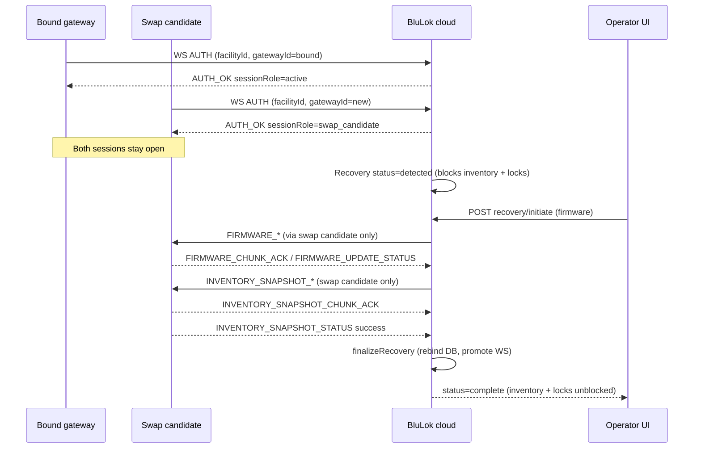

# Gateway Swap / Recovery — Operator & Developer Guide

End-to-end reference for **sys admins** (cloud setup, facility operations) and **gateway firmware developers** (WebSocket behavior, phased recovery protocol). Use this together with the internal architecture doc: [Gateway Swap / Recovery Architecture](./gateway-swap-recovery-architecture.md).

---

## 1. What this system does

When a facility’s on-site gateway is replaced, the cloud **must not trust inventory from the new hardware** until a controlled recovery finishes. Without this:

- A new gateway can connect and **take over** the facility WebSocket silently.
- A partial inventory upload can **delete cloud lock records** for devices not yet reported (`POST /internal/gateway/devices/inventory` reconciles by omission).

**Swap / Recovery** detects a second gateway, parks it as a **swap candidate**, keeps the **bound (production) gateway** as the active session, runs a **phased pipeline** on the candidate, then rebinds the facility to the new gateway.

---

## 2. Prerequisites checklist

### Cloud / sys admin (before any swap)

| Requirement | Why |
|-------------|-----|
| Facility has a **bound gateway** row (`gateways.facility_id` set) | Defines “production” vs swap candidate |
| Replacement gateway has a **stable GUID** it sends in `AUTH.gatewayId` | Identity; **the cloud record is auto-created on first connect** — pre-creating it is optional (see §5.1) |
| Replacement gateway `facility_id` is **null** or matches this facility | Other-facility gateways are rejected as swap candidates |
| At least one **gateway firmware image** uploaded (`target_type=gateway`) matching the production gateway version | Recovery phase 1 (only when **Include firmware matching** is enabled) |
| Operator JWT with **`facility_admin`** (scoped), **`admin`**, or **`dev_admin`** | WS AUTH (also gates auto-registration) + recovery REST |
| Backend migration **078** + **079** applied | Recovery tables + one active recovery per facility |
| Gateway can reach **`wss://<host>/ws/gateway`** and **`https://<host>/api/v1`** | Same URLs as Facility → Gateway → Overview |

See also: [Gateway ↔ Cloud integration](./gateway-integration.md), [Facility provisioning data](./facility-provisioning-data.md), [Firmware OTA](./firmware-ota-architecture.md).

### Gateway firmware (before field deployment)

| Requirement | Why |
|-------------|-----|
| Generate + persist a **stable GUID** and send it as `AUTH.gatewayId` | Identity binding / swap detection / auto-registration |
| Handle **`sessionRole`** in `AUTH_OK` | Know if you are `active`, `swap_candidate`, or `legacy` |
| Implement **firmware OTA** ACK/status (existing) | Recovery phase 1 |
| Implement **`INVENTORY_SNAPSHOT_*`** (new) | Recovery phase 2 |
| **Do not** rely on inventory sync during recovery | Cloud returns **409** `recovery_in_progress` |
| Reconnect + re-**AUTH** after disconnect | Resume pushes; swap candidate must stay online during recovery |

---

## 3. Roles & permissions

| Action | `facility_admin` | `admin` / `dev_admin` |
|--------|------------------|------------------------|
| View recovery status / candidates | Yes (own facilities) | Yes |
| Start / cancel / retry recovery | Yes | Yes |
| **Bypass recovery** | **No** | **Yes** (`confirm: true`) |
| WebSocket `AUTH` to `/ws/gateway` | Yes (scoped `facilityIds`) | Yes |

Dashboard: **Facility → Gateway → Swap / Recovery** tab (badge when attention needed).

---

## 4. End-to-end flow (operator view)



### Recovery statuses

| Status | Meaning | Blocks inventory / remote locks? |
|--------|---------|----------------------------------|
| `detected` | Swap candidate seen; not started | **Yes** |
| `awaiting_config` | Config saved; about to start firmware | **Yes** |
| `firmware` | OTA to swap candidate | **Yes** |
| `inventory_push` | Inventory snapshot chunks + verify | **Yes** |
| `complete` | New gateway bound; normal ops | No |
| `bypassed` | Platform admin escape hatch | No |
| `failed` | Terminal error; retry available | No |
| `cancelled` | Operator cancelled | No |

---

## 5. Sys admin procedures

### 5.1 Register hardware in the cloud (now automatic)

**Auto-registration (recommended):** You no longer need to pre-create a gateway record. When the replacement unit connects to `wss://<host>/ws/gateway` and sends a valid operator JWT plus its **stable GUID** in `AUTH.gatewayId`, the cloud creates the record automatically:

- **Facility already has a bound gateway** → the new unit is auto-registered as an **unbound swap candidate** and appears in the Swap / Recovery tab. The live gateway is untouched.
- **Facility has no gateway yet (first install)** → the new unit is auto-registered **and auto-bound** as the active gateway.

`AUTH_OK` returns `gatewayId` (and `autoRegistered: true` the first time) so the device can confirm/cache its GUID for reconnects.

**Guardrails:** the connecting JWT must be `facility_admin` scoped to the facility, or `admin` / `dev_admin`. The GUID must be a valid UUID. A facility allows at most **3** parked swap candidates and a limited number of auto-registrations per 10-minute window. A GUID already bound to another facility is rejected (`AUTH_FORBIDDEN`).

**Manual (optional / legacy):** you may still pre-create a record (Admin → Gateways or `POST /api/v1/gateways`), leave `facility_id` null, and flash that `id` onto the device. The connect flow then simply finds the existing record.

See design notes: [Gateway auto-registration design](./gateway-auto-registration-design.md).

### 5.2 Configure the on-site gateway

From **Facility → Gateway → Overview**, copy:

- **WebSocket URL:** `wss://<host>/ws/gateway`
- **API base:** `https://<host>/api/v1`

Set on the device (e.g. `CLOUD_WS`, `CLOUD_API` in mesh-manager compose). Use a **facility-scoped service account JWT** or facility admin login token for `AUTH.token`.

### 5.3 Typical swap workflow

1. **Keep the old gateway online** (production traffic, existing session).
2. **Power on the replacement** with its cloud `gatewayId` configured; it connects as **swap candidate**.
3. Open **Swap / Recovery** tab — confirm:
   - Bound gateway ID (production)
   - Swap candidate ID + **connected**
   - Alert: facility operations restricted
4. Optionally enable **Include firmware matching** (default on). When enabled, the cloud matches the **production gateway’s** firmware version and OTA-pushes to the swap candidate only if it differs. When disabled, recovery skips firmware and goes straight to inventory push.
5. Click **Start swap recovery**.
6. Monitor the **4-step stepper** and event log until **Complete**.
7. Verify Overview shows the **new gateway** bound; inventory sync and remote locks work again.

**Important:** The swap candidate must stay **connected** during phases 1–2. If it drops, recovery pauses; reconnect and re-**AUTH** with the same `gatewayId`. The bound gateway may disconnect without pausing recovery (if the candidate stays up).

### 5.4 If recovery fails

| Situation | Action |
|-----------|--------|
| Phase failed (firmware / inventory) | Read event log + `error_message`; fix root cause; **Retry recovery** |
| Swap candidate offline | Reconnect device; **Retry** (or **Cancel** and start new recovery when ready) |
| Stuck / unacceptable risk | Platform admin: **Bypass recovery** (skips all phases — see risks below) |
| Wrong recovery started | **Cancel recovery** → **Start new recovery** |

### 5.5 Bypass (platform admin only)

Bypass immediately:

- Unblocks inventory sync and remote locks
- Runs DB rebind to the swap candidate gateway (if configured)
- **Does not** guarantee firmware or inventory snapshot were applied

**Risk:** If the new gateway later sends partial inventory, cloud devices could still be affected. Use only when operators accept that risk.

API: `POST /api/v1/gateways/:gatewayId/recovery/bypass` body `{ "confirm": true }`.

### 5.6 What operators cannot do during blocking recovery

- **Manual gateway sync** (Sync tab disabled)
- **Remote lock/unlock** (REST returns failure — recovery in progress)
- **Inventory reconcile** via gateway (`409 recovery_in_progress`)
- **Manual firmware push** on bound gateway tabs (UI blocked; use Swap / Recovery instead)
- Outbound **denylist**, **access code push**, **lock commands** to the facility (dropped by cloud)

---

## 6. Gateway developer reference

### 6.1 WebSocket connection

| Item | Value |
|------|--------|
| Path | `/ws/gateway` (exact) |
| First message | `AUTH` (not query-string token) |
| Max message size | Default **5 MB** (`GATEWAY_WS_MAX_MESSAGE_BYTES`, overridable via env) |

**AUTH (required fields):**

```json
{
  "type": "AUTH",
  "token": "<JWT from this backend>",
  "facilityId": "<facility UUID>",
  "gatewayId": "<device's stable UUID>"
}
```

`gatewayId` is the device’s **own stable, self-generated UUID** (persisted across reboots). If the cloud has never seen it, it is **auto-registered** (see §5.1). If it is already known, the existing record is used. An unknown GUID that is **not** a valid UUID is rejected (`AUTH_BAD_REQUEST`).

**AUTH_OK (relevant fields):**

```json
{
  "type": "AUTH_OK",
  "facilityId": "...",
  "gatewayId": "...",
  "sessionRole": "active | swap_candidate | legacy",
  "autoRegistered": true,
  "ops_public_key": "...",
  "ops_public_key_jwk": { },
  "ops_public_key_pem": "..."
}
```

`autoRegistered` is `true` only on the connect that **created** the gateway record (first time the device is seen). Persist `gatewayId` on receipt and reuse it on every reconnect.

**Session roles:**

| `sessionRole` | Meaning |
|---------------|---------|
| `active` | This `gatewayId` is the facility’s bound gateway; receives **operational** commands (locks, denylist, access codes) |
| `swap_candidate` | Different `gatewayId` than bound; **parked** — receives **recovery push** messages only during recovery |
| `legacy` | No `gatewayId` in AUTH (deprecated for new deployments) |

**Swap candidate rejection:** `AUTH` fails with `AUTH_FORBIDDEN` if the gateway record’s `facility_id` points to a **different** facility.

### 6.2 Dual-connection behavior during swap

- **Bound gateway** and **swap candidate** may both be connected simultaneously.
- Recovery **outbound** (`FIRMWARE_*`, `INVENTORY_SNAPSHOT_*`) is sent **only to the swap candidate** WebSocket.
- If the swap candidate is offline, those messages are **dropped** (not redirected to the bound gateway).
- **Inbound** recovery ACK/status messages are accepted **only from the swap candidate** whose `gatewayId` matches the armed recovery target. The bound gateway **cannot** spoof inventory snapshot status.

### 6.3 Phase 1 — Firmware (existing OTA)

Same protocol as manual OTA. During recovery, messages arrive on the **swap candidate** session.

**Gateway → cloud:**

| Type | Purpose |
|------|---------|
| `FIRMWARE_CHUNK_ACK` | Per-chunk ACK (`nonce`, `chunkIndex`, `status`: `ok` \| `error`) |
| `FIRMWARE_UPDATE_STATUS` | Terminal status for gateway target (`push_id`, `status`, …) |
| `FIRMWARE_PROGRESS` | Optional progress |

**Cloud → gateway:**

| Type | Purpose |
|------|---------|
| `FIRMWARE_MANIFEST` | Signed JWT manifest |
| `FIRMWARE_CHUNK` | Signed JWT chunk |
| `FIRMWARE_PUSH_RESUME` | After reconnect, if push was verifying |

On success, cloud auto-advances to inventory snapshot push. Implement reconnect: on `AUTH`, handle resume messages.

See: [Firmware OTA Architecture](./firmware-ota-architecture.md).

### 6.4 Phase 2 — Inventory snapshot (new)

Cloud builds a binary snapshot from current cloud device records, pushes it to the swap candidate, and waits for apply confirmation.

**Cloud → gateway:**

| Type | Notes |
|------|--------|
| `INVENTORY_SNAPSHOT_MANIFEST` | JWT; manifest includes metadata below |
| `INVENTORY_SNAPSHOT_CHUNK` | JWT; chunked binary |
| `INVENTORY_SNAPSHOT_RESUME` | On reconnect during verify |

**Manifest JWT payload (inside signed command):**

| Field | Description |
|-------|-------------|
| `recovery_id` | Recovery row UUID — **required in status reply** |
| `snapshot_id` | Snapshot UUID |
| `sha256` | Hash of full binary |
| `size_bytes` | Total bytes |
| `device_count` | Device count |
| `chunk_count` | Number of chunks |
| `chunk_size` | Bytes per chunk |

**Gateway → cloud:**

| Type | Fields |
|------|--------|
| `INVENTORY_SNAPSHOT_CHUNK_ACK` | `nonce`, `chunkIndex`, `status`: `ok` \| `error` |
| `INVENTORY_SNAPSHOT_STATUS` | **`recovery_id`** (required), `status`, optional `error` |

**Status values:**

| `status` | When |
|----------|------|
| `success` | After snapshot applied to local lock DB — **only accepted while cloud is in `inventory_push`** |
| `failed` / `error` / `failure` | Apply failed — only accepted during `inventory_push` |

**Cloud → gateway:** `INVENTORY_SNAPSHOT_STATUS_ACK` (`accepted`, `recovery_status`, `reason`).

**Verify timeout:** Cloud waits **5 minutes** after all chunks are ACKed. If no `success`, recovery → `failed`.

**Firmware implementation checklist for phase 2:**

1. Receive manifest; verify JWT + `sha256` / size.
2. ACK each chunk with matching `nonce` + `chunkIndex`.
3. Reassemble binary; validate hash.
4. Rebuild local device/inventory database from snapshot format (cloud builds from DB — coordinate with backend team on binary layout in `InventorySnapshotService`).
5. Send `INVENTORY_SNAPSHOT_STATUS` with `recovery_id` from manifest and `status: "success"`.
6. On reconnect mid-push, handle `INVENTORY_SNAPSHOT_RESUME`.

### 6.6 Inventory sync during recovery — do not use

Normal inventory reconcile:

```json
{
  "type": "PROXY_REQUEST",
  "method": "POST",
  "path": "/internal/gateway/devices/inventory",
  "body": { "devices": [ ] }
}
```

While recovery is blocking, cloud responds with **HTTP 409**:

```json
{
  "code": "recovery_in_progress",
  "message": "Gateway recovery in progress — inventory sync blocked until recovery completes or is bypassed"
}
```

Use the **inventory snapshot** path instead during swap recovery.

### 6.7 Heartbeats

- Respond to JSON `{ "type": "PING" }` with `{ "type": "PONG" }`.
- Respond to WebSocket RFC6455 ping frames (transport-level).
- Inactivity timeout ~**30s** without activity → connection closed.

---

## 7. REST API (operator / automation)

Base: `https://<host>/api/v1`  
Auth: `Authorization: Bearer <JWT>`

| Method | Path | Purpose |
|--------|------|---------|
| GET | `/gateways/facility/:facilityId/recovery/candidates` | Swap candidates + active recovery summary |
| GET | `/gateways/:gatewayId/recovery/status` | Latest recovery for swap gateway |
| GET | `/gateways/:gatewayId/recovery/options` | Production vs candidate firmware comparison |
| GET | `/gateways/:gatewayId/recovery/inventory-preview` | Devices that will be in snapshot |
| GET | `/gateways/:gatewayId/recovery/:recoveryId/events` | Event timeline (`?limit=100`) |
| POST | `/gateways/:gatewayId/recovery/initiate` | Start recovery `{ includeFirmware?, firmwareId? }` |
| POST | `/gateways/:gatewayId/recovery/retry` | Retry failed recovery |
| POST | `/gateways/:gatewayId/recovery/:recoveryId/cancel` | Cancel in-progress recovery |
| POST | `/gateways/:gatewayId/recovery/bypass` | **Admin only** `{ confirm: true }` |
| POST | `/gateways/:gatewayId/recovery/advance` | Manual phase advance (automation; UI uses auto-advance) |

**Initiate body example:**

```json
{
  "includeFirmware": true
}
```

Set `"includeFirmware": false` to skip the firmware phase entirely. When enabled (default), the cloud uses the production gateway’s reported version — no manual firmware selection. An optional `firmwareId` override remains for API/testing use.

---

## 8. Dashboard real-time updates

Operators subscribed to the facility dashboard receive WebSocket events:

| Subscription | Event | Content |
|--------------|-------|---------|
| `gateway_recovery_progress` | `gateway_recovery_progress_update` | `percent`, `status`, `message`, chunk progress |

The Swap / Recovery tab also polls every 4–8s while in progress (faster when dashboard WS disconnected).

---

## 9. Infrastructure & deployment notes

### Database

- Migration **078**: `gateway_recoveries`, events, inventory snapshots tables.
- Migration **079**: `active_facility_key` unique constraint — **one non-terminal recovery per facility**.

Run migrations on deploy before gateways connect.

### Startup order

On backend boot, **gateway recovery** in-flight state is re-armed **before** firmware resume, so recovery push routing targets the swap candidate before child jobs run.

### Cloud Run / multi-instance

- Gateway connections and recovery push targets are **in-memory per process**.
- Prefer **`min-instances=1`**; consider **`max-instances=1`** until shared routing exists.
- WebSocket request timeout: set **`--timeout=3600`** (see [Gateway integration](./gateway-integration.md)).
- Outbound gating uses a **5-second TTL cache** per instance; lock/inventory paths use DB checks.

### Environment variables (relevant)

| Variable | Purpose |
|----------|---------|
| `GATEWAY_MAX_MESSAGE_BYTES` | WS max frame size (default 5 MB) |
| `SKIP_SWAP_RECOVERY_E2E=1` | Skip swap E2E section (dev only) |
| `E2E_API_PORT` | E2E test port override |

---

## 10. Validation & testing

| Command | Validates |
|---------|-----------|
| `npm run test:serial` (backend) | Unit/integration including recovery routes, transport, gating |
| `npm test` (frontend) | Swap / Recovery UI |
| `npm run ws:e2e` (backend, dev server on port 3000) | Live dual-WS swap, blocking, bypass, DB rebind |

E2E swap section creates an unassigned gateway, connects second WS, verifies candidates API, lock/inventory block, bypass, and binding.

**Field smoke test:**

1. Bound GW connected → inventory sync works.
2. Second GW connects → Swap tab shows candidate; inventory sync **409**.
3. Complete recovery → new GW bound; inventory sync works on new session.

---

## 11. Troubleshooting

| Symptom | Likely cause | Fix |
|---------|--------------|-----|
| Swap candidate not listed | WS not connected or wrong `gatewayId` | Verify AUTH succeeds and a stable `gatewayId` is sent (record auto-creates on connect) |
| `AUTH_BAD_REQUEST` on new hardware | `gatewayId` is not a valid UUID | Device must send a well-formed UUID it generated and persisted |
| `AUTH_FORBIDDEN` on new hardware | Gateway GUID already bound to another facility, **or** facility already has 3 parked swap candidates | Use the correct facility / clear stale candidates; cap is 3 per facility |
| `AUTH_RATE_LIMITED` on new hardware | Too many auto-registrations in the 10-min window | Wait and retry; investigate why many new GUIDs are connecting |
| Recovery stuck in firmware | Swap candidate offline | Reconnect swap GW; retry |
| Chunks sent but recovery fails at 95% | No `INVENTORY_SNAPSHOT_STATUS success` within 5 min | Implement status message with correct `recovery_id` |
| Status ACK `accepted: false` | Message sent from **bound** gateway, wrong `recovery_id`, or wrong phase | Only swap candidate; use `recovery_id` from manifest |
| Lock commands fail during recovery | Expected blocking | Complete or bypass recovery |
| Inventory 409 after “complete” | Recovery not terminal; wrong facility | Check `GET .../recovery/status` |
| Two recovery rows / retry errors | Another active recovery | Cancel other recovery first |
| Bypass button missing | User is `facility_admin` | Use platform admin account |

---

## 12. Related documentation

| Document | Topics |
|----------|--------|
| [Gateway Swap / Recovery Architecture](./gateway-swap-recovery-architecture.md) | Cloud state machine, gating rules |
| [Gateway ↔ Cloud integration](./gateway-integration.md) | AUTH, PROXY, Cloud Run |
| [Firmware OTA Architecture](./firmware-ota-architecture.md) | Phase 1 messages |
| [Facility provisioning data](./facility-provisioning-data.md) | Facility file upload/download (not part of swap recovery) |
| [Gateway device inventory payload](./gateway-device-inventory-payload.md) | Normal inventory (blocked during recovery) |

---

## 13. Quick reference — message routing during recovery

| Message family | Sent to | Accepted from |
|----------------|---------|---------------|
| `LOCK`, `DENYLIST_*`, `ACCESS_CODE_UPDATE` | Bound (`active`) session | N/A (cloud → GW) |
| `FIRMWARE_*`, `INVENTORY_SNAPSHOT_*` | Swap candidate only | Swap candidate only |
| `PROXY_REQUEST` / inventory | Bound session (but inventory **409** while blocking) | Bound session |
| `PING` / `PONG` | Both | Both |

When recovery completes or is bypassed, cloud **finalizes**: device rows rebind to new gateway, old gateway unassigned, swap candidate WS promoted to **active**, recovery push target cleared, blocking lifted.
