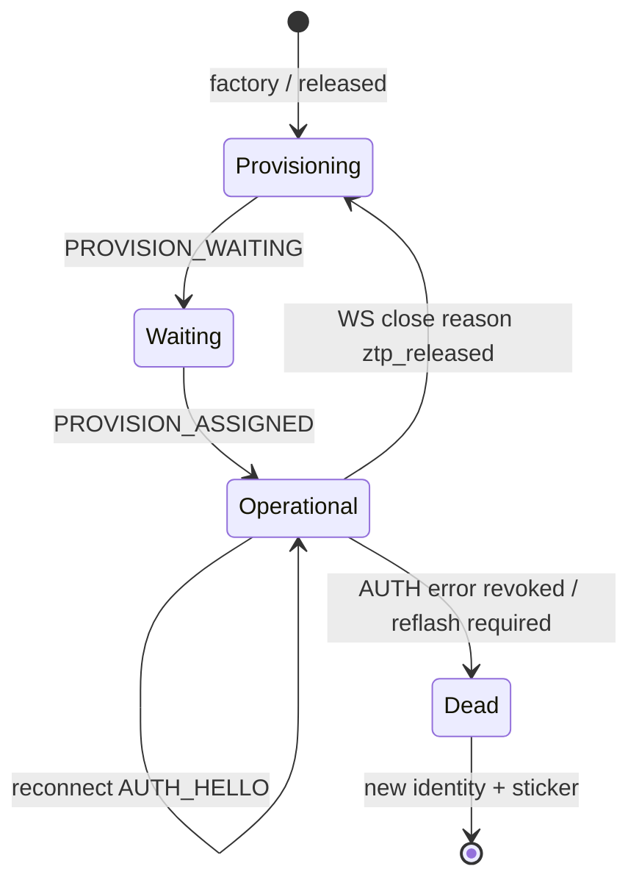

# Gateway ZTP — firmware developer guide

**Audience:** Mesh-manager / gateway firmware developers implementing sticker Zero-Touch Provisioning and ECDSA operational auth against BluLok Cloud.

**Status:** Cloud side is implemented. This document is the **device contract** — implement these behaviors and message formats exactly.

**Companions:**

| Doc | Role |
|-----|------|
| [Gateway ZTP sticker architecture](./gateway-ztp-sticker-design.md) | Product/security design, threat model, manufacturing tiers |
| [Gateway ↔ Cloud integration](./gateway-integration.md) | Endpoints, legacy JWT AUTH, PROXY, Cloud Run notes |
| [Gateway device sync developer guide](./gateway-device-sync-developer-guide.md) | Inventory/state after you are operational |
| [Gateway swap / recovery](./gateway-swap-recovery-architecture.md) | Hardware replacement (different `device_id`) |

**Reference implementations (lab):**

- Backend crypto: `backend/src/services/gateway/ztp/gateway-ztp-crypto.utils.ts`
- Provision WS: `backend/src/services/gateway/ztp/gateway-provision-websocket.service.ts`
- Ops AUTH: `backend/src/services/gateway/websocket-gateway.transport.ts` (`AUTH_HELLO` / `AUTH_PROOF`)
- E2E: `backend/scripts/ws-gateway-e2e-auth.js` (`E2E_GATEWAY_AUTH=ztp`)
- Simulator: `gateway-simulator` with `authMode: 'ztp_keypair'`

---

## 1. What you are building

The gateway **never** stores a human JWT, API key, or refresh token for cloud auth.

| Phase | Socket | Credential |
|-------|--------|------------|
| Unbound / released | `wss://…/ws/gateway-provision` | Prove possession of flash-time ECDSA P-256 private key |
| Claimed / operational | `wss://…/ws/gateway` | Same private key; cloud verifies against stored `public_key` |

Claim (binding to a facility) is done by the **mobile app / portal** (`POST /api/v1/gateways/claim`). The gateway only waits, receives `PROVISION_ASSIGNED`, then switches sockets.

```text
Factory flash → boot unbound → provision WAITING (ready LED)
       → app scans sticker → PROVISION_ASSIGNED
       → close provision → /ws/gateway ECDSA AUTH → solid LED
       → normal PROXY / inventory / … (existing docs)
```

**Do not** implement legacy `AUTH { token, facilityId, gatewayId }` for ZTP production images. That path remains for lab/legacy fleets only. Once a cloud row has `public_key`, the cloud **rejects** human JWT `AUTH` for that gateway.

---

## 2. Device state machine (required)

Persist enough state across reboots to pick the correct socket.

| Persisted mode | Meaning | On boot |
|----------------|---------|---------|
| **`provisioning`** | Not bound (factory, after Release, or never claimed) | Open `/ws/gateway-provision` |
| **`operational`** | Bound; know `facility_id` (and `device_id` = gateway id) | Open `/ws/gateway` + ECDSA AUTH |



**Transitions you must implement:**

1. **Factory / first boot** → `provisioning`.
2. **`PROVISION_ASSIGNED`** → persist `facility_id`, set mode `operational`, ACK, close provision socket, connect ops.
3. **Ops WS close with reason containing `ztp_released`** → clear bound facility (or mark unbound), set mode `provisioning`, reconnect to provision socket (same keys / same sticker).
4. **Ops AUTH fails with revoked** → stop retrying ops; enter error LED; require reflash (new keypair + sticker). Do not silently fall back to JWT.

Optional local cache of `facility_id` is fine; cloud is authoritative on AUTH.

---

## 3. Identity on the device

### 3.1 Artifacts

| Artifact | Storage | Wire / sticker |
|----------|---------|----------------|
| `device_id` | UUID v4, permanent | QR + all messages; equals `gateways.id` |
| ECDSA P-256 **private key** | **Prod:** Pi OTP / firmware crypto (never export). **Lab:** software key file | Never sent |
| ECDSA P-256 **public key** | Derived / stored for HELLO | Base64url **compressed** SEC1 (33 bytes → ~44 chars) |

**QR (manufacturing prints this; firmware does not generate it at runtime):**

```text
blulok://gw/claim?device_id=<uuid>&pk=<base64url-compressed-p256-pubkey>
```

Suggested identity file (lab / SD):

```json
{
  "device_id": "xxxxxxxx-xxxx-xxxx-xxxx-xxxxxxxxxxxx",
  "public_key": "<base64url compressed P-256>",
  "key_protection": "software"
}
```

Production: `device_id` (+ maybe pubkey cache) on disk; private key only via OTP sign API. Protocol is identical.

### 3.2 Public key encoding (exact)

- Curve: **NIST P-256** (`secp256r1`)
- Form: **compressed** SEC1 point: `0x02` or `0x03` + 32-byte X
- Encoding on the wire: **base64url** (no padding)
- Must be an **on-curve** point (cloud rejects garbage)

### 3.3 Signature encoding (exact)

- Algorithm: **ECDSA with SHA-256** over the payload bytes below
- Wire form: **DER** ECDSA signature, then **base64url** (no padding)
- Field name: `signature` (cloud also accepts `proof` as alias — prefer `signature`)

Java / Node / OpenSSL: sign digest SHA-256 of the **raw payload bytes** (not a hex string of the payload).

---

## 4. Signing payload (critical — must match byte-for-byte)

Both provision and ops use the same layout with **different domain prefixes**:

```text
UTF-8(prefix) || 0x00 || UTF-8(nonce) || 0x00 || UTF-8(deviceId)
```

| Context | `prefix` (ASCII) | `deviceId` argument |
|---------|------------------|---------------------|
| Provision (`PROVISION_AUTH`) | `blulok-ztp-v1` | `device_id` from HELLO |
| Ops (`AUTH_PROOF`) | `blulok-gw-auth-v1` | `gatewayId` (= same UUID) |

`nonce` is the exact string from the cloud challenge (base64url). Do **not** decode it before concatenating.

**Pseudocode:**

```text
payload = encodeUTF8(prefix) + [0x00] + encodeUTF8(nonce) + [0x00] + encodeUTF8(deviceId)
signature = ECDSA_SHA256_sign(privateKey, payload)   // DER
wire = base64url(signature)                           // no '=' padding
```

Wrong prefix, wrong UUID, or hashing a stringified JSON object → `AUTH_FAILED`.

---

## 5. Endpoints

| Purpose | URL |
|---------|-----|
| Provision waiting room | `wss://<BACKEND_HOST>/ws/gateway-provision` |
| Operational gateway | `wss://<BACKEND_HOST>/ws/gateway` |

Same host as today’s `CLOUD_WS`, different path. Use `wss` when the API is HTTPS. Do **not** put credentials on the query string.

Derive provision URL from ops URL by replacing `/ws/gateway` → `/ws/gateway-provision`.

---

## 6. Provisioning protocol (`/ws/gateway-provision`)

JSON text frames. First messages after open:

### 6.1 Sequence

```text
Gateway                         Cloud
   |--- PROVISION_HELLO ------->|
   |<-- PROVISION_CHALLENGE ----|
   |--- PROVISION_AUTH -------->|
   |<-- PROVISION_WAITING ------|   ← ready LED (slow blink)
   |                            |   (installer claims via app)
   |<-- PROVISION_ASSIGNED -----|
   |--- PROVISION_ACK --------->|
   |        (close socket)      |
   |--- open /ws/gateway ------>|
```

Stay on the provision socket until `PROVISION_ASSIGNED` (minutes is normal). Reconnect and re-HELLO if the socket drops while still unbound.

### 6.2 Messages (gateway → cloud)

**`PROVISION_HELLO`**

```json
{
  "type": "PROVISION_HELLO",
  "device_id": "<uuid>",
  "public_key": "<base64url compressed P-256>"
}
```

Aliases accepted by cloud: `deviceId`, `publicKey`. Prefer snake_case as above.

**`PROVISION_AUTH`**

```json
{
  "type": "PROVISION_AUTH",
  "signature": "<base64url DER ECDSA>"
}
```

Sign with prefix `blulok-ztp-v1`, challenge `nonce`, and your `device_id`.

**`PROVISION_ACK`** (after ASSIGNED)

```json
{ "type": "PROVISION_ACK" }
```

### 6.3 Messages (cloud → gateway)

**`PROVISION_CHALLENGE`**

```json
{
  "type": "PROVISION_CHALLENGE",
  "nonce": "<base64url>",
  "expires_in_seconds": 60
}
```

Challenge lifetime is ~60s. If you miss it, send a new `PROVISION_HELLO`.

**`PROVISION_WAITING`**

```json
{
  "type": "PROVISION_WAITING",
  "device_id": "<uuid>"
}
```

You are in the waiting room. Show **ready LED**.

**`PROVISION_ASSIGNED`**

```json
{
  "type": "PROVISION_ASSIGNED",
  "gatewayId": "<uuid>",
  "facilityId": "<uuid>"
}
```

- `gatewayId` equals your `device_id`.
- Persist `facilityId`, set mode **`operational`**, send `PROVISION_ACK`, close this socket, immediately start §7.

**`PROVISION_ERROR`**

```json
{
  "type": "PROVISION_ERROR",
  "code": "AUTH_FAILED | BAD_REQUEST | CHALLENGE_EXPIRED | …",
  "message": "<human readable>"
}
```

On `AUTH_FAILED` the cloud may close the socket (`4001`). Back off and retry HELLO (do not tight-loop).

### 6.4 Provision rules

- At most one live waiting session per `device_id` (newer verified connect replaces older).
- Cloud does **not** create a MySQL gateway row until claim.
- You do **not** call the claim REST API from the gateway.

---

## 7. Operational AUTH (`/ws/gateway`)

Only after mode is **`operational`** (you have been claimed / `PROVISION_ASSIGNED`).

### 7.1 Sequence

```text
Gateway                         Cloud
   |--- WSS open /ws/gateway -->|
   |--- AUTH_HELLO ------------>|
   |<-- AUTH_CHALLENGE ---------|
   |--- AUTH_PROOF ------------>|
   |<-- AUTH_OK ----------------|
   |--- PROXY_REQUEST / … ----->|   (existing protocol)
```

### 7.2 Messages

**`AUTH_HELLO`**

```json
{
  "type": "AUTH_HELLO",
  "gatewayId": "<uuid>",
  "facilityId": "<uuid optional — required match when unbound swap-prep>",
  "firmware_version": "<optional string>"
}
```

- `gatewayId` = `device_id`.
- Bound gateways: omit `facilityId` or send the bound facility.
- Unbound swap-prep (claim stored `ztpIntendedFacilityId`): send that facility id; cloud rejects mismatches.
- If `firmware_version` is present, cloud seeds/updates `gateways.firmware_version` on successful AUTH (same as legacy).

**`AUTH_CHALLENGE`**

```json
{
  "type": "AUTH_CHALLENGE",
  "nonce": "<base64url>",
  "expires_in_seconds": 60
}
```

**`AUTH_PROOF`**

```json
{
  "type": "AUTH_PROOF",
  "signature": "<base64url DER ECDSA>"
}
```

Sign with prefix **`blulok-gw-auth-v1`**, the challenge `nonce`, and `gatewayId`.

**`AUTH_OK`** (success — same shape as legacy)

```json
{
  "type": "AUTH_OK",
  "facilityId": "<uuid>",
  "gatewayId": "<uuid>",
  "sessionRole": "active | swap_candidate",
  "ops_public_key": "<base64…>",
  "ops_public_key_jwk": { },
  "ops_public_key_pem": "<optional PEM>"
}
```

Treat `facilityId` as authoritative (update local cache if it differs).

- `sessionRole: "active"` — normal ops (inventory sync, PROXY, commands).
- `sessionRole: "swap_candidate"` — facility already has another bound gateway; **do not** displace production; defer inventory sync until Swap/Recovery promotes you to `active`.

Then continue with existing post-auth behavior (ops keys, heartbeats, PROXY when active). See [gateway-integration.md](./gateway-integration.md) and [device sync guide](./gateway-device-sync-developer-guide.md).

**`ERROR`** (auth failures)

```json
{
  "type": "ERROR",
  "code": "AUTH_FAILED | AUTH_FORBIDDEN | AUTH_BAD_REQUEST | …",
  "message": "<string>"
}
```

| Situation | Typical code / message | Gateway action |
|-----------|------------------------|----------------|
| Never claimed / no `public_key` | `AUTH_FAILED` — not claimed for ZTP | Enter **provisioning** mode |
| Released unbound **without** intended-facility metadata | `AUTH_FAILED` — unbound — use provision flow | Enter **provisioning** |
| After **Release** (`released_at` set) | `AUTH_FAILED` — unbound — use provision flow | Enter **provisioning**; re-claim same sticker |
| Unbound with intended facility (swap-prep) | `AUTH_OK` `swap_candidate` | Stay connected; await promote |
| Revoked | `AUTH_FORBIDDEN` — Gateway revoked | **Error LED**; stop; reflash |
| Bad / expired signature | `AUTH_FAILED` | Retry with new HELLO (backoff) |
| Claim changed mid-challenge | `AUTH_FORBIDDEN` — claim state changed | Reconnect |

### 7.3 Session replacement

Cloud still enforces **one active ops session per facility**. A second connection may get the previous socket closed with code **`4000`** and reason like `replaced`. That is normal (reconnect after network flap). Distinguish from **`ztp_released`**.

---

## 8. Release, revoke, and close reasons

### 8.1 Release (RMA / facility move)

Portal calls `POST /api/v1/gateways/:id/release`:

- Cloud clears `facility_id`, **keeps `public_key`** (same sticker can re-claim).
- Cloud force-closes the ops WebSocket with reason **`ztp_released`** (close code typically `4000`).

**Gateway must:**

1. Detect close reason containing `ztp_released` (substring match is fine).
2. Switch persisted mode to **`provisioning`**.
3. Clear local “bound facility” if you store it.
4. Open `/ws/gateway-provision` again with the **same** `device_id` + public key.
5. Ready LED → wait for a new claim.

Do **not** generate a new keypair on Release.

### 8.2 Revoke (compromise)

Portal revoke sets `revoked_at`. Ops AUTH and further use of that pubkey fail.

**Gateway must:** treat as terminal for this identity — error LED, no automatic provision with the same keys (cloud will reject reclaim of revoked ids). Field fix = **reflash** new `device_id` + new keypair + new sticker.

### 8.3 Long offline

No action beyond reconnect + `AUTH_HELLO`. Credentials do not expire.

---

## 9. LED / installer contract (minimum)

| Pattern | When |
|---------|------|
| Slow blink | Provision `PROVISION_WAITING` (ready to scan) |
| Solid / distinct “online” | Ops `AUTH_OK` and session healthy |
| Error pattern | Cannot reach cloud, auth revoked, or repeated AUTH failure |

Installers are trained: power → wait for ready blink → scan sticker → solid.

---

## 10. Boot / reconnect pseudocode

```text
onBoot():
  id = loadIdentity()
  mode = loadMode()   // provisioning | operational

  if mode == operational:
    connectOps(id)
  else:
    connectProvision(id)

connectProvision(id):
  ws = open(CLOUD_WS_PROVISION)
  send PROVISION_HELLO { device_id, public_key }
  wait PROVISION_CHALLENGE
  send PROVISION_AUTH { signature(blulok-ztp-v1) }
  wait PROVISION_WAITING → setLed(ready)
  wait PROVISION_ASSIGNED → persist facilityId, mode=operational
  send PROVISION_ACK
  ws.close()
  connectOps(id)

connectOps(id):
  ws = open(CLOUD_WS_GATEWAY)
  send AUTH_HELLO { gatewayId, firmware_version? }
  wait AUTH_CHALLENGE
  send AUTH_PROOF { signature(blulok-gw-auth-v1) }
  wait AUTH_OK → setLed(online); runExistingGatewayLoop(ws)
  onClose(code, reason):
    if reason contains "ztp_released":
      mode=provisioning; connectProvision(id)
    else if revoked error earlier:
      setLed(error); halt
    else:
      backoff; connectOps(id)   // normal reconnect
```

Use exponential backoff with jitter on reconnect (suggest 1s → 30s cap). Challenge expiry is 60s — if stalled mid-handshake, reopen and start HELLO again.

---

## 11. After AUTH_OK (unchanged)

ZTP only changes **how** you authenticate. After `AUTH_OK`:

- Keep WebSocket heartbeats / `PING`/`PONG` as today.
- Use `PROXY_REQUEST` for inventory, state, etc.
- Honor `DEVICE_DELETED`, firmware push, swap candidate rules if applicable.

See [device sync developer guide](./gateway-device-sync-developer-guide.md).

**Note:** Cloud mints a short-lived **internal** proxy principal for your session (`ztp:{gatewayId}`, facility-scoped). You never see or store that JWT; PROXY works like today.

---

## 12. What not to do

| Don’t | Why |
|-------|-----|
| Put private key or PIN on the sticker / QR | Photo = hijack |
| Send private key or JWT to cloud | Challenge-response only |
| Use provision signature bytes for ops AUTH | Domain prefixes differ |
| Auto-bind via legacy JWT on production ZTP builds | Bypasses sticker claim; cloud may reject |
| Generate new keys on every Release | Breaks same-sticker re-claim |
| Open `/ws/gateway` before `PROVISION_ASSIGNED` | `AUTH_FAILED` unbound / not claimed |
| Tight-loop reconnect on `AUTH_FORBIDDEN` revoked | Needs reflash, not spam |

---

## 13. Acceptance checklist (firmware)

- [ ] Identity: UUID `device_id` + P-256 keypair; pubkey compressed base64url
- [ ] Sign payload bytes exactly: `prefix || 0x00 || nonce || 0x00 || id`
- [ ] Provision: HELLO → CHALLENGE → AUTH → WAITING → ASSIGNED → ACK → close
- [ ] Ready LED on `PROVISION_WAITING`
- [ ] Persist `operational` + `facilityId` after ASSIGNED
- [ ] Ops: AUTH_HELLO → CHALLENGE → AUTH_PROOF → AUTH_OK
- [ ] Optional `firmware_version` on AUTH_HELLO
- [ ] Close reason `ztp_released` → back to provision mode, **same keys**
- [ ] Revoked → error state, no silent JWT fallback
- [ ] Reconnect after months offline works without re-scan
- [ ] Lab: against local backend + simulator claim, or `npm run ws:e2e:ztp`
- [ ] Prod key path: OTP/sign API; private key never on removable media

---

## 14. Quick test plan (against BluLok backend)

1. Flash / configure a lab unit with known `device_id` + keypair (or use gateway-simulator ZTP mode).
2. Connect → confirm `PROVISION_WAITING` in logs / ready LED.
3. Claim with FA token: `POST /api/v1/gateways/claim` with `facility_id`, `device_id`, `public_key`.
4. Confirm `PROVISION_ASSIGNED`, then ops `AUTH_OK`.
5. Disconnect power 30s → reconnect → `AUTH_HELLO` only (no provision).
6. Admin **Release** → socket close `ztp_released` → unit returns to waiting room → re-claim same sticker.
7. Confirm inventory PROXY still works after ZTP AUTH (existing sync tests).

---

## 15. Manufacturing note (prod)

Protocol is unchanged between lab software keys and Pi OTP. Manufacturing must:

1. Generate or inject P-256 key into OTP.
2. Write `device_id` to the unit.
3. Print QR with `device_id` + compressed pubkey.
4. Never print or log the private key.

Details and threat model: [gateway-ztp-sticker-design.md](./gateway-ztp-sticker-design.md) §17.
