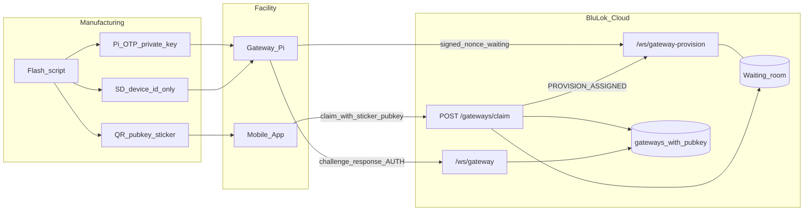
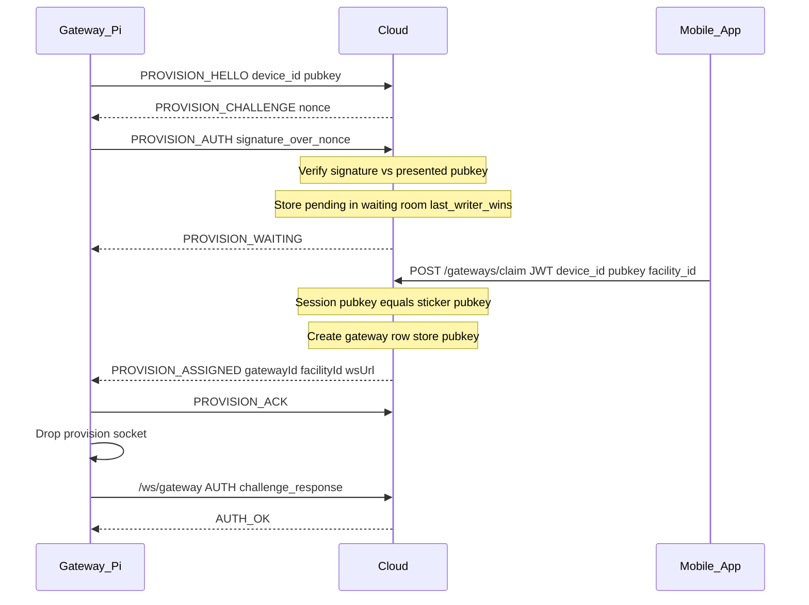

# Gateway Zero-Touch Provisioning (Sticker ZTP) — Architecture

**Status:** Implemented (backend + simulator Tier 0; Pi OTP Tier A is firmware/manufacturing)  
**Related:** [Gateway ↔ Cloud integration](./gateway-integration.md), [Gateway auto-registration](./gateway-auto-registration-design.md), [Gateway swap / recovery](./gateway-swap-recovery-architecture.md)

**Firmware contract (implement this):** [Gateway ZTP — firmware developer guide](./gateway-ztp-firmware-developer-guide.md)

Secure, low-maintenance provisioning for headless facility gateways: one golden image, a sticker on the box, no typing on the Pi, no warehouse database of serials in the cloud.

> **Approved:** Public key on sticker + ECDSA P-256 challenge-response. No secret on the QR. No expiring device tokens. Production target: private key in Pi OTP (Tier A); lab/current: software key on SD (Tier 0). See [§17](#17-device-key-protection-closing-the-sd-card-flaw).
>
> **Pending session store:** Redis is **not** a hard requirement. It is the preferred shared store when Cloud Run runs multiple instances. With the same constraint already documented for `/ws/gateway` (`max-instances=1` or equivalent), an **in-process waiting room** is enough. MySQL with a short TTL is also viable. See [§8](#8-data-model-cloud).

---

## How it actually works

### The problem we are solving

Today a gateway joins the cloud by presenting a **human** login JWT (facility admin email/password baked into or entered on the device) plus a self-chosen GUID. That is awkward for a headless appliance and weak for “ship identical images, plug in at site, done.”

We want:

- Every Pi ships with the **same software image**.
- The only thing unique per unit is a tiny identity file written when the SD card is flashed, mirrored on a **physical QR sticker**.
- The installer never opens a gateway UI. They use the **BluLok mobile app** they already trust.
- The cloud does **not** need a pre-loaded inventory of every serial before the unit ships.
- After pairing, the gateway talks to cloud with its **own machine credential**, not a person’s password.

### The core idea: an asymmetric keypair, split between SD card and sticker

At flash time each unit gets:

1. **`device_id`** — a random UUID. This becomes the gateway’s permanent id in the cloud (`gateways.id`).
2. **An ECDSA P-256 keypair** (Pi OTP–compatible). The **private key** must not live as a plaintext file on a removable SD card in production — see §17. The **public key** is printed into the sticker QR.


```text
blulok://gw/claim?device_id=<uuid>&pk=<base64url-compressed-p256-pubkey>

```

An ECDSA P-256 compressed public key is 33 bytes (~44 base64url characters) — it fits comfortably in a QR alongside the UUID. We standardize on **P-256** (not Ed25519) so the same protocol works with Raspberry Pi OTP firmware crypto without dual algorithms.


The split is the whole trick:

- The **sticker is public information.** Anyone can photograph it in a warehouse; it lets them *identify* the device, never *impersonate* it.
- The **signing key stays on the hardware.** In production it lives in the Pi’s OTP (not on the removable SD). Only that physical board can produce signatures.
- **Claiming** means: an authenticated facility admin says “bind the device whose public key is on this sticker to my facility,” and the cloud checks that the live, waiting device can actually sign with the matching private key.

Until someone claims the device, **the cloud has never seen either value**. There is no factory registration step and no inventory to maintain.

### End-to-end story (happy path)

**1. Factory**

The flash script provisions an ECDSA P-256 key into the **Pi’s OTP** (production) or a lab software key, writes `device_id` to the SD card, and prints the QR sticker (`device_id` + public key) on the chassis. The private key never appears on the sticker and, in production, never as a plaintext file on the SD card.


**2. Site: plug in the gateway**

The installer gives the Pi power and network (Ethernet preferred). On boot the gateway:

- Reads its identity file.
- Opens a **provisioning** WebSocket to the cloud (`/ws/gateway-provision`) — not the normal operational socket yet.
- Sends `device_id` + its public key, receives a random **nonce**, and returns a **signature** over the nonce.
- The cloud verifies the signature against the presented public key. The session is now cryptographically proven to hold that keypair. The cloud parks it in the **waiting room** (in-process map initially; see §8) and the Pi shows a **ready LED** (slow blink).

At this moment the cloud still has **no gateway row** in MySQL — just a short-lived pending entry.

**3. Site: claim from the phone**

The facility admin opens the BluLok app (already logged in), starts “Add gateway,” waits for the ready LED, and scans the sticker.

The app sends one authenticated API call:

> “I am facility admin of Facility X. Bind `device_id` from this QR. Here is the public key from the sticker.”

**4. Cloud matches three things**

The claim completes only if **all** are true:

| Check | Why |
|-------|-----|
| Caller’s JWT may manage that facility | Authorization — who owns the facility |
| That `device_id` has a live, signature-verified provisioning session | The physical unit is online right now and holds the private key |
| The public key from the QR equals the session’s public key | The scanned sticker belongs to the online box, not some other device |

If anything fails (wrong sticker, device offline, already claimed), the app gets a clear error and nothing is bound.

**5. Cloud finishes pairing in one shot**

On success, the cloud atomically:

1. Creates the `gateways` row (`id = device_id`, bound to the facility) and stores the **public key** as the gateway’s permanent credential.
2. Marks the `device_id` claimed (a sticker can bind exactly one facility until released).
3. Pushes `PROVISION_ASSIGNED` down the same provisioning socket.
4. Tells the app “success.”

Note what is *not* here: no secret to burn, no bearer token bundle to deliver. The device already owns its credential — the private key.

**6. Gateway goes operational (and stays that way forever without re-scan)**

The Pi drops the provisioning socket and connects to the normal gateway channel (`/ws/gateway`). Operational AUTH is the same challenge-response pattern: cloud sends a nonce, device signs it with the **same flash-time private key**, cloud verifies against the stored public key. LED goes solid.

That private key **never expires**. Power outages, Cloud Run disconnects, or months offline do not force a sticker re-scan — the device just reconnects and signs a fresh nonce. Re-provision is only for Release (move facility) or Revoke (compromise). There is no API key and no access/refresh JWT on the device; those would either expire (your concern) or become a stealable bearer (weaker than the key we already have). See [§7.3](#73-operational-auth--wsgateway-permanent-challenge-response).

### Why this beats a shared secret on the sticker

The obvious v1 design prints a secret PIN on the sticker and has the app relay it to the cloud. We rejected it (details in §16) because:

- **A photo of the sticker = the secret.** Anyone in the supply chain who photographs the QR and has any facility-admin account can pre-claim the unit. With a public key, a photo is worthless.
- **The cloud can’t verify a secret it has never seen**, forcing an awkward HMAC-commitment protocol where squatters look identical to real devices until claim time. A signature is verifiable the moment the device connects.
- **Bearer tokens need rotation and clone tripwires.** With challenge-response signatures there is no token on disk to steal and replay; the private key never crosses the wire.
- **RMA re-claims get ugly** — “re-arming” a burned secret re-opens the photo attack. Re-claiming with a public sticker is always safe.

### What the installer experiences

1. Log into the app as facility admin.  
2. Plug in the gateway; wait for the ready LED.  
3. Scan sticker → confirm facility → done when status shows online.

No password on the Pi. No typing UUIDs. If they scan before the gateway is online, the app says “plug in and wait for ready,” not a cryptic crypto error.

### What this does *not* fully stop (honesty)

- **SD card clone (software-key mode only).** If the private key lives as a file on the SD card, copying the card to another Pi impersonates the gateway. **Solvable** — see [§17 Device key protection](#17-device-key-protection-closing-the-sd-card-flaw). Production hardware should **not** ship in software-key mode.
- **Theft of the entire powered gateway.** Whoever holds the physical board that contains the signing key *is* that gateway until cloud **Revoke**. No protocol fixes “attacker stole the appliance.” Detect (session flap / unexpected geography) + revoke + reflash/replace.
- **Physical possession + facility admin (pre-claim).** Holding the unbound unit *and* an FA account can claim it — that is a legitimate install.

---

## 1. Goals

1. Ship the same OS/JAR image on every unit (no facility secrets baked in).
2. Identity comes from **flash-time** injection + a **physical sticker** (not a dynamic on-device QR).
3. Installer never logs into the gateway; they use the mobile app (already logged in).
4. Cloud needs **no warehouse inventory** of serials/MACs before install.
5. Sticker contains **no secret** — photographing it must be harmless.
6. Operational tunnel authenticated by a **device keypair**, not a human email/password or long-lived bearer token.

---

## 2. Non-goals (initial cloud slice)

- Warehouse MAC/serial pre-registration in cloud
- Dynamic HDMI/setup-screen QR
- Local gateway web admin / cloud password login on the Pi
- Manufacturing CA / full mTLS PKI (can layer later; see §16)
- Immediately removing legacy human-JWT `/ws/gateway` AUTH (lab/legacy coexistence)

**Not a non-goal:** hardware-binding the signing key (Pi OTP / secure boot / SE). That is a **required production path** for real hardware — see §17. Cloud protocol stays the same either way (verify ECDSA P-256 signatures against stored pubkey).

---

## 3. Actors and trust

| Actor | Trust role |
|-------|------------|
| **Manufacturing flash script** | Writes `device_id`; provisions device key into **Pi OTP** (or lab software key); prints pubkey sticker |
| **Gateway (Pi)** | Outbound-only; proves identity by signing nonces via OTP/firmware crypto (prod) or software key (lab); never exports private key |
| **Mobile app** | Authenticated `facility_admin` (or admin); scans sticker; submits claim |
| **Cloud** | Verifies signatures; matches sticker pubkey to live session; binds facility; stores pubkey |

---

## 4. Identity artifacts

### Flash / sticker

| Artifact | Where | Sensitivity |
|----------|--------|--------|
| `device_id` (UUID) | `/boot/blulok_identity.json` + QR | Public |
| ECDSA P-256 **private key** | **Production:** Raspberry Pi OTP (sign via firmware; never on SD). **Lab only:** encrypted/file on SD (software-key mode) | **Secret** — never printed, never sent |
| ECDSA P-256 **public key** | QR sticker (+ sent by device on connect) | Public |

**QR URI:**

```text
blulok://gw/claim?device_id=<uuid>&pk=<base64url-compressed-p256-pubkey>
```

Human-readable `device_id` printed under the QR for backup entry if the camera fails (app can then match the pubkey from the live session).

### Cloud (after claim)

| Artifact | Storage |
|----------|---------|
| Gateway row | `gateways.id = device_id`, `facility_id`, provision metadata |
| `public_key` | Permanent machine credential for operational AUTH |
| Claim audit | `claimed_by_user_id`, `claimed_at`; claim-once uniqueness |

### Ephemeral (pre-claim only)

Pending provision sessions in an ephemeral **waiting room** (not the main `gateways` table): `{ deviceId, publicKey, nonce, verifiedAt, ownerInstanceId, expiresAt }`. See §8 for in-process vs MySQL vs Redis.
No permanent gateway row until a successful claim.

---

## 5. High-level architecture



---

## 6. Lifecycle states

| State | Meaning |
|-------|---------|
| **Flashed / unbound** | Private key on SD; may open provision WS; **no** cloud gateway row |
| **Pending** | Live waiting-room session: device online, signature verified, waiting for app claim |
| **Claimed** | Gateway row exists with stored pubkey; bound to facility |
| **Operational** | Active `/ws/gateway` session established via signature AUTH |
| **Released** | Facility unbound; device may be re-claimed with the same sticker (safe — QR is public) |
| **Revoked** | Admin kill or compromise; pubkey rejected until re-flash |

---

## 7. Protocol reference

### 7.1 Provisioning WebSocket — `wss://…/ws/gateway-provision`

Separate from operational `/ws/gateway`. Used only until claim completes.



Rules:

- Signature is verified **at connect** against the pubkey the device presents (self-consistent proof of key possession). Binding to *the sticker* happens at claim via pubkey equality.
- Sign over `nonce || device_id` with a domain-separation prefix (e.g. `"blulok-ztp-v1"`) to prevent cross-protocol signature reuse.
- At most one pending session per `device_id` (newer verified connect replaces older).
- No MySQL writes for unbound devices; nonces are single-use with short expiry.
- Multi-instance deploys: either keep **`max-instances=1`** (same as operational gateway WS today) so claim and provision share one process, **or** use a shared pending store (MySQL/Redis) so any instance can complete claim and signal `ASSIGNED`.

### 7.2 Claim REST — `POST /api/v1/gateways/claim`

**Auth:** Bearer user JWT; `facility_admin` for `facility_id`, or `admin` / `dev_admin`.

```json
{
  "facility_id": "<uuid>",
  "device_id": "<uuid>",
  "public_key": "<base64url from QR>",
  "name": "optional"
}
```

Atomic server steps:

1. Authorize facility access  
2. Load live pending session for `device_id`  
3. Constant-time compare: session `publicKey` === submitted `public_key`  
4. Reject hard conflicts (`409`): already claimed to another facility, revoked, pubkey mismatch  
5. Persist `gateways` row with `public_key` + claim audit fields:
   - **Greenfield** (no other gateway bound to `facility_id`): bind `facility_id`, return `bound: true`, `sessionRole: "active"`
   - **Facility already has a bound gateway** (RMA / replace): leave this row **unbound** (`facility_id: null`), store `metadata.ztpIntendedFacilityId`, return `bound: false`, `sessionRole: "swap_candidate"` — does **not** steal the live production binding
6. Push `PROVISION_ASSIGNED { gatewayId, facilityId, sessionRole }` on that provision socket  
7. Return `200`/`201` to app with `bound` + `sessionRole`

No live session → `425` (device not in provisioning mode — plug in, wait for ready LED, retry).

Swap-prep claim is followed by operational ECDSA AUTH as `swap_candidate`, then the existing [Swap/Recovery](./gateway-swap-recovery-architecture.md) UI to promote. Claim never auto-finalizes recovery.

### 7.3 Operational AUTH — `/ws/gateway` (permanent challenge-response)

**Decision (locked):** After claim, the gateway authenticates forever with the **same device ECDSA P-256 private key** (OTP in production). There is no API key, no access/refresh JWT on the device, and **no credential expiry**. Offline for months → power back on → same signature AUTH works. Re-provision is only required on Release (facility move) or Revoke (compromise / reflash).


```mermaid
sequenceDiagram
  participant Pi as Gateway_Pi
  participant Cloud as Cloud

  Pi->>Cloud: WSS connect /ws/gateway
  Pi->>Cloud: AUTH_HELLO gatewayId [facilityId]
  Cloud-->>Pi: AUTH_CHALLENGE nonce expires_in_seconds
  Pi->>Cloud: AUTH_PROOF signature_over_prefix_nonce_gatewayId
  Note over Cloud: Lookup gateways.public_key verify signature
  Note over Cloud: Bound row → active; unbound + intended facility + other bound → park swap_candidate
  Cloud-->>Pi: AUTH_OK gatewayId facilityId sessionRole
```

| Mode | Mechanism |
|------|--------|
| **ZTP (production)** | `AUTH_HELLO {gatewayId, facilityId?}` → `AUTH_CHALLENGE {nonce}` → `AUTH_PROOF {signature}` → verify vs stored `public_key` → `AUTH_OK` with `sessionRole` `active` or `swap_candidate` |
| **Legacy (lab)** | Human facility_admin/admin JWT in `AUTH.token` (existing behavior; **rejected** if the gateway row has `public_key`) |

Unbound ZTP rows (swap-prep after claim) may AUTH when `metadata.ztpIntendedFacilityId` is set; optional HELLO `facilityId` must match. Production session is never displaced until Swap/Recovery finalize.

#### Why not an API key / long-lived bearer?

| Option | Offline for months? | Secret on the wire? | Steal from SD / logs? | Kill compromised unit? |
|--------|---------------------|---------------------|----------------------|------------------------|
| **Expiring JWT + refresh** | Breaks if refresh window missed → forced re-provision | Yes (bearer) | Yes | Revoke refresh family |
| **Long-lived API key** | Survives | Yes every AUTH (or every request) | Yes — copy key = full impersonation until rotated | Rotate / revoke key in DB |
| **Challenge-response (chosen)** | Survives — key never expires | No — only a one-time signature | Private key yes, but never transmitted; clone still trips single-session + flap alerts | Set `revoked_at`; pubkey rejected |

An API key is just a non-expiring password. It satisfies “don’t force re-provision after long offline,” but it is weaker than the key we already have on the card:

1. Every reconnect would send a stealable secret over TLS (or HMAC it — at which point you reinvented challenge-response with a second secret).
2. You’d need a second credential lifecycle (issue at claim, store hash, rotate, dual-key windows) on top of the flash keypair.
3. Logging, support dumps, and SD clones all become full impersonation until ops rotates the key.

The private key already never expires. Challenge-response is the secure way to *use* that permanent credential without turning it into a bearer.

#### Properties

- **Credential lifetime = device lifetime** (until Release or Revoke). No clock, no refresh job, no “token expired while power was off.”
- **Nonces are short-lived** (seconds). That is *session* freshness, not credential expiry. A stale challenge just means “ask for a new nonce” — never “go scan the sticker again.”
- **Nothing secret crosses the wire.** Signatures are nonce-bound and single-use.
- Cloud may mint a short-lived **in-memory** session JWT after `AUTH_OK` for its own bookkeeping — never written to the Pi.
- One active operational session per facility remains (existing `4000 replaced`). **Alert on session flapping** — clone-detection signal.
- Sign with a distinct domain prefix from provisioning (e.g. `"blulok-gw-auth-v1"`) so provision signatures cannot be replayed as operational AUTH.

#### When re-provision *is* required

| Event | What happens |
|-------|----------------|
| Long offline / power loss / Cloud Run disconnect | Reconnect + same `AUTH_HELLO` / sign — **no** sticker |
| Facility move / RMA reuse | Portal **Release** → Pi wipe → provision mode → scan sticker again |
| Suspected key compromise | Portal **Revoke** → pubkey rejected → reflash new identity + new sticker |

Production flag **`GATEWAY_ZTP_REQUIRED`**: disables first-install auto-bind via human JWT so sticker claim cannot be bypassed.

---

## 8. Data model (cloud)

### Ephemeral — the waiting room (pending provision sessions)

Stores online-but-unclaimed gateways: `{ publicKey, nonce, verifiedAt, expiresAt, ownerInstanceId }`, keyed by `device_id`, TTL ~30 minutes. **Not** a permanent inventory.

**Redis is not required.** It is one implementation of a shared waiting room. Pick based on how you already run `/ws/gateway`:

| Option | When to use | Claim → ASSIGNED delivery |
|--------|-------------|---------------------------|
| **In-process map** (default for current Cloud Run) | Same constraint as today’s gateway sockets: prefer **`max-instances=1`** (already recommended in [gateway-integration.md](./gateway-integration.md) because `facilityToClient` is in-memory). Claim HTTP and provision WS land on the same process. | Direct push on the local socket |
| **MySQL / Cloud SQL** table `gateway_ztp_pending` | Want multi-instance without introducing Redis. Row TTL via `expires_at` + periodic cleanup. | Instance holding the socket **polls** (e.g. every 1–2s) or watches a `claim_token` / `assigned_at` column; on claim, HTTP writes the row and the WS loop sends `ASSIGNED` |
| **Redis / Memorystore** | Multi-instance Cloud Run *and* you want pub/sub fan-out without polling. Terraform already sketches Memorystore; the Node app does **not** use it yet. | Pub/sub (or key + owner instance signal) to the process that owns the socket |

**Locked for initial implementation:** in-process waiting room (matches existing gateway WS topology). Abstract behind a small `ZtpPendingStore` interface so Redis or MySQL can be swapped later without protocol changes.

Do **not** write unbound devices into the main `gateways` table until claim succeeds.

### Persistent (`gateways` table)

| Column | Purpose |
|--------|---------|
| `id` | UUID = `device_id` |
| `facility_id` | Bound facility (`NULL` when unbound after Release) |
| `public_key` | Permanent machine credential (ECDSA P-256 compressed, base64url) |
| `status` | e.g. `operational` / `unbound` / `revoked` (or equivalent existing status + flags) |
| `claimed_by_user_id`, `claimed_at` | Audit |
| `released_at` | RMA / move |
| `revoked_at` | Compromise / kill switch |
| `metadata.provisionedVia` | `"ztp_sticker"` |
| `metadata.key_protection` | Optional: `"software"` \| `"otp"` \| `"se"` |

Claim-once = uniqueness on `gateways.id` with `revoked_at` / unbound gates for re-claim after Release.

---

## 9. Threat model (summary)

| Threat | Mitigation |
|--------|------------|
| Warehouse photo of sticker | **Harmless** — QR is public key only; cannot sign challenges |
| Guess device_id / socket squatting | Cannot pass signature verification without private key |
| Claim races (two sessions, same device_id) | Only one signature-verified pending session; both would need the private key |
| MITM on facility LAN | Nothing secret on the wire; signatures are nonce-bound and single-use; TLS still required |
| Post-claim SD clone | **Closed in production** by Pi OTP key (§17) — cloned SD cannot sign on different hardware. Lab software-key: single-session + flap alerts |
| SD theft alone (prod) | Useless without the SoC that holds the OTP key |
| Whole-unit theft | Attacker *is* the gateway until **Revoke**; flap/geo alerts; replace hardware |
| SD theft before claim (lab software-key) | Thief still needs a facility-admin account to claim; audit trail |
| Root extract of OTP key | Mitigated by `lock_device_private_key` + secure boot + encrypted rootfs (Tier B); not a full HSM |
| Cloud bloat from floods | Signature check before any pending-store write; rate limits; TTL; no MySQL gateway row until claim |
| Legacy AUTH bypass | `GATEWAY_ZTP_REQUIRED` in production |
| Multi-instance claim miss | Same as today’s gateway WS: keep `max-instances=1` **or** shared pending store (MySQL/Redis) + assign signal |
| Cross-protocol signature reuse | Domain-separated signing prefix per message type |

---

## 10. RMA / release / swap

| Scenario | Flow |
|----------|------|
| **Move / re-claim same hardware** | Portal **Release** (Facility → Gateway overview, or `POST /api/v1/gateways/:id/release`) → unbind facility, clear `ztpIntendedFacilityId`, set `released_at`, **keep `public_key`** → force-disconnect that gateway’s WS (`ztp_released`) → Pi returns to provision mode → scan the **same sticker** again |
| **Abandon swap-prep** | Release works on unbound ZTP rows scoped by `ztpIntendedFacilityId` (FA of that facility or admin) — clears intent so ops AUTH cannot park again without a new claim |
| **Replace hardware** | New unit sticker → claim while old gateway still bound → cloud creates **unbound** ZTP identity (`bound: false`, `sessionRole: swap_candidate`) → device AUTH parks as swap candidate → operator completes [swap / recovery](./gateway-swap-recovery-architecture.md) |
| **Suspected key compromise** | **Revoke** → pubkey rejected everywhere → unit must be re-flashed with a new identity + new sticker |

---

## 11. Installer UX (product contract)

Headless device needs an **external ready signal** or field installs will generate support load.

| Step | User experience |
|------|-----------------|
| 1 | Log into BluLok app as facility admin |
| 2 | Plug in gateway (Ethernet preferred); wait for **ready LED** |
| 3 | App wizard: Power → Ready → Scan sticker |
| 4 | Confirm facility → claim |
| 5 | Success when gateway shows **operational online** (not merely HTTP 201) |

LED (minimum):

- Slow blink — provisioning, waiting for claim  
- Solid / distinct pattern — operational  
- Error pattern — cannot reach cloud  

App must handle: offline device (`425`), already claimed (`409`), facility already has a gateway → claim succeeds as **swap_candidate** (then Swap/Recovery), multi-facility picker.

---

## 12. Component ownership

| Component | Responsibility |
|-----------|----------------|
| **Manufacturing** | Provision OTP key (prod) or lab software key; write `device_id`; print pubkey QR; enable lock/secure-boot per tier |
| **Gateway firmware** | Sign via `rpi-fw-crypto` / PKCS#11 (prod) or software key (lab); provision + operational challenge-response; LED states; no local login UI — see [firmware developer guide](./gateway-ztp-firmware-developer-guide.md) |
| **Mobile app** | Provisioning wizard; QR parse; claim API; wait for online |
| **Cloud (this repo)** | `/ws/gateway-provision`, claim/release/revoke APIs, signature AUTH on `/ws/gateway`, `ZtpPendingStore` waiting room, audit, flags |

---

## 13. Coexistence with today’s auto-registration

Today, a facility_admin JWT on `/ws/gateway` can auto-create/bind a gateway GUID ([auto-registration design](./gateway-auto-registration-design.md)).

| Environment | Behavior |
|-------------|----------|
| Lab / legacy | Human JWT AUTH + auto-register may remain for **non-ZTP** gateways |
| Any env, row has `public_key` | Human JWT `AUTH` is **rejected** — device must use ECDSA `AUTH_HELLO` / `AUTH_PROOF` |
| Production (`GATEWAY_ZTP_REQUIRED`) | Greenfield bind only via sticker claim + signature AUTH (no JWT first-install auto-bind) |

ZTP does not remove swap/recovery for replacement hardware.

---

## 14. Implementation phases

1. Design doc (this file) + cross-links  
2. Cloud: provision WS, in-process `ZtpPendingStore`, claim, **ECDSA P-256** signature AUTH on `/ws/gateway`, tests  
3. Release / revoke + wipe hook + flap alerting  
4. Mobile claim UX  
5. Firmware: provision client + LED + **lab software-key mode** (unblocks cloud/app before factory OTP tooling lands)  
6. **Production key protection (required for shipping hardware):** Pi OTP provisioning in flash script + firmware sign path + `lock_device_private_key` (§17 Tier A)  
7. **Hardening:** secure boot + LUKS (§17 Tier B); optional external SE (§17 Tier C); manufacturing CA if needed  

---

## 15. Open follow-ups

- Nonce format, signature domain-separation prefixes, and message schemas (implementation detail)  
- Authenticated “is this `device_id` pending online?” helper for the app wizard  
- Wi-Fi commission path for sites without Ethernet (product decision; out of core ZTP crypto)  
- Factory decision: which Pi SKU + confirm OTP crypto / secure-boot support on the chosen board  
- Whether lab software-key mode is allowed behind an explicit `GATEWAY_ALLOW_SOFTWARE_KEY=1` cloud/firmware flag (recommended: yes for simulators; no for production images)
- When to default `GATEWAY_ZTP_REQUIRED=true` in production (deferred until mobile claim + firmware land)

### Locked product decisions (lab / cloud)

| Decision | Choice |
|----------|--------|
| JWT AUTH when row has `public_key` | **Rejected** — ZTP devices must use ECDSA forever (not gated only on `GATEWAY_ZTP_REQUIRED`) |
| Release pubkey policy | **Keep `public_key`** + audit `released_at` — same sticker re-claim after RMA/move |
| Simulator ZTP | Accurate provision waiting room; factory sticker QR (`blulok://gw/claim?…`); UI for factory reset / claim / auth mode; respect `ztp_released` close reason |
| `ws:e2e:ztp` | Hybrid: primary gateway ECDSA; swap/bulk sections stay on legacy JWT |
---

## 16. Alternatives considered

### “Burn and Roll” — PIN sticker + refresh-token clone trap (rejected as primary)

A software-only design (no OTP/TPM): sticker carries `device_id` + single-use `provisioning_pin`; claim burns the PIN and delivers `access_token` + infinite-TTL rotating `refresh_token`; reuse of an old refresh token revokes the gateway (“clone trap”), with a `previous_refresh_token` grace window closed when the new access token successfully opens `/ws/gateway`. Release returns the Pi to the waiting room using the **original** PIN on `/boot/ztp.json`.

**Same UX as our design** (power → ready LED → scan → solid). The clone-trap / grace-period logic is carefully thought through for *active* forks and network drops. It is **not** more secure overall, and it is **not** simpler in the cloud.

#### Side-by-side

| Criterion | Burn and Roll | Pubkey + challenge-response (current) | + Pi OTP (§17) |
|-----------|---------------|----------------------------------------|----------------|
| Installer UX | Identical | Identical | Identical |
| Factory tooling | Easiest (write PIN file + print QR) | Write keypair (or pubkey+OTP) + print QR | OTP provision step |
| Cloud complexity | **High** — rotate API, current/previous refresh, grace close, revoke, reset-tokens, brick recovery | **Low** — verify signatures; no token family | Same (cloud unchanged) |
| Warehouse / logistics photo of QR | **Vulnerable** — PIN *is* the secret; any FA account can pre-claim | Harmless (QR is public) | Harmless |
| “Only paid FA can claim” as photo mitigation | Does **not** close it — attackers can be (or create) a legitimate FA on *their* facility | N/A | N/A |
| Zero-inventory PIN verify at connect | Cannot know PIN is correct until claim; URL `?pin=` also leaks into proxy/CDN logs | Signature self-verifies at connect | Same |
| Release / RMA | Re-arms **same PIN forever** → every warehouse photo is a permanent re-claim credential | Same sticker always safe to re-scan | Same |
| SD clone while **both** try to run | Detected (often **bricks both** → support re-scan) | Session replace + flap alert; revoke optional | Clone **cannot sign** on other hardware |
| SD clone while original **offline** / powered down | Clone has current tokens → becomes the “real” device **silently**; trap never fires until original returns (then possibly bricks the legitimate unit too) | Same residual if software key on SD | **Closed** — wrong SoC cannot auth |
| Long offline (months) | OK if refresh never expires (as specified) | OK — key never expires | OK |
| Passive clone that never refreshes | Mitigated if access JWT hard-expires and socket is killed | N/A (no bearer) | N/A |
| Credentials on disk | Access + refresh tokens on SD (clone gets them) | Private key on SD (lab) or OTP (prod) | Not on SD |

#### Critical flaws in the Burn and Roll threat model

1. **Warehouse photo is not mitigated by RBAC.** The doc claims only a facility_admin of a paid facility can claim. That is authorization for *who may bind*, not proof of *physical custody*. Anyone with a BluLok FA account who photographed the QR can claim the unit to *their* facility before the real installer arrives. Live-socket + PIN match does not help — the attacker’s socket presents the photographed PIN.

2. **Release re-arming the original PIN makes (1) permanent.** After every facility move, the photographed sticker works again. Support “Reset Tokens → re-scan QR” has the same property.

3. **The clone trap does not prefer the legitimate hardware.** It detects *diverging token chains*. If the attacker clones while the gateway is offline and powers the clone first, the clone is the healthy chain; the real site gateway may brick itself on return. Security outcome is often “both dead, truck roll / re-scan,” not “clone dies, original lives.”

4. **PIN on the WebSocket query string** (`/ws/provision?device_id=&pin=`) is an operational foot-gun (access logs, reverse proxies). Even moved into the first message, the PIN remains a stealable shared secret.

5. **“Bullet-proof without hardware crypto” oversells.** Refresh rotation is an excellent *detection* layer for *concurrent* clones. It is not prevention, and it does not replace hardware binding for the offline-clone case.

#### What Burn and Roll gets right (keep the ideas)

- Ready LED + scan UX contract  
- Single active WS per gateway  
- Short-lived access JWT *if* you were using bearers (force reconnect)  
- Graceful refresh retry (`previous` token) — good pattern **if** you ever need bearer rotation  
- Explicit revoke + admin reset path for false positives  

Those ideas apply equally on top of pubkey auth (session singularity + flap alerts). They do not justify putting a secret on the sticker.

#### Verdict

| Goal they named | Winner |
|-----------------|--------|
| Pleasant UX | Tie |
| Simplicity (cloud + long-term ops) | **Pubkey design** (no rotate/grace/brick-recovery machinery) |
| Simplicity (factory today, no OTP) | **Burn and Roll** slightly — but pubkey+**software key** is nearly as easy and closes the photo hole |
| Bullet-proof vs SD clone | **OTP** (prevention) ≫ clone trap (detection, often mutual brick) |
| Bullet-proof vs supply-chain photo | **Pubkey** ≫ Burn and Roll |

**Do not adopt Burn and Roll as the primary architecture.** If manufacturing OTP is deferred, ship **pubkey sticker + software key on SD + session flap alerts** (our Tier 0 temporarily in the field) rather than PIN-on-sticker — you keep software-only simplicity without re-opening warehouse hijack. Add OTP when factory tooling is ready; wire protocol unchanged.

### v1: shared secret printed on the sticker (rejected)

Superseded by the Burn and Roll analysis above — same core flaw (secret on QR), with a less detailed clone story. See comparison table there.

### Factory-issued certificates (mTLS / manufacturing CA) — deferred

Flash script mints a per-device cert signed by a BluLok manufacturing CA; sticker carries the cert fingerprint. Adds provenance (“BluLok made this unit”) and standard mTLS tooling, but requires CA key management, issuance auditing, and revocation infrastructure. The raw-keypair design gets ~90% of the benefit with none of the PKI overhead; the CA can be layered on later without changing the claim UX. Does **not** by itself stop SD clones unless the private key is also hardware-bound (§17).

### BLE proximity proof — deferred

Phone must receive a nonce broadcast from the powered device to complete the claim, proving physical presence. With a public-key sticker the attack it defends against (remote claim with photographed credentials) is already dead, so BLE only adds value against a thief who has both the private key and an FA account — niche enough to defer. Would help Burn and Roll’s photo problem; still would not fix offline SD clone vs OTP.

### Cloud-generated pairing codes — rejected

Admin generates a code in the portal and enters it on the device. Requires local input on a headless box; fails the core constraint.

### Long-lived API key / non-expiring JWT for operational AUTH — rejected

Satisfies “don’t re-provision after long offline,” but is strictly weaker than challenge-response with the device keypair:

- Secret (or bearer) crosses the wire every connect, or you HMAC it and reinvent challenge-response with a *second* secret.
- SD clone / log leak = silent impersonation until ops rotates; challenge-response never transmits the private key.
- Extra credential lifecycle (issue, hash store, dual-key rotation) with no UX benefit over “sign the nonce with the key you already have.”

**Locked:** permanent ECDSA P-256 challenge-response for `/ws/gateway`. Nonces expire in seconds (session freshness only); the key itself does not.

### “Just encrypt the key on the SD with a password” — rejected

No one to type a password on a headless box; a fixed password in the image is shared across the fleet and worthless.

---

## 17. Device key protection (closing the SD-card flaw)

### The real problem

Challenge-response stops **wire** theft. It does **not** stop **disk** theft if the private key is a file on a removable SD card. Clone the card → clone the identity.

Two different attacks get conflated:

| Attack | What attacker has | Can crypto stop it? |
|--------|-------------------|---------------------|
| **A. SD clone** | Copy of the card, different (or blank) Pi | **Yes** — bind key to the SoC so the clone cannot sign |
| **B. Whole-unit theft** | The physical gateway that holds the key | **No** — that box *is* the authenticator until cloud Revoke |

We solve A properly. For B we detect + revoke (and optionally ship with chassis tamper / facility cameras — product, not protocol).

### Tiers (pick for manufacturing)

#### Tier 0 — Software key on SD (lab / simulator only)

Private key in `/boot/blulok_identity.json`. Fine for gateway-simulator and engineering boards. **Forbidden on production shipping images** (or gated behind an explicit lab flag). Residual: SD clone = impersonation; rely on single-session + flap alerts only.

#### Tier A — Raspberry Pi OTP device key (**recommended production minimum**)

Raspberry Pi SoCs expose a **device-unique ECDSA P-256 private key in OTP**. Firmware crypto (`rpi-fw-crypto` / `librpifwcrypto`, optionally PKCS#11) can **sign without exporting the key to userspace**. Factory:

1. Generate (or accept) OTP key via `rpi-fw-crypto genkey` / `rpi-otp-private-key`
2. Export **public** key only → print sticker QR + store later at claim in cloud
3. Write `device_id` (and maybe pubkey copy) to SD — **never the private key**
4. Set `lock_device_private_key=1` so raw OTP private-key read-back is blocked after boot

**Result:** Stealing or cloning the SD card alone cannot impersonate the gateway. The signer is fused to that board.

Caveat (Raspberry Pi’s own docs): this is **not a full HSM**. Root on an unlocked board may still reach OTP. Tier A closes casual SD cloning; Tier B raises the bar against malware/root.

#### Tier B — Tier A + secure boot + encrypted rootfs (**recommended for field**)

- Fuse BluLok secure-boot pubkey hash into OTP; only signed boot images run
- LUKS (or equivalent) for root so a pulled SD is ciphertext without the SoC-derived unlock
- Only trusted firmware can call sign APIs

**Result:** Attacker needs a running, non-tampered board — not just a disk image. Still: if they steal the whole powered unit, they can keep using it until Revoke.

#### Tier C — External secure element (ATECC608 / TPM) — optional

Add a discrete SE that generates the key internally and never releases it. Stronger extraction resistance and third-party audit story; extra BOM, board spin, and manufacturing programming. Use if threat model / insurers demand it beyond Pi OTP.

### Protocol impact

**None for cloud.** Claim and `/ws/gateway` AUTH always verify ECDSA P-256 signatures against `gateways.public_key`. Whether the Pi signed with OTP, an SE, or a lab software key is invisible to the cloud. Optional metadata: `key_protection: "otp" | "se" | "software"` for fleet policy (e.g. reject `software` when `GATEWAY_ZTP_REQUIRED`).

### Detection still required (Tier A–C)

Even with perfect hardware binding, a stolen **whole unit** authenticates successfully. Keep:

- One active session per gateway/facility (existing replace behavior)
- **Flap alerts** (rapid session replaces)
- Admin **Revoke** → pubkey rejected → unit is a brick until reflash / new identity
- Optional later: unusual reconnect patterns, facility geo mismatch

### Locked recommendation

| Environment | Key protection |
|-------------|----------------|
| Gateway simulator / eng lab | Tier 0 software key |
| Production shipping gateways | **Tier A minimum**; target **Tier B** before broad field deploy |
| High-assurance SKU (if ever) | Tier C |

Cloud work does not wait on factory OTP tooling — implement signature AUTH first; firmware starts in Tier 0 for e2e, then swaps the signer backend to OTP without changing wire protocol.
