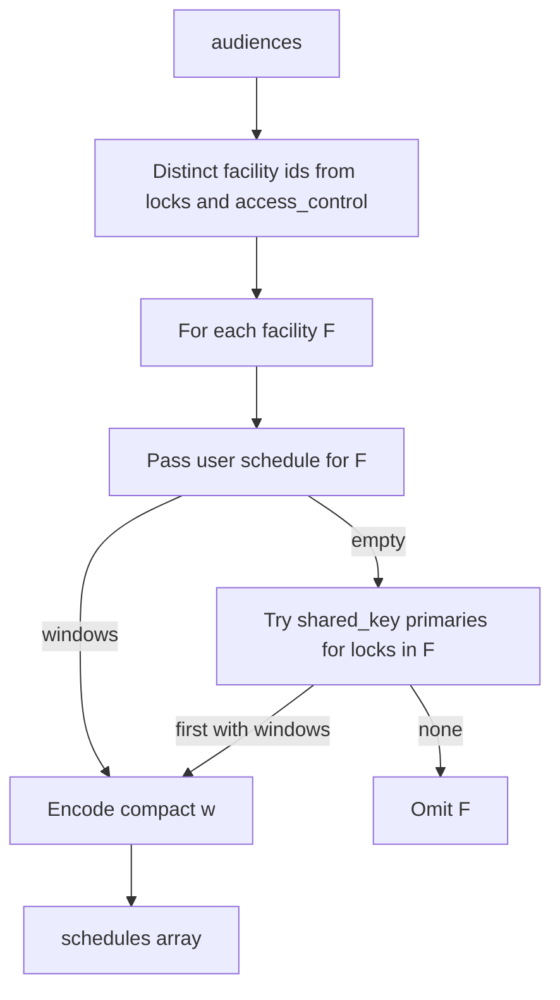

# Route pass JWT (BluLok Cloud)

This document describes the **route pass**: a short-lived **Ed25519-signed JWT** issued by BluLok Cloud that authorizes a **specific user** on a **specific registered app device** to interact with **specific locks and access-control devices**. Mobile clients obtain it over HTTPS and present it to hardware (often over BLE) for verification.

Related context: [auth.md](./auth.md) (user sessions and roles), [security-design.md](./security-design.md), [gateway-integration.md](./gateway-integration.md).

---

## Issuance (HTTP)

| Item | Value |
|------|--------|
| Endpoint | `POST /api/v1/passes/request` |
| Authentication | `Authorization: Bearer <user JWT>` |
| Device binding | Optional header `X-App-Device-Id: <app_device_id>` (must match a registered key for the user). If omitted, the most recently updated registered device is used. |
| Facility scoping | Optional body or query field `facility_id` (UUID). Restricts audience resolution and facility-scoped roles to that facility when allowed by RBAC. |
| Response | `{ "success": true, "routePass": "<jwt>" }` |

Implementation: [`backend/src/routes/passes.routes.ts`](../backend/src/routes/passes.routes.ts), orchestration in [`backend/src/services/passes/route-pass.orchestrator.ts`](../backend/src/services/passes/route-pass.orchestrator.ts), authoritative scope in [`backend/src/services/passes/route-pass-context.service.ts`](../backend/src/services/passes/route-pass-context.service.ts), signing in [`backend/src/services/passes.service.ts`](../backend/src/services/passes.service.ts) and [`backend/src/services/crypto/ed25519.service.ts`](../backend/src/services/crypto/ed25519.service.ts).

**Authoritative data at issuance:** Each `POST /passes/request` reloads the user's **role**, **active status**, and **facility scope** from the database. The route handler passes only `userId` and optional `facility_id` into the orchestrator — session JWT claims (`role`, `facilityIds`) are never forwarded. Every route pass claim is derived from DB state at request time:

| Claim / field | Source at issuance |
|---------------|-------------------|
| `sub` | Authenticated user id (from session), cross-checked against DB active flag |
| `user_role` | `users.role` from DB |
| `aud[]` | Unit assignments, key shares, facility associations, and device inventory queries |
| `schedules` | Facility schedules for facilities implied by resolved audiences (not from session JWT) |
| `device_pubkey` | Registered `user_devices` row for the bound app device |

---

## JWT envelope

Route passes are standard **JWS compact** JWTs: `header.payload.signature`.

### Protected header

| Field | Typical value | Notes |
|-------|----------------|-------|
| `alg` | `EdDSA` | Ed25519 signature |
| `typ` | `JWT` | |
| `kid` | Base64url fragment of ops public key | Matches ops key distribution on login / gateway `AUTH_OK` |

### Lifetime (`iat` / `exp`)

Set automatically at signing time. **`exp - iat`** defaults to **`ROUTE_PASS_TTL_HOURS` × 3600** seconds (commonly 24 hours). See `Ed25519Service.signJwt` and `config.security.routePassTtlHours`.

---

## Payload claims (full shape)

All string claims use UTF-8 JSON in the payload. Types below describe the **logical** shape after base64url decoding of the middle segment.

| Claim | Required | Type | Description |
|-------|------------|------|-------------|
| `iss` | Yes | string | Always **`BluCloud:Root`**. |
| `sub` | Yes | string | User id (UUID) this pass is issued for. |
| `aud` | Yes | string[] | Audience entries this pass grants (see **Audience strings**). |
| `iat` | Yes | number | Unix seconds (issued at). |
| `exp` | Yes | number | Unix seconds (expiration). |
| `jti` | Yes | string | Unique JWT id (replay mitigation, issuance logging). |
| `device_pubkey` | Yes | string | Base64url-encoded **Ed25519 public key** of the bound app device (32-byte raw key, not PEM). |
| `user_role` | Yes | string | Normalized role for device-side policy: lowercase, underscores (e.g. `tenant`, `facility_admin`, `dev_admin`). See `normalizeRoutePassUserRole` in [`passes.service.ts`](../backend/src/services/passes.service.ts). |
| `schedules` | No | object[] | **Compact per-facility schedule** data (see **Schedule claim**). Omitted entirely when not applicable or empty. |

There is **no** legacy `schedule` single-object claim on newly issued passes.

---

## Audience strings (`aud`)

Each element is one entitlement target. Implementations must parse the **prefix** before the first colon.

| Prefix | Format | Meaning |
|--------|--------|---------|
| `lock:` | `lock:{lockSerial}` | Direct access to the BluLok device with that **device serial** (as stored on `blulok_devices`). |
| `shared_key:` | `shared_key:{primaryTenantUserId}:{lockSerial}` | Access via key share: **primary** (granting) tenant user id and the **shared lock serial**. The pass subject is the **recipient** user. |
| `access_control:` | `access_control:{deviceId}` | Access to an **access control** device (UUID **id** from `access_control_devices`), e.g. app-entry doors in the user’s access groups or the facility default group. |

Resolution logic (who gets which audiences) lives in [`backend/src/services/passes/audience-resolver.service.ts`](../backend/src/services/passes/audience-resolver.service.ts).

**Role summary:**

| Role | `aud` | Device authorization |
|------|-------|----------------------|
| `admin`, `dev_admin`, `facility_admin` | **Empty `[]`** | Devices authorize via **`user_role`** (listing every lock / access-control target would make the JWT too large) |
| `tenant`, `maintenance` | Assigned / shared unit locks plus specific-group and default/global app-entry devices in assigned facilities | Match target against `lock:…` / `shared_key:…` / `access_control:…` entries |

Facility associations for **`facility_admin`** still come from the DB (not the login JWT) and gate optional `facility_id` filters on issuance — they are **not** expanded into `aud`.

**Important:** For tenant/maintenance, `aud` can reference **multiple facilities** in one pass (e.g. a tenant with units in more than one site). Schedule data is **per facility** and must be evaluated against the facility of the lock or access point being used (see below).

---

## Schedule claim (`schedules`)

The `schedules` claim carries **time-of-week policy** for **facility-scoped** access control on devices, in a **compact** JSON form used **only inside route pass JWTs**. It is **not** the same JSON shape as facility schedules on the REST API or as **`SerializedSchedule`** on gateway **access-code** payloads (those remain unchanged).

Source module: [`backend/src/services/passes/route-pass-schedules.ts`](../backend/src/services/passes/route-pass-schedules.ts).

### When `schedules` is omitted

The claim is **absent** (not an empty array) when any of the following holds:

1. **Privileged management roles:** `user_role` is **`admin`**, **`dev_admin`**, or **`facility_admin`** after normalization. These roles receive empty `aud` and are not given embedded schedule policy in the token.
2. **No enforceable windows:** For every facility implied by `aud`, the resolved user (or shared-key fallback) has **no** non-empty `schedule_time_windows` after filtering and normalization.

If `schedules` is present, it is a **non-empty** array.

### Which facilities appear

Facilities are collected from **`aud`** after audience resolution:

- Every `lock:` and every `shared_key:` lock serial is mapped through **`blulok_devices` → `units.facility_id`** (batched query).
- Every `access_control:` device id is mapped through **`access_control_devices` → `gateways.facility_id`** (batched query).

Distinct facility ids are **sorted lexicographically**; that order is stable for encoding and testing.

### How windows are chosen per facility

For each facility id `F` in that sorted set:

1. Load **`user_facility_schedules`** for the **pass subject** (`sub`) and facility **`F`** with full **`schedule_time_windows`** (same source as the REST “user schedule for facility” model).
2. If that yields **at least one** valid window, those rows drive the compact encoding for **`F`**.
3. Otherwise, if `aud` contains **`shared_key:`** entries whose lock serial maps to facility **`F`**, consider each such entry in **lexicographic order of lock serial**. For the first entry whose **primary tenant** (`shared_key:{primary}:…`) has a non-empty schedule for **`F`**, use **that** schedule’s windows for **`F`** (shared-access inheritance).
4. If there are still no valid windows, **omit** facility **`F`** from `schedules` (no placeholder object).



### Top-level shape of `schedules`

```json
[
  {
    "f": "550e8400-e29b-41d4-a716-446655440000",
    "w": [
      [[[1, 5]], "09:00", "17:00"],
      [[[0, 0], [6, 6]], "10:00", "14:00"]
    ]
  }
]
```

| Field | Meaning |
|-------|---------|
| `f` | Facility UUID (same id as `facilities.id` in the database). |
| `w` | Ordered list of **time bands** for that facility (see below). |

### Time bands (`w` entries)

Each element of `w` is a JSON array of **exactly three** elements:

```text
[ dayRanges, start, end ]
```

| Index | Name | Type | Meaning |
|-------|------|------|-----------|
| `0` | `dayRanges` | array of pairs | List of **disjoint**, **inclusive** day ranges. Each pair is `[lo, hi]` with integer **`day_of_week`** in **`0..6`** where **`0 = Sunday`**, **`1 = Monday`**, …, **`6 = Saturday`** (aligned with `schedule_time_windows.day_of_week` in the DB). |
| `1` | `start` | string | Local **start** time of day for that band. |
| `2` | `end` | string | Local **end** time of day for that band. |

**Time string rules**

- Values originate from SQL `TIME` / `HH:MM:SS` strings.
- If the value matches **`HH:MM:00`** (seconds exactly zero), the cloud emits **`HH:MM`** (seconds omitted) to save space.
- If seconds are **non-zero**, the full **`HH:MM:SS`** string is preserved.
- Examples: `09:00:00` → `09:00`; `09:00:30` → `09:00:30`. End-of-day windows such as `23:59:59` become **`23:59`** when seconds round-trip as `:00` in the normalizer; firmware should treat band semantics consistently with how the facility schedule was authored in the product.

**Day range rules**

- Ranges use **linear** calendar order on `0..6`. There is **no** week-wrapping range (do not interpret `[6,0]` as “Saturday through Sunday” in one interval; see below).
- **Consecutive** days sharing the **same** `(start, end)` are merged: e.g. Mon–Fri 9–5 → one range **`[1,5]`** with one band.
- **Non-consecutive** days with the same `(start, end)` become **multiple** ranges, e.g. Saturday and Sunday only → **`[[6,6],[0,0]]`** (because `6` and `0` are not consecutive integers).
- A single day is **`[d,d]`** (still a range for a uniform schema).

**Band ordering**

Bands are sorted deterministically for stable JWT bytes: primarily by first range’s `lo`, then `start`, then `end`, then tie-break on the full `dayRanges` structure.

### Encoding algorithm (cloud, summary)

1. Expand DB windows to normalized **`(day, start, end)`** slots; drop invalid rows; dedupe identical slots; sort.
2. **Bucket** all slots by exact **`(start, end)`** string pair (after time normalization).
3. For each bucket, collect the set of **days**, sort unique days ascending, then **run-length merge** consecutive integers into `[lo, hi]` ranges.
4. Emit one band **`[ranges, start, end]`** per bucket; sort bands as above.

### Decoding algorithm (firmware / client)

Given local “now” with **`day_of_week`** `d` in `0..6` and local clock time `t`:

1. Find the schedule object whose **`f`** equals the **facility id** of the lock or access point being evaluated (from device configuration or context).
2. For each band `[dayRanges, start, end]` in **`w`**:
   - Expand every `[lo, hi]` in `dayRanges` to the set of integer days `{lo, lo+1, …, hi}`.
   - If **`d`** is in that set **and** `t` is in **`[start, end]`** inclusive (define inclusive end semantics to match product rules for “through close” windows), the band **matches**.
3. If **any** band matches, the user is **within schedule** for that facility for “now” (subject to other pass checks: signature, `exp`, `aud`, device binding, etc.).

**Overnight windows:** If a facility schedule is stored as two DB rows (e.g. end at `23:59:59` and start next calendar segment), they appear as **two bands** (or more) after encoding. There is no special single-band “cross midnight” encoding in the route pass.

### Worked examples

**A. Weekdays only, same hours**

DB rows: Mon–Fri `09:00:00`–`17:00:00`.

```json
"w": [
  [[[1, 5]], "09:00", "17:00"]
]
```

**B. All seven days, same hours**

Days `0..6` identical `09:00`–`17:00`:

```json
"w": [
  [[[0, 6]], "09:00", "17:00"]
]
```

**C. Weekend only, same hours**

Saturday and Sunday `10:00`–`14:00`:

```json
"w": [
  [[[6, 6], [0, 0]], "10:00", "14:00"]
]
```

**D. Two different bands same day**

Different `(start, end)` pairs stay in **separate** bands even on the same day.

---

## Relationship to other schedule JSON

| Context | Shape | Notes |
|---------|--------|--------|
| Route pass JWT | `schedules` as above | Signed with ops key; **per facility**; compact bands. |
| REST API / DB | `time_windows` with `day_of_week`, `start_time`, `end_time` | Verbose; source of truth for editing. |
| Gateway access-code commands | `SerializedSchedule` in [`message-types.ts`](../backend/src/services/gateway/message-types.ts) | **Different** contract; not changed by route pass work. |

---

## Verification checklist (devices)

1. Verify JWT with the **operations public key** (`EdDSA`, issuer expectations per product).
2. Check **`exp`** and clock skew policy.
3. If **`user_role`** is `admin`, `dev_admin`, or `facility_admin`, treat **`aud` as intentionally empty** and authorize per product role policy (do not require audience match).
4. Otherwise validate **`aud`** contains the target `lock:…`, `shared_key:…`, or `access_control:…` as appropriate.
5. Confirm **`device_pubkey`** matches the expected app-device key agreement / challenge flow used by the product.
6. If **`schedules`** is present, evaluate **facility `f`** and **bands `w`** as above; if absent, apply product rules for roles that do not embed schedules (privileged management roles) or “no schedule” tenants.

---

## Versioning and migrations

- **Current:** `schedules` compact format as documented; **`schedule`** single-object claim is **not** issued on new tokens.
- **Future:** Additional optional fields (for example a numeric `fmt` alongside `schedules`) could be introduced in a backward-compatible way if the encoding ever changes. Firmware should treat unknown claims as ignorable unless a migration explicitly requires them.
